# Error

## 小项目错误总结

### 1.Vm重启 打不开

总结: 学习了servlet运行过程  如果虚拟机强制关机,第二次会啊打不开,然后以管理员身份运行

```shell
cmd   netsh winsock reset, 
```

然后重新启动系统

修改 tomcat manger 账户:steve 密码:19950921y  进入网址:http://localhost/manager/html


### 2.java.lang.IllegalStateException: Failed to load ApplicationContext

总结:当发现  java.lang.IllegalStateException: Failed to load ApplicationContext 此提示时

建议第一步  看caused by内容  第二步  看配置文件  一般情况此为配置文件错误

当然  如果不是配置文件错误  建议查看mysql 内部数据库服务器是否开启  或数据库信息名称是否匹配

Caused by: org.springframework.beans.factory.BeanCreationException: Error creating bean with name 'customAspect' defined in file [D:\JavaEEWorkplace\springaop\homework_transfer_aop\target\classes\com\cskaoyan\aspect\CustomAspect.class]: BeanPostProcessor before instantiation of bean failed; nested 


### 3.今天遇到的问题:

**问题是word无法启动markdown!**

网上没有相应的解决方案! 外网也没有!


**关于word转换成markdown  软件pandoc 这个硬骨头**

2019年9月27之前,安装了这个软件旧版本,用的好好地,今天突然用不了啦!下载了一天,没有用VPN,结果都是下载到一半停止! 

晚上用VPN连接,结果下载顺利!

还需要注意的一点是,要**先安装pandoc,然后安装那个w开头的!**

虽然简书上面没说安装顺序! 但是以前确实会出现问题!


### 4.解决周末的问题,用username查询password查不出来,没有打印任何异常处理,原以为没错!其实不是!

在exception中的异常处理器中

没有打印异常输出语句

就是下面这句话,不加这句话,就会打印不出来异常处理! 

```java
e.printStackTrace();
```

这个异常处理是全局变量! 对所有的异常都是起作用的!

```java
/**
 * 全局的自定义异常处理器   异常的时候跳转到某一个特定的页面
 */
@Component
public class CustomExceptionHandler implements HandlerExceptionResolver {
    @Override
    public ModelAndView resolveException(HttpServletRequest httpServletRequest, HttpServletResponse httpServletResponse, Object o, Exception e) {
        ModelAndView modelAndView = new ModelAndView();
        e.printStackTrace();
        //各种异常跳转到对应的异常中,和对应的页面
        //上面的自定义异常,下面的是参数异常
        if (e instanceof CustomException){

            modelAndView.addObject("message",e.getMessage());
            modelAndView.setViewName("/WEB-INF/view/exception.jsp");

        }else if (e instanceof ParamException){

            modelAndView.addObject("message",e.getMessage());
            ParamException paramException = (ParamException) e;
            modelAndView.addObject("paramz",paramException.getParam());
            modelAndView.setViewName("/WEB-INF/view/param.jsp");

        }
        return modelAndView;
    }
}
```

还有bean中**user**中一定要加**空构造器**!


### 5.遇到问题:如果下面的都访问不到,那可能是没有加注解!注册!加了这句话,上面的注解才会起作用!

```xml
<mvc:annotation-driven/>
```


验证拦截器拦截没拦截住,访问一下其他的servlet即可,如果错误,就合适!


### 6.如果访问不到静态资源，看一下target文件夹下面

开始将静态资源放到了resources里面,结果访问不到! 就目前学的知识来看,先放到webapp目录下!

注意查看target目录下,如果WEB-INF目录下啥都没有,那肯定访问不到! 


**还有一个坑**!如果这个项目时web就是如果修改了module的名字,可能idea没有修改tomcat里面配置中Artifacts中的名字,要记得将原来的删除了,再重新添加一个新的artifacts!


### 7.java.lang.IllegalStateException: Failed to load ApplicationContext

```java
Caused by: java.lang.ClassNotFoundException: org.aspectj.lang.annotation.Pointcut
```

出现这两个错误,意思是xml中没有织入对应的aspectj的依赖


### 8.java.sql.SQLException: Cannot set uid: incompatible types. Query: select * from orders

就是说 数据库中的uid 类型好javabean中的类型不一致导致的,所以在操作的过程中,要注意!

接收数据是可以用Map接收的!新建一个即可!


### 9.JSON传输的时候,格式一点都不能少,前端要求啥,后端必须传输啥! 如果可以response接受到JSON,那么一定是格式不对!

1.JSON传输的时候,格式一点都不能少,前端要求啥,后端必须传输啥! 如果可以response接受到JSON,那么一定是格式不对!

2.写逻辑的时候,相应的表格要能查出来相应的数据,表格直接是有联系的,数据库不可以随便写!  

一定要注意数据库递增是id增加,其他表查不到相应的id!


### 10 数据库

1.添加外键是 相互关联的健的类型必须一样,如果goods表中specsList加了外键,specs表的id和其关联.   则specsList的类型也必须为int..

2.往数据库中添加数据,出现1064  You have an error in your SQL syntax; check the manual that corresponds to your MySQL server version for the right syntax to use near 'desc,img,name,typeId) values (Linux,/static/image/1567349613841Linux2.jpg,Linux,' at line 1

这个错误意思是用了mysql的关键字做字段,应该用数字健最左边的类似单引号的括起来!

3.1054 错误 是数据库中没有该字段.如果数据库中有该字段,看看是不是多个空格,要是没有空格,再看看要values后面的内容有没有添加""(引号).  但是用数据库连接池,?是不需要加""的!!!!

4.数据结构很重要的,有些逻辑需要数据结构


### 11.Failed to configure a DataSource: 'url' attribute is not specified and no embedded datasource could be configured.

```java
Description:

Failed to configure a DataSource: 'url' attribute is not specified and no embedded datasource could be configured.
//无法配置数据库，没有指定url属性，并且无法配置embedded datasource
Reason: Failed to determine a suitable driver class
//原因：无法明确指定正确的驱动类（driver.class）

Action:

Consider the following:
	If you want an embedded database (H2, HSQL or Derby), please put it on the classpath.
	If you have database settings to be loaded from a particular profile you may need to activate it (no profiles are currently active).

//建议：
//如果如果需要加载嵌入式的数据库，请将他放入路径中
//如果有数据库设置需要从指定配置文件中加载，需要调用该配置文件（目前没有活动的配置文件）
```

出现上述问题,是数据库的配置,datesource 和 url 没有加载到 

看看application.yml有没没有写数据库的相关配置,如果配置写了的话,格式也没有问题,那就rebuild一下下啊!


### 12.逆向工程生成的语句,数据库关键字没有加``

例如desc等,如果用逆向工程出现sql语句错误,要修改数据xml文件中关键字

有些逆向工程生成的语句,insert中会将id也写入的. 如果遇到问题,自己可以修改.xml文件!


13.给list中add值,出现空指针

```java
//原来是这么写的
List<Category> categoryList = null;
categoryList.add(list);
//然后上面这句话,一直报空指针异常

//进过好长时间的找寻,发现,空的list要写成下面这样的
List<Category> categoryList = new ArrayList<>();
```

上面的出现错误的原因是,null.add(list), 给空值add,肯定报错!

### 13.bean自动生成的boolean是有问题的.

自动生成的bean的set和get方法,不是getIsHot 和 setIsHot,所以要修改自动生成的bean的get和set


### 14.数据库中要避免脏数据!

写好以后要删除脏数据


### 15.遇到一个问题:

配置了ssh和xshell,用WinSPC操作root的时候,出现一个问题:


解决Winscp 软件上传文件出现==>无权访问。 错误码：3 服务器返回的错误消息：Permission denied的问题


遇到这个问题后,是因为没有权限导致的!

1、首先设置 root 密码

sudo passwd root
[sudo] password for luban:                                    //输入当前普通用户的密码

Enter new UNIX password:                                    //给root设置密码

Retype new UNIX password:                                 //确认输入密码

passwd: password updated successfully


我这里直接用root用户省去权限的麻烦

2、修改 /etc/ssh/sshd_config 文件

拿到修改权限

```
su
```

然后修改设置

```
vim /etc/ssh/sshd_config     
```


1.注释掉 “PermitRootLogin without-password”，修改两个地方：（或者是我图中标注的一样）

2.添加 “PermitRootLogin yes”

 

3、重启 ssh  服务

```
service ssh restart
```

操作完成后就可以通过 root 账号登入 winscp 了。


记住是root用户登陆

### 16.ZkNoNodeException


如果出现上述这个问题,需要导包.

阿里的Dubbo框架已经集成了Zookeeper、Spring等框架所以无须再添加这些框架的引用，但是有一个例外就是zkclient，如果没有引用将会抛出如下异常信息：

```xml
//解决办法就是添加zkclient的jar，maven工程的话增加如下引用：
<dependency>
    <groupId>com.github.sgroschupf</groupId>
    <artifactId>zkclient</artifactId>
    <version>0.1</version>
</dependency>
```

加了这个依赖以后,就不会报错啦!


### 17.发现导入依赖报错

进去仓库,搜索las..

然后后删除所有没有下载完整的包!


### 18.父子工程

在Springboot和dubbo结合的过程中,创建项目的时候,目录结构没有选择默认!

然后建造出来的工程中看上去是父子工程!


两个module放在了项目下面,其实,最外面的pom,xml中是没有这句话的!

```xml
<modules>
    <module>provider</module>
    <module>consumer</module>
</modules>
```

要想让子module使用父module中的依赖,必须要有这句话!

如果发现依赖没有起作用,然后自己将这句话加上!


## .Litemall错误总结:

第一阶段:用户模块,影院模块,影片模块!

### 1.和dubbo有关的 bean 都是需要序列化的!因为这些bean传输要进过网络层,网络层需要序列化**,所以都要实现序列化接口!**

### 2.而且微服务项目,呀同时把zookeeper,redis等相关都开启

### 3.测试要用postman测试,有些必须是post,所以,用浏览器的时候,会出现错误!

### 4.日期类,以前都是用String来接收的,可能数据库中就是varchar类型没有问题!

这次数据库中的类型是时间戳,所以bean中要用Date类型接收!要注意!

### 5.写一个测试一个 pull一个 ,避免时间太长没有提交,一点有人改服务器代码,然后错误太多,只能重新克隆下来!

### 6.过滤器起得作用,是在ctroller层之前! 如果要在ctroller层拿token,只需要引入request即可,就可以得到!见代码!


第二阶段:

### 7.支付宝沙箱,用浏览器扫描,然后下载!然后安装!

### 8.关于mapper层加@param注解


如果参数是多个的时候,一定要加上,如果是一个的话,加不加都行!

但是最好加上,加上好用!.xml层可以直接用! 

```java
public interface YLOrderMapper  {

    SteveUserForOrder getUserForOrder(@Param("username") String username);

    List<SteveOrderInfo> getOrderInfo(@Param("userId") int userId);

    String getFilmName(@Param("uuid") int film_id);

    String getFieldTime(@Param("uuid") int field_id);

    String getCinemaName(@Param("uuid") int cinema_id);
}
```

### **9.写mapper对应的xml文件的时候,里面的SQL语句,提前在Navicat里面运行,Navicat有提示1功能,不会出错!**

### 10.如果不知道数据库表的某一个数据啥意思,可以点击设计表,详细信息里面可以看到!

好的数据库应该有这个功能!

### **11.在postman中测试,根据token获取username**


这个挺重要的!

### 12.在写异常抛出,要给前端返回错误信息的时候!

**不光要抛出异常,还要把异常信息打印出来!**

不然报错,但是找不到错哪里!很麻烦!

### 13.今天遇到的分页问题:

将数据库中数据查出来,业务需求是放到一个新的list中,返回到前端:


每次遍历一遍,将新的对象,放到list中!

```java
SteveOrderVo steveOrderVo = new SteveOrderVo();
```

**这一条语句,千万不能放到foreach外面,**如果放到foreach外面的话,其实相当于在内存中new了一块内存空间!

每一次给他赋值的时候,他会覆盖掉上一条数据的!所以不管怎么赋值,最后只有一条数据!


### **14 .微服务启动项目的时候,如果报错是说没有bean,而且没有服务提供者,那就是网关所需要的接口微服务部分没有启动!都启动了就好啦!**

如果服务都启动啦,还是没有启动起来,还需要看这三个地方:

```xml
<!--zookeeper依赖-->
        <dependency>
            <groupId>com.101tec</groupId>
            <artifactId>zkclient</artifactId>
            <version>0.10</version>
        </dependency>
```

yml中的配置:

```yml
spring:
  application:
    name: guns-promo
  dubbo:
    protocol:
      name: dubbo
      port: 20886
    server: true
    registry: zookeeper://localhost:2181
```

最重要的是这个:一定要加,不加的话,就没有注册进dubbo,一直不能用用!


### **15.微服务项目,没有暴露接口报错:**


显示找不到service接口


service的接口需要这么写!这里不用@Autowired

### 16.枚举类的定义

这次项目中遇到枚举类的定义,自己书写错误!

问鑫哥,然后习得

```java
public enum StockLogStatus {
    INIT(0, "初始状态"),
    SUCCESS(2, "成功状态"),
    FAIL(1, "失败状态");
    
    private int index;
    private String status;

    StockLogStatus(int index, String status) {
        this.index = index;
        this.status = status;
    }

    public int getIndex() {
        return index;
    }

    public void setIndex(int index) {
        this.index = index;
    }

    public String getStatus() {
        return status;
    }

    public void setStatus(String status) {
        this.status = status;
    }
}
```

枚举类上面部分分号;之前的部分是和构造函数有关的!

构造函数写的是参数,上面的三个枚举可以对里面的进行初始化!

如果想使用:就是下面的用法,就可以拿到枚举立面的值!

```java
StockLogStatus.SUCCESS.getIndex()
```

17.mybatis-plus总结:

数据库中的表如果有主键,根据数据库中生成bean,参数上面,可能没有主键的注解!


没有的话,要自己加上,才可以用的!

```java
/**
* 主键id
*/
@TableId(value = "uuid",type = IdType.INPUT)
private String uuid;
```

17.mybatis自动生成的sql语句,会出错的,要看清!

18.写代码,长加日志!哪里出错,一目了然!

19.遇到的问题:

启动MQ的时候,首先启动:start mqnamesrv.cmd

结果如下: 


然后启动start mqbroker.cmd -n 127.0.0.1:9876 autoCreateTopicEnable=true

就没有出来想要的结果!

问鑫哥,大佬说要删除磁盘下的一个文件


就是将整个文件夹删除掉!

知识有限,不知道为啥!

删了以后,正确结果是:


这样的才是正确的!


## 交易所错误总结

### 1.数据库和bean的映射,数据库种的email_chack  在bean种就是emailChack


### 2.阿里云oss,这里有大写字母


会报错:


将大写的O 修改成小写的 就ok


### 3.阿里云oss图片上传,要加后缀的.jpg,否则访问不了.

### 4.配置文件没有读取到:


有些地方是需要classpath的,这里不用.   什么时候用,什么时候不用?


### 5.将Byte[] 和 String 相互之间进行转换

**通过String类将String转换成byte[]或者byte[]转换成String**

用String.getBytes()方法将字符串转换为byte数组，通过String构造函数将byte数组转换成String

注意：这种方式使用平台默认字符集

[](javascript:void(0);)

```
package com.bill.example;
 
public class StringByteArrayExamples 
{
    public static void main(String[] args) 
    {
        //Original String
        String string = "hello world";
         
        //Convert to byte[]
        byte[] bytes = string.getBytes();
         
        //Convert back to String
        String s = new String(bytes);
         
        //Check converted string against original String
        System.out.println("Decoded String : " + s);
    }
}
```

[](javascript:void(0);)

输出：

```
hello world
```

### 通过Base64 将String转换成byte[]或者byte[]转换成String[Java 8]

可能你已经了解 Base64 是一种将二进制数据编码的方式，正如UTF-8和UTF-16是将文本数据编码的方式一样，所以如果你需要将二进制数据编码为文本数据，那么Base64可以实现这样的需求

从Java 8 开始可以使用Base64这个类

[](javascript:void(0);)

```
import java.util.Base64;
public class StringByteArrayExamples 
{
    public static void main(String[] args) 
    {
        //Original byte[]
        byte[] bytes = "hello world".getBytes();
         
        //Base64 Encoded
        String encoded = Base64.getEncoder().encodeToString(bytes);
         
        //Base64 Decoded
        byte[] decoded = Base64.getDecoder().decode(encoded);
         
        //Verify original content
        System.out.println( new String(decoded) );
    }
}
```

[](javascript:void(0);)

输出:

```
hello world
```

### 6.遇到图片存储到阿里云 的时候

图片url,转换成Json以后,会在url上面带上方括号[]  导致其他地方不能访问.

7.Idea设置 去掉 SQL 中 Mapper.xml文件中的下划线 

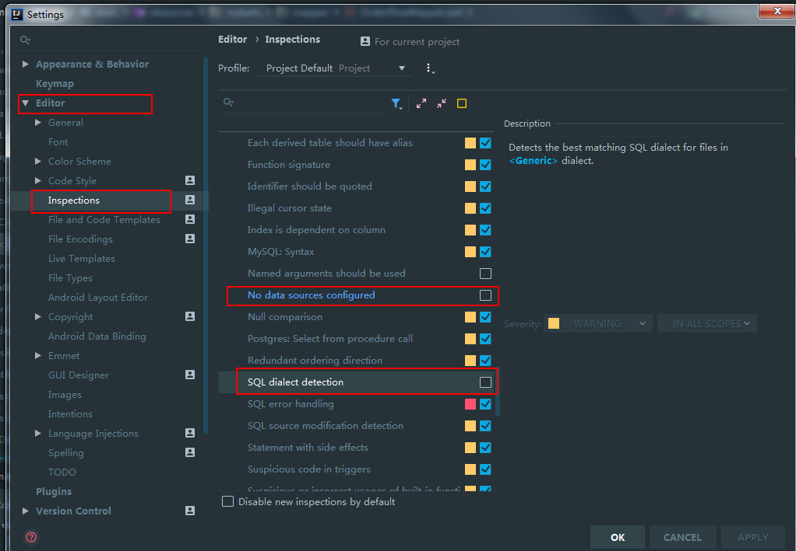

### 7.数据库有默认值  如果没有插入数据中没有值得话 数据库找原因  默认值可以设置

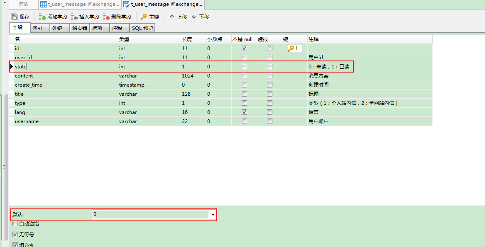

### 8.插入语句 中 可以用now() 函数给 create_time直接赋值 

### 9.关于token 

用户登录以后 带一个token 

这个token在登录以后,每一次随便的请求中都可以看到

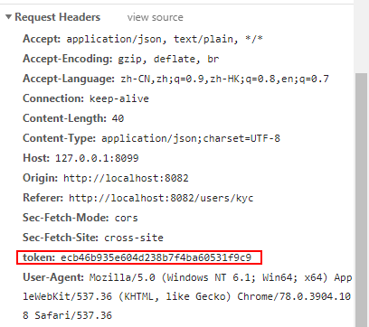

### 用 postman 测试的时候 

加token的地方:

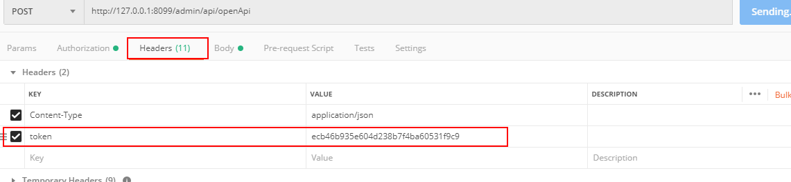

### 10.注意debug的时候如果有一个地方没有走到 ,则可能是没有重启,刚写的代码 买有起到作用!


11.用ftp连接阿里云服务器    下面类型要选SFTP 端口要选22 

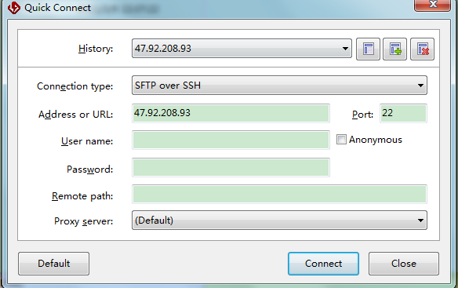

因为阿里云的安全组中配置规则 写的端口是 22 可以用

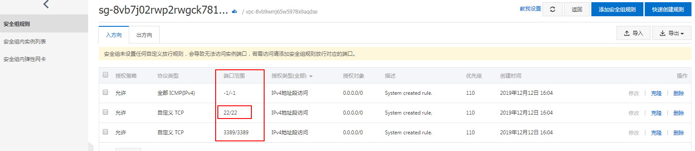

添加安全组中 :

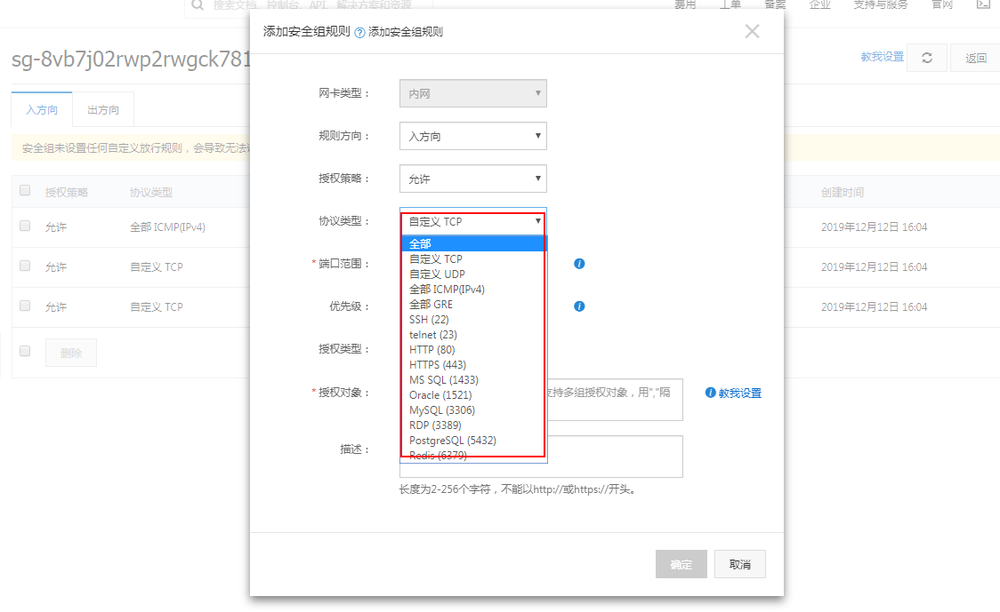

可以自己定义端口和 协议


用ftp连接成功以后 ,发过来一堆文字

```
New server host key

Either the connection to this host is being established for the first time or the host key was never saved.  There is no guarantee that the server is the computer you think it is.

Please contact the server's administrator and verify the received key.  Accepting the host key without verification is not recommended.

Server address: 47.92.208.93 Port: 22

Host key algorithm: ECDSA, size: 256 bits.

MD5 Fingerprint: 
d3:70:bf:59:44:9b:81:99:47:7a:78:b4:60:33:f4:06
SHA1 Fingerprint: 
40:61:2f:e0:0a:a8:34:72:13:8b:fc:08:e4:9f:f8:04:f9:52:b4:47
SHA256 Fingerprint: 
AoRPtA4w9VHfACnDwZQ0nX3mAoOMtLP6/+g1+THGz2I=
```

翻译如下:

```
新的服务器主机密钥

要么是首次建立到此主机的连接，要么是从未保存主机密钥。不能保证服务器就是您所认为的计算机。

请与服务器管理员联系并验证接收到的密钥。不建议未经验证就接受主机密钥。

服务器地址:47.92.208.93端口:22

主机密钥算法:ECDSA，大小:256位。
```


### 11.用单元测试 

需要导入两个依赖

```xml
<dependency>
            <groupId>org.springframework.boot</groupId>
            <artifactId>spring-boot-starter-test</artifactId>
            <scope>test</scope>
</dependency>
```

```xml
<dependency>
            <groupId>junit</groupId>
            <artifactId>junit</artifactId>
            <version>4.12</version>
            <scope>test</scope>
</dependency>
```

如果家了依赖以后 还是不能使用单元测试 

则 要将其变为作用域变为test


测试一下mybatis-plus中的代码生成器 


12 Mybatis 逆向工程生成的代码 

resultMap 继承问题:

项目原来的数据库增加了一个字段 

然后 在原来生成的resultMap文件中,有一个继承关系:

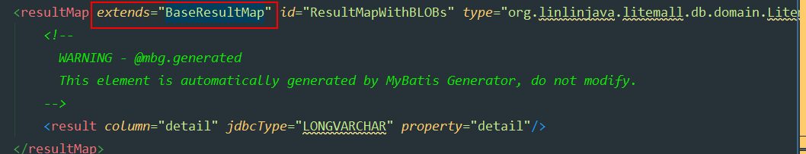

而基础的resultMap 是没有新增的字段的 

所以要改基础resultMap  问题的根源在这里!


13. VUE前端 标签<template>里面必须也是一个闭合标签  

    而且尽量不要出现空行 有时候会报错


14.不要动mybatis里面的mapper.xml   不要随便加where

15.关于typehander 

商城项目 商品上架那块  以前合适 后来 老是出现参数不对 

原来在用生成器的时候 没有用上typehander 

```xml
<table tableName="litemall_goods">
            <generatedKey column="id" sqlStatement="MySql" identity="true"/>
            <columnOverride column="gallery" javaType="java.lang.String[]"
                            typeHandler="org.linlinjava.litemall.db.mybatis.JsonStringArrayTypeHandler"/>
        </table>
```


实际开发中,要这么写 才会将数组和字符串进行转换

```java
 /**
     *
     * This field was generated by MyBatis Generator.
     * This field corresponds to the database column litemall_goods.gallery
     *
     * @mbg.generated
     */
    private String[] gallery;
```

这样写了以后  生成的bean 也是数组啦


### 12后台 前台 改请求地址 


### 13.There is no getter for property named 'id' in 'class java.lang.Integer'

但是实际上实体类中写了相关的方法，最后找到问题出现在Mapper接口中，

```
 List<User> getAllUser( Integer id);
```

将代码改为：

```
List<User> getAllUser(@Param("id") Integer id);
```


### 14.循环末尾 remove一下 时时刻刻考虑性能


### 15.mybatis 中 如果提取一个 不用selectExample

用 selectOne


### 16 shiro 里面注解 不能重复 重复会报错


### 17.demical 数据库设置的时候 要记得设置小数位后面的位数


### 18  同时 demical 后面位数不同 做除法运算时 要指定保留几位

2位小数 / 8位小数

```
order.getGoodsPrice().divide(rate,2,BigDecimal.ROUND_HALF_UP)
```

### 19.idea maven打包 install 报错The packaging for this project did not assign a file to the build artifact

idea maven打包 install 报错，信息如下：


这是说找不到插件的包，其实不是找不到这个打包插件，而是自己的项目没有从maven仓库里加载这个包到项目里，

idea中打包maven项目，有两个install；一直就用Plugins下的install,并 不晓得Lifecycle中的install,经过这次问题，百度了一下，其实lifecycle是maven中一个十分完善的生命周期模型，所以使用Lifecycle中的install项目就会自动去maven仓库下载需要的包。问题解决！


### 20.项目部署到 服务器上 运行时 会出现

mysql errorcode1698  错误代码为这个的错误

百度 解决方案：

https://blog.csdn.net/qq_35846773/article/details/80992155


### 21.SpringBoot打包 jar    要在root根目录打包

### 22.NOAUTH Authentication required.

如果redis-cli设置了密码，在配置的时候，没有写密码 则会报这个错误

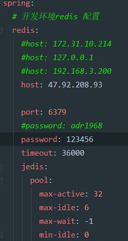

需要在这里添加上密码

### 23.部署vue的时候，协议是http，如果没有申请域名什么的，这里的协议不能是https


### 24 .1067 - Invalid default value for 'active_to'

这个问题出现在Ubuntu18上面的数据库中运行sql文件，报错。

百度原因如下： 需要修改sql_mode

网上找了很多，都没起作用，原因是网上教程可能linux系统不是ubuntu18，所以教程不对。没有具体问题具体定位:

https://www.cnblogs.com/lygz/p/11391065.html


### Ubuntu18设置mysql的sql_mode


**原因：**

MySQL 5.7.5及以上功能依赖检测功能。如果启用了ONLY_FULL_GROUP_BY SQL模式（默认情况下），MySQL将拒绝选择列表，HAVING条件或ORDER BY列表的查询引用在GROUP BY子句中既未命名的非集合列，也不在功能上依赖于它们。

（5.7.5之前，MySQL没有检测到功能依赖关系，默认情况下不启用ONLY_FULL_GROUP_BY。有关5.7.5之前的行为的说明，请参见“MySQL 5.6参考手册”。）

**一.临时性解决**

终端执行 set @@global.sql_mode = ‘STRICT_TRANS_TABLES,NO_ZERO_IN_DATE,NO_ZERO_DATE,ERROR_FOR_DIVISION_BY_ZERO,NO_AUTO_CREATE_USER,NO_ENGINE_SUBSTITUTION’;

如果 NO_AUTO_CREATE_USER 报错，去掉它重新执行。

set @@global.sql_mode = ‘STRICT_TRANS_TABLES,ERROR_FOR_DIVISION_BY_ZERO,NO_ENGINE_SUBSTITUTION’;

注：该方法在MySQL重启后就会失效。

**二.从根本解决**

终端执行 sudo vim /etc/mysql/conf.d/mysql.cnf

粘贴以下文本：

[mysqld] 
**sql_mode=STRICT_TRANS_TABLES,ERROR_FOR_DIVISION_BY_ZERO,NO_AUTO_CREATE_USER,NO_ENGINE_SUBSTITUTION**

保存退出

**重启mysql服务 sudo service mysql restart**

如果重启失败，去掉NO_AUTO_CREATE_USER，保存退出重新启动


### 25.交易所vue项目，打包成手机app

### 手机只能请求到静态资源，动态资源请求不到

灵感来源之处：

https://blog.csdn.net/weixin_34037977/article/details/88772681?depth_1-utm_source=distribute.pc_relevant.none-task&utm_source=distribute.pc_relevant.none-task

原因如下：要将 config下面的index.js 也要配置成阿里云对应服务器路径

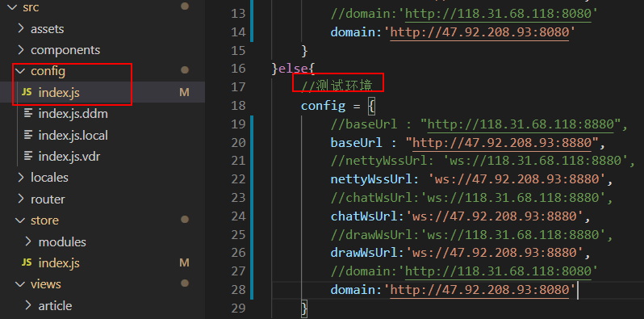

源代码如下:

```js
let config = {}
if(process.env.NODE_ENV !== 'production'){
	//本地环境
	config = {
		//baseUrl : "http://118.31.68.118:8880",
		baseUrl : "http://47.92.208.93:8880",
		//nettyWssUrl: 'ws://118.31.68.118:8880',
		nettyWssUrl: 'ws://47.92.208.93:8880',
		//chatWsUrl:'ws://118.31.68.118:8880',
		chatWsUrl:'ws://47.92.208.93:8880',  
		//drawWsUrl:'ws://118.31.68.118:8880',
		drawWsUrl:'ws://47.92.208.93:8880',  
		//domain:'http://118.31.68.118:8080'
		domain:'http://47.92.208.93:8080'
	}
}else{
	//测试环境 
	config = {
		//baseUrl : "http://118.31.68.118:8880",
		baseUrl : "http://47.92.208.93:8880",
		//nettyWssUrl: 'ws://118.31.68.118:8880',
		nettyWssUrl: 'ws://47.92.208.93:8880',
		//chatWsUrl:'ws://118.31.68.118:8880',
		chatWsUrl:'ws://47.92.208.93:8880',
		//drawWsUrl:'ws://118.31.68.118:8880',
		drawWsUrl:'ws://47.92.208.93:8880', 
		//domain:'http://118.31.68.118:8080'
		domain:'http://47.92.208.93:8080'
	}
}
export default config;
```


### 26.shell连接阿里云服务器时 会出现  等待一下 就能连接上

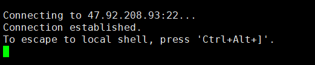

如果还是连接不上  看这个  https://blog.csdn.net/weixin_41619143/article/details/89515803 


### 27.vue项目打包以后 npm run build 打开dist文件夹 点击index.html

没反应 白屏  百度解决方案是 将baseUrl路径修改为  “./”  前面要加一个点

一般的项目  修改这个是在config下面index.js里面修改  这个比较特殊。

这样修改以后 也就可以访问到啦。


### 28.做下面这道题，碰见一个错误，1093 - You can't specify target table 's1_test' for update in FROM clause

写sql将数据库中表中重复的数据删除掉，只保留id号最小的那条记录， 数据库表T有id，year，mouth，amount这五列。

```sql
DELETE 
FROM
	test 
WHERE
	year IN 
	( SELECT year FROM test GROUP BY year HAVING COUNT( year ) > 1)  
	
	AND id NOT IN 
	(SELECT MAX(id) as id FROM test GROUP BY year HAVING COUNT( year ) > 1) 
```

按照上面写法运行的时候，报错啦。**解决方案是在外面包装一层。**

这个错误的意思是，更新这个表的同时又查询了这个表，查询这个表的同时又去更新这个表，可以理解为死锁，所以出现了这个问题。

正确答案：

```sql
DELETE 
FROM
	test 
WHERE
	year IN 
	(SELECT year FROM ( SELECT year FROM test GROUP BY year HAVING COUNT( year ) > 1) a ) 
	
	AND id NOT IN 
	(SELECT id FROM (SELECT MAX(id) as id FROM test GROUP BY year HAVING COUNT( year ) > 1) b )
```


## 报装系统错误总结

### 1.用mybatis 逆向工程生成 的bean 和mapper xml 文件 包错

springboot中java.lang.IllegalStateException: No typehandler found for property xxx错误

是bean 的时间类 改成Date类型 就好啦 是有数据类型不对应造成的


### 2本来需要两个参数 结果写了一个
```
java.util.MissingFormatArgumentException: Format specifier '%s'
```

参考：https://www.cnblogs.com/qingmuchuanqi48/p/11528905.html


### 3.遇到一个问题：在请求里面没写@RequestBody @Valid  然后后面一直获取不到DTO里面的数据  

```java
@ApiOperation(value = "开票列表")
@RequestMapping(value = "invoiceList", method = RequestMethod.POST)
public ResposeVO invoiceList(@RequestBody @Valid InvoiceListDTO dto)  {
    return ResponseFactory.ok(invoiceService.invoiceList(dto));
}

```
### 4.navicat连接oracle 出现ORA-28547错误

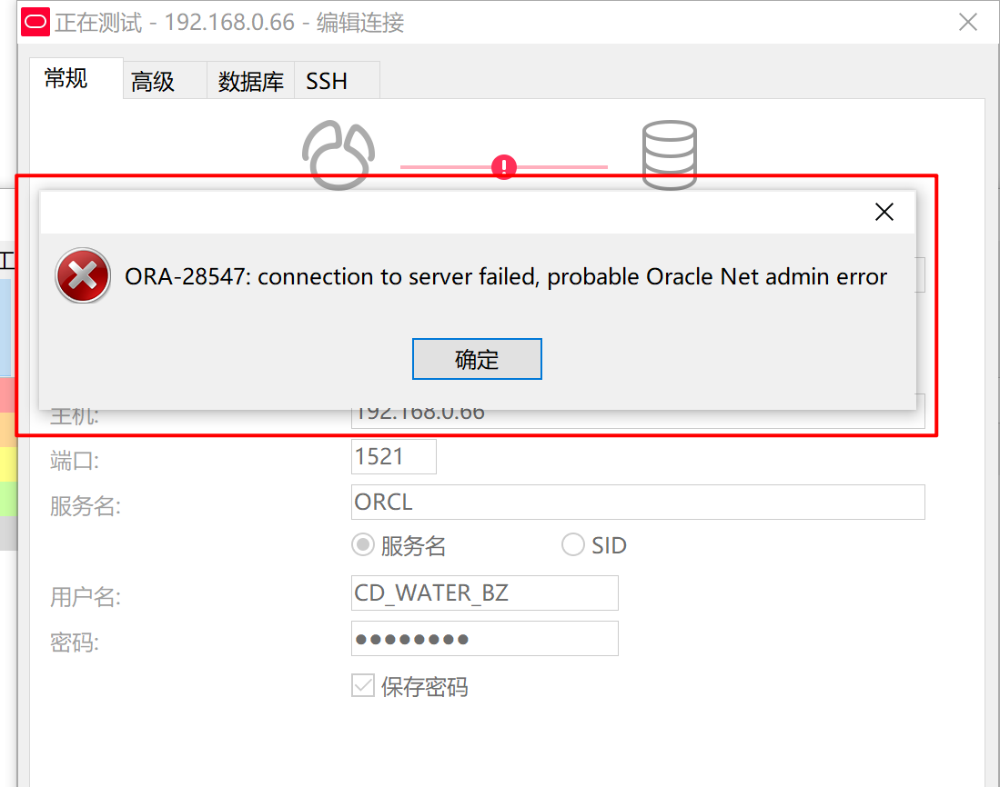

需要下载一个软件

参考：https://blog.csdn.net/gaoying_blogs/article/details/45440797

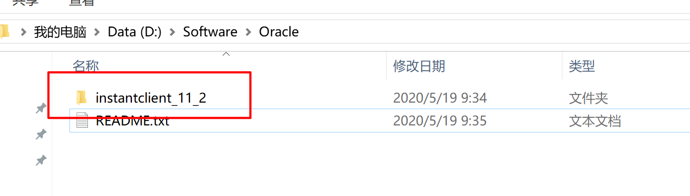

### 4.Error starting ApplicationContext. To display the auto-configuration report re-run your application with 'debug' enabled.


在maven里面root中  clean一下 ，重启


### 5.讲application.properities  换成 application.yml 会报错 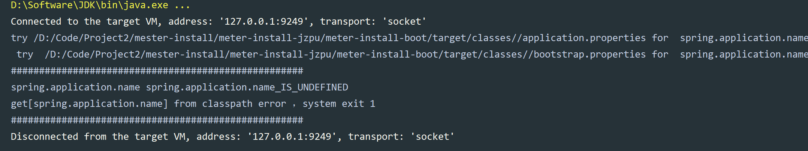

可能是springboot版本太低，识别不了 name

name需要单独加在application.properties，这样项目就可以启动啦 


```
spring.application.name=cdsw-install
#spring.profiles.active=dev
```


有些版本低的springboot，比如1.几，如果要使用yml配置文件，需要添加yml依赖

```xml
<dependency>
    <groupId>org.yaml</groupId>
    <artifactId>snakeyaml</artifactId>
    <version>1.25</version>
</dependency>
```


.properties转换成.yml 

https://www.toyaml.com/index.html


boot版本很低

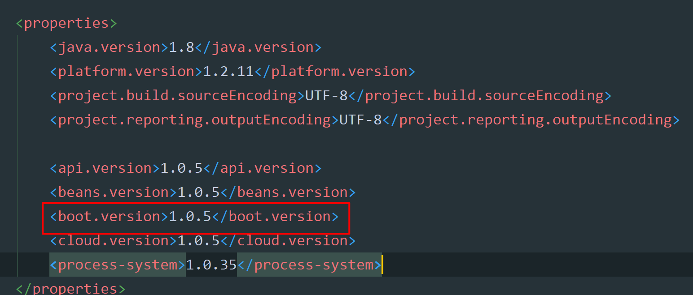


### 34.在构建SpringCloud项目的时候 ，父工程的pom文件，一定要打包，打包方式为pom


```xml
<groupId>com.atguigu.springcloud</groupId>
<artifactId>cloud2020</artifactId>
<version>1.0-SNAPSHOT</version>
<packaging>pom</packaging>

<modules>
    <module>cloud-provider-payment8001</module>
</modules>
```


如果不加最下面这个，会一直报错的。而且这个要放在<modules>标签上面

```xml
<packaging>pom</packaging>
```


### 6.碰到一个问题说 controller，servises，sql等都没有注入到Spring容器当中。

首先碰到这种问题看看每一层是不是都加了注解@RestController @Services @Mapper

然后看看mapper.xml里面


这里主要的是 mapper.xml 中 ResultMap写错啦。

正确的应该是下面这样：

```xml
<resultMap id="BaseResultMap" type="com.eiletxie.springcloud.entity.Payment">
    <id column="id" property="id" jdbcType="BIGINT" />
    <id column="serial" property="serial" jdbcType="VARCHAR"/>
</resultMap>
```

原来错误的写法是：type里面路径没有写全路径，所以会报错


### 7.一个服务调用另一个服务，如果服务提供者在参数之前没有加@RequestBody，那么写到数据库中的值会是一个空。


如果服务提供者加上@RequestBody的话，就可以插入数据库啦。


因为服务提供者，请求方式是post，数据在body里面放着。

**RequestBody 接收的是请求体里面的数据；而RequestParam接收的是key-value里面的参数**


这个例子中，服务调用者用的是get请求，参数写到url后面，但是，请求过去以后，还是调用的 服务提供者中的post方法

服务调用者：

```java
public static final String PAYMENT_URL = "http://localhost:8001";

//注意这里是get
@GetMapping("/consumer/payment/create")
    public CommonResult< Payment > create(Payment payment) {
        return restTemplate.postForObject(PAYMENT_URL + "/payment/create", payment, CommonResult.class);
    }
```

服务提供者：

```java
//注意这里是post
@PostMapping(value="/payment/create")
    public CommonResult create(@RequestBody Payment payment) {
        int result = paymentService.create(payment);
        log.info("****插入结果:" + result);

        if(result > 0){
            return  new CommonResult(200,"插入数据库成功,serverPort: " + serverPort,result);
        } else {
            return new CommonResult(444,"插入数据库失败",null);
        }
    }
```


参考：https://www.cnblogs.com/zhuhui-site/p/10088238.html

https://blog.csdn.net/justry_deng/article/details/80972817  写的比较详细的关于@RequestBody的方法。


### 8.电脑中 开启虚拟机 网络适配器里面没有关，所以在济宁服务重新注册的时候，电脑ip发生变化啦。所以导致前端连接不到 济宁后端。

网络适配器里面 将虚拟机网卡禁用掉。

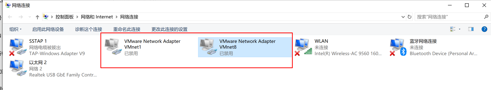


### 9.IntelliJ Idea报错Could not autowire. No beans of 'xxxx' type found的错误提示，并且编译运行时报错解决方案

参考：https://blog.csdn.net/Hellowenpan/article/details/85249679

将这里这个地方改了 就不会提示报错啦。原来是Error，改成warring。

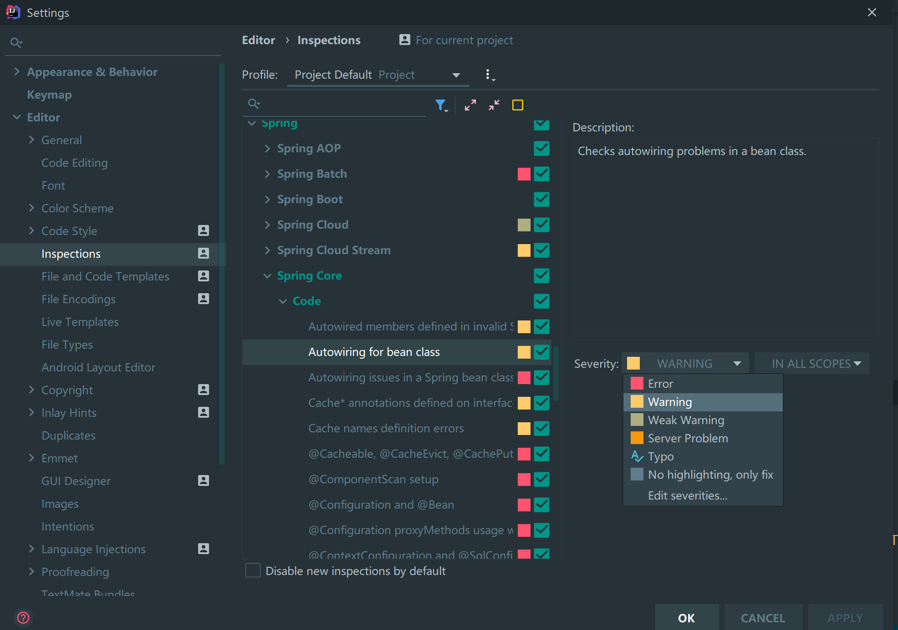


### 10.记一次事故：关乎代码回滚 重新提交

公司代码有些比较老，也有很多没有的代码，我自己没事干删了一些。

结果同时电代码跑不起来啦。

这时候需要代码回退。

```shell
首先 
git log 查看提交日，这里面会有一些提交日志
```

可以上下翻页来看


然后复制对应的版本号

```shell
git reset --hard 9897c32a759ecdc802f6160ff33fb9c91134062d  然后强制回退到对应的版本
```

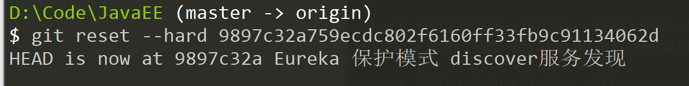


然后提交，这个提交会覆盖回退的那些代码，就是说，后面提交的代码全部都没有啦

```shell
git push --force-with-lease origin master 

git push --force-with-lease <远程主机名> <本地分支名>:<远程分支名> 完整的命令是这个样子的

git push --force-with-lease  origin  luquan-nacos  比如回退鹿泉的就要这么写
```


回退完了git log再看，就是这个样子，想要回退的commit。


#### 总结：

每一个很小的知识 包含很多东西。要谦虚，要认真，要一直学习。

关于代码要不要优化，公司老项目代码要不要修改。

老大建议是不要动。因为不知道哪里会用到，万一出错，很麻烦。


其实代码最初都是设想好的，架构好的，用的也是很稳定的技术。但是随着时间的推移，同一个代码经过好几个人写，最后有些代码 ，就像一坨屎一样。其实有些也是很难避免的。

每个开发人员水平和代码习惯不一样，最后代码会很不一样。

旧代码不要动。


### 11.关于maven install的一次事故。

在做济宁报装的时候，中间有一次操作，使用过maven install 将代码打包 ，然后后续代码就开始引用打包里面的文件  ，没有用  自己的bean里面的代码。


### 12. 运行济宁 的项目 如果没有关闭虚拟机网卡 项目启动的时候 都注册不到注册中心里面去。

注册成功以后是这个样子：


### 13 .git  HttpRequestException encountered解决方法

https://blog.csdn.net/txy864/article/details/79557729?utm_medium=distribute.pc_relevant_t0.none-task-blog-BlogCommendFromMachineLearnPai2-1.nonecase&depth_1-utm_source=distribute.pc_relevant_t0.none-task-blog-BlogCommendFromMachineLearnPai2-1.nonecase


下载这个软件 安装就好啦


### 14.不小心将google书签删除啦。结果试了六七个文件恢复软件好像恢复不了已经修改的文件。

C:\Users\Steve\AppData\Local\Google\Chrome\User Data\Default 

这个路径下 BookMarks 里面放的是浏览器书签，可以定期保存一下这个文件。保存到笔记中。


以前是通过VPN进行google数据同步的，现在进过这么一个事情，找到了另外一种方式，可以保存书签，也还不错。赛风失马，焉知非福。


### 15.SpringBoot加事务没有生效

自己没有生效的两个原因：

首先@Transactional 这个注解引入的包不对，应该是：

```
import org.springframework.transaction.annotation.Transactional;

@Transactional
```

第二个原因是，代码中有抛出异常处理，要在注解里面写异常以后回滚代码，要写成下面这个样子：

```
@Transactional(rollbackFor = Exception.class)
```

这样的话有异常才会抛出异常。


## 个人征信系统


图片里面还有一个PDF，上面有详细的征信记录。