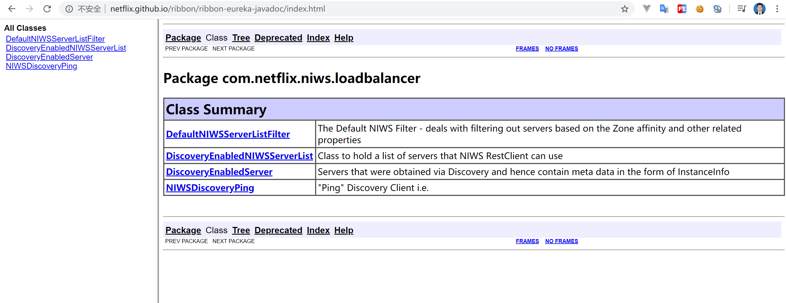
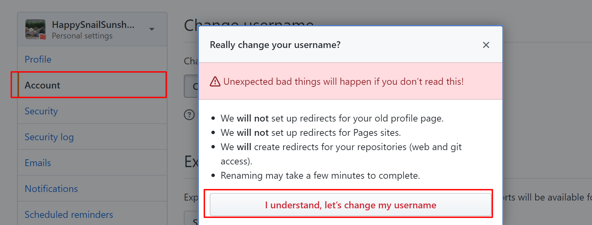
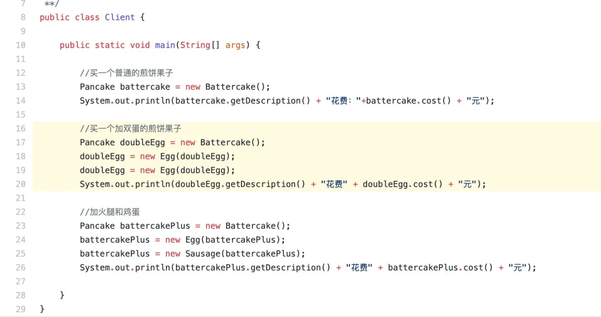
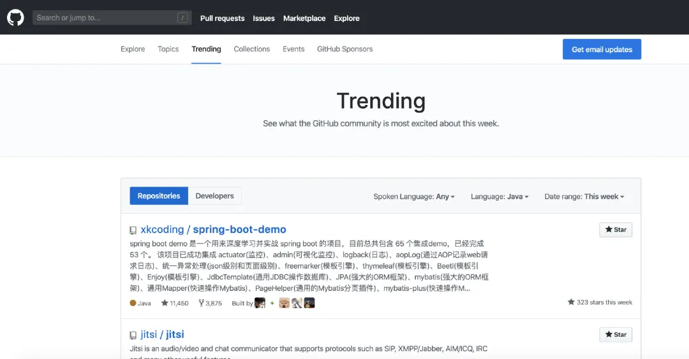
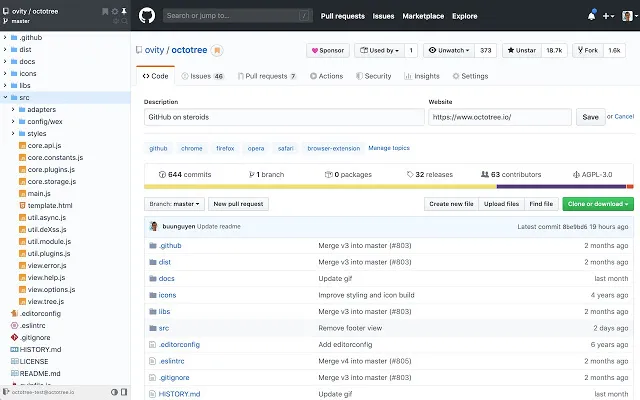
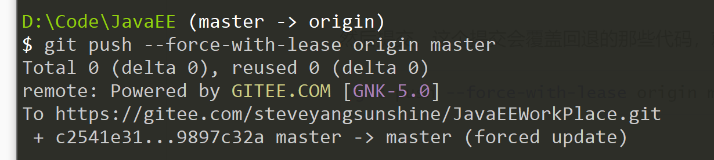
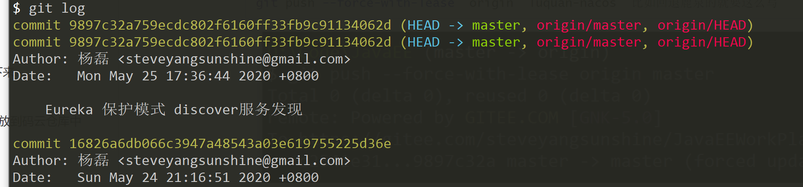

# Git

版本控制，可以避免团队协作项目时，好多问题的出现!

## Github 

### 如何看开源项目

https://github.com/Netflix/ribbon/wiki/Getting-Started

比如这个spring-cloud里面的 负载均衡ribbon


点开右边的文档，里面是这个样子的。




### 修改自己github用户名和账号



### 在Github上面搜索

GitHub，不用过多介绍。一个面向开源及私有软件项目的托管平台，因为只支持 git 作为唯一的版本库格式进行托管，故名 GitHub。

作为「全球最大的程序员“交友”社区」，程序员的你，真的可以把它的使用发挥到极致吗？

#### 搜索

##### 全局搜索

###### 傻瓜式搜索

比如我们要学习下秒杀（seckill）代码的实现，可以在整个 GitHub 站点全局搜索相关内容



但是这样的搜索范围太大，且项目质量参差不齐，所以在搜索结果页，还可以通过 Languages 选择实现语言，Sort 选择排序规则（按 Star 数量、Fork 数量、最近更新时间等）。

###### 精准搜索（技术范）

###### 1. 关键词限制搜索范围

公式：`搜索词 in:name(/description/readme)`

搜索项目名称和自述文件中包含秒杀的仓库   **seckill in:name,readme**

| 限定符            | 示例                                                         |
| :---------------- | :----------------------------------------------------------- |
| `in:name`         | **jquery in:name** 匹配仓库名称包含 "jquery" 的内容          |
| `in:description`  | **jquery in:name,description** 匹配仓库名或描述中包含 "jquery" 的内容(组合使用) |
| `in:readme`       | **jquery in:readme** readme文件中包含"jquery"                |
| `repo:owner/name` | **repo:octocat/hello-world** 查询某人的某个项目（查octocat 的 hello-world 仓库） |

###### 2.关键词查找

**搜索语法**：

- `>n`、`>=n`、`<n`、`<=n`：查询数量范围，可以是 starts、forks、topics......
- `n..*`、`*..n`：等同于 `>=n` 和 `<=n`
- `n..m`：取值范围 n 到 m

| **限定符**           | **示例**                                                     |
| :------------------- | :----------------------------------------------------------- |
| `stars:n`            | **stars:500** 匹配 500 个 stars 的项目 **stars:10..20** 匹配 starts 数量 10 到 20 的项目 |
| `followers:n`        | **node followers:>=10000** 匹配关注者大于等于 10000 的 node 仓库 |
| `forks:n`            | **seckill forks:5**  匹配有 5 个 forks 的秒杀项目            |
| `created:YYYY-MM-DD` | **seckill created:>2020-01-01** 创建时间在 2020-01-01 之后的秒杀项目 |
| `language:LANGUAGE`  | **seckill language:java** 匹配 java 语言编写的秒杀项目       |
| `user:name`          | **user:Jstarfish stars:>50** 匹配 Jstarfish 用户 stars 数大于 50 的仓库 |
| `location:LOCATION`  | **location:beijing** 匹配北京的朋友们                        |
| 互相组合使用         | **seckill stars:>=500 fork:true language:java** 匹配stars 数量大等于 500（包含 forks 数），且语言是 java 的秒杀项目 **location:beijing language:java** 北京做 Java 开发的大佬 |

###### 3. awesome 加强搜索

```
awesome 关键字` ，awesome 系列，一般是用来收集学习，工具，书籍类相关的项目。比如我们要学习下 redis 相关的项目，包括框架、教程等，`awesome redis
```


这几个其实也够用了，官方还给出了所有你能想得到的搜索方式：

https://help.github.com/en/github/searching-for-information-on-github/searching-on-github

##### 项目内搜索

- 在项目页 输入小写 t
- github 快捷键 https://help.github.com/en/github/getting-started-with-github/keyboard-shortcuts

###### 文件搜索

进入仓库主页面，有个 **Find file**，可以按文件名搜索


#### 快捷键

- `s` 或 `/`    定位到搜索框
- g + 操作，表示跳转
- - `g d` 前往我的主页
  - `g n` 前往通知面板 About notifications
  - `g c` 前往代码界面 Code tab（以下均在仓库页面）
  - `g i` 前往问题界面 About issues
  - `g w` 前往 About Wike
- `t`  激活文件查找，和 Find file 一样
- `w`  切换分支
- `l` 浏览代码时，快速跳转到指定行

官方提供：https://help.github.com/en/github/getting-started-with-github/keyboard-shortcuts

#### 高亮显示代码

有时候我们要请教大佬，让大佬帮忙看看代码，可以使用高亮功能，在 GitHub 或 GitLab 中找到自己的代码，url 地址后加 `#L 数字` 表示高亮第几行，加 `#L 数字 -L数字` ，表示高亮代码区间（GitLab 上不需要第二个 L）

eg：

https://github.com/Jstarfish/starfish-learning/blob/master/starfish-learn-designpattern/src/decorator/Client.java#L16-L20


#### 查看 GitHub 热门趋势

https://github.com/trending  可以按语言，日期范围（本天、本周、本月）查看热度，有好多可供学习的热门项目。



#### 插件

最后再推荐一个查看 GitHub 代码的浏览器插件。

octotree 用于将 Github 项目代码以树形格式展示，可以像 IDE 一样，看代码。而且在展示的列表中，我们可以下载指定的文件，而不需要下载整个项目。




## Git命令


### Git init(初始化仓库)

### git init –bare 仓库名


### git init


### git clone 远程仓库地址

从远程仓库拉取一个仓库下来作为本地仓库

是最常用获取远程仓库的方式


### git status


### git add 文件名

git add . 提交当前文件夹下的全部文件

git add src/\*


可以通过git status查看代码提交到暂存区的状态

### git commit –m “消息”


### git push

将本地仓库的修改提交到远程仓库


### git pull

从远程仓库拉取最新的更新


### git Config

需要配置邮箱和用户名

在第一次commit之前

1. 通过命令修改 git config –global user.name(email) 值
2. 修改user目录下的.gitconfig文件

### git log

提交日志

包含版本号 提交用户信息 和提交的message

### git push的时候

需要github的登陆信息


### git reset（谨慎操作）

git reset --hard 版本号（相较于下面两个更常用）

```shell
git reset --hard aa516174 
```

git reset –hard HEAD\^ 回退一个版本

git reset –hard HEAD\~n 回退n个版本


### git rm 删除

文件的删除git rm

修改的撤销：撤销的是工作区还未提交到暂存区的部分git checkout 文件名（谨慎操作）

2020.6.1

## 分支

### 查看分支

git branch -a   

用Gitlab的时候用 

### 切换分支

git checkout 分支名

### 创建分支

切换分支   git checkout 新的分支名  

新创建分支  git checkout –b 分支名


在新的分支上面开一个分支：https://www.cnblogs.com/hahajava/p/10318756.html

```shell
1.先克隆一个项目
git clone
2.再转移到分支中
$ git status
位于分支 master
您的分支与上游分支 'origin/master' 一致。
无文件要提交，干净的工作区

$ git checkout dev 
分支 dev 设置为跟踪来自 origin 的远程分支 dev。
切换到一个新分支 'dev'

3.再拉取最新的代码
git pull origin dev

4.再创建新的分支
git checkout -b dev-timeout
这个时候，分支的代码就是基于dev这个分支的

5.将分支推送到线上
$ git push origin dev-timeout  (上次在成都自来水分支操作，没有进行这一步，结果始终没有提交到gitlab上面，这里单纯git push 不行)
```


### 分支的合并

比如说我们现在做的是dev要合并到master上

1. 切换到master分支上
2. 在master上合并dev，git merge dev
3. （解决冲突）提交git push

### 从分支下面拉取分分支

```
git remote add origin https://github.com/FIGHB/cskaoyan_test.git
git fetch origin dev
git checkout -b dev origin/dev
git pull origin dev-
```


### 从dev分支上面克隆东西下来:

```
git remote add origin https://github.com/FIGHB/cskaoyan_test.git
git fetch origin dev
git checkout -b dev origin/dev
git pull origin dev
```

**git pull = git fetch + git merge**

## 记一次事故：

公司代码有些比较老，也有很多没有的代码，我自己没事干删了一些。

结果同时电代码跑不起来啦。

这时候需要代码回退。

```shell
首先 
git log 查看提交日，这里面会有一些提交日志
```

可以上下翻页来看


然后复制对应的版本号

```shell
git reset --hard 9897c32a759ecdc802f6160ff33fb9c91134062d  然后强制回退到对应的版本
```


然后提交，这个提交会覆盖回退的那些代码，就是说，后面提交的代码全部都没有啦

```shell
git push --force-with-lease origin master 

git push --force-with-lease <远程主机名> <本地分支名>:<远程分支名> 完整的命令是这个样子的

git push --force-with-lease  origin  luquan-nacos  比如回退鹿泉的就要这么写
```




回退完了git log再看，就是这个样子，想要回退的commit。




参考：https://blog.csdn.net/WPwalter/article/details/80371264  

https://blog.csdn.net/asoar/article/details/84111841?utm_medium=distribute.pc_relevant.none-task-blog-BlogCommendFromMachineLearnPai2-1.nonecase&depth_1-utm_source=distribute.pc_relevant.none-task-blog-BlogCommendFromMachineLearnPai2-1.nonecase


## 冲突解决

多个用户维护同一部分的代码时发生冲突。

发生冲突时，首先拉取冲突下来git pull

手动解决冲突（修改代码）

重新执行代码提交流程（add → commit → push）

## 文件忽略的配置


## Idea中配置git的terminal


## 补充

## 快捷键

Shift+insert：粘贴

Ctrl+insert：复制

## Linux命令

Cd 前往目录

touch 创建文件

mkdir 创建文件夹

vim


## gitee将本地项目或者笔记放到码云仓库中 

便于将工作笔记和家里面的笔记着整合

下面这个博客里面有介绍

https://blog.csdn.net/fox9916/article/details/78253714

选中文件夹 将其初始化

### git init

### git status

三、将你本地仓库与码云上的远程仓库关联起来

### git remote add origin https://gitee.com/fox9916/demo.git

四、在你准备上传你的项目之前，最好更新一下项目，确保没有和远程仓库的代码有冲突

### git pull --rebase origin master

五  :

五、把你的项目复制到这个目录下，用命令添加你要上传的项目，再提交到本地暂存区，最后把本地仓库项目提交到远程仓库。git 是强烈建议你在提交代码的时候，要写备注注释的，所以既然人家是强烈建议，你就别懒了。

git add . 添加目录下所有发生改变的文件

git commit -m '注释信息'

git push -u origin master 本地仓库代码提交至远程仓库


在提交过程中，如果遇到出现其他分支的情况

```java
git push origin master  //回退
```


亲自测试是有效的  顺利将笔记放到了码云上


#### 还有一种简单方法 就是仓库弄好 克隆下来 然后代码放到文件夹

git 忽略

```java
HELP.md
/target/
!.mvn/wrapper/maven-wrapper.jar

### STS ###
.apt_generated
.classpath
.factorypath
.project
.settings
.springBeans
.sts4-cache

### IntelliJ IDEA ###
.idea
*.iws
*.iml
*.ipr

### NetBeans ###
/nbproject/private/
/nbbuild/
/dist/
/nbdist/
/.nb-gradle/
/build/
/target/*

### VS Code ###
.vscode/

**/node_modules/**
/project4/**
**/*.log

```


## github 组织每次登录都需要输入账号密码问题：

- 如果买次提交都需要用户名和密码登录的话，按照如下操作：(意思是讲HTTPS换成SSH 亲测有效)

```shell
 git remote rm origin
 git remote add origin git@github.com:JavaSudyGroup/JavaStudy.git
 git push -u origin master
```

​		参考：https://www.cnblogs.com/lxwphp/p/10702177.html


# 更新Wins电脑git版本

## 1.先查看当前安装的git版本

```
git --version
```

## 2.更新

git版本是2.17.1之前的，使用

```
git update
```

git版本是2.17.1之后的，使用

```
git update-git-for-windows
```

## 3.版本是2.14.1的，会报错

**git: 'update' is not a git command**

**git: 'update-git-for-windows' is not a git command**

解决方法：重新下载新版本安装包，覆盖安装即可

## 4.镜像下载

git官网下载：https://git-scm.com/download/win  （特别慢！！）

git安装包 阿里镜像，下载速度超快。

网址：https://npm.taobao.org/mirrors/git-for-windows/