# Projects

# Others

## 服务器

现在二供在上面放着

```
192.168.10.150:22
root/bigdata   root密码
/opt/jdrx/secondary-supply/jdrx-secondary-supply
开发环境的二供后台服务部署地址
```


## Eureka

```
40.250  开发环境
```


## OA

```
sunshine
19950921y
```


# 河北建投  智慧水务 

zhsw-permission 权限模块 2000万项目

有些接口 需要U-ID  可以重新登录上系统，然后就可以在参数中看到

## 数据库

192.168.10.164  

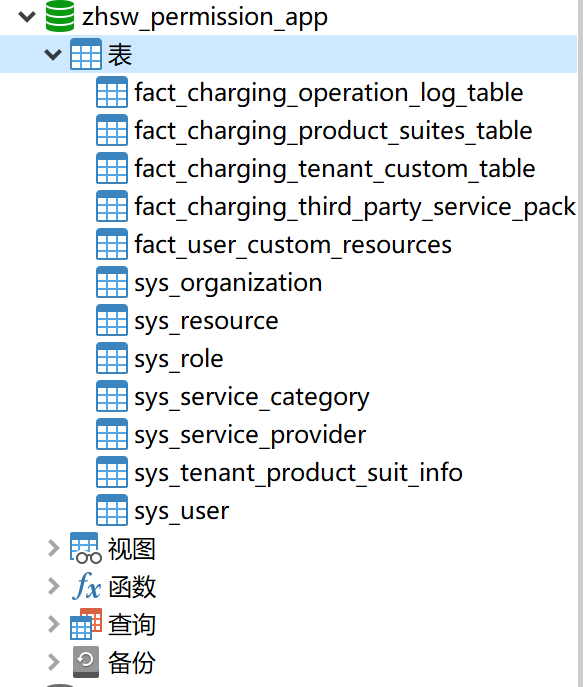


# 一体化管理平台

```
http://192.168.0.250/cloud_dev/     总的页面
```

```java
http://192.168.0.250/cloud_dev/ocp-ui-portal
账号：admin
密码：admin2020

账号密码sunshine 原来是中银 现在是111111
```


# 二次供水供系统

```
4.工单状态：
    1）.应根据操作进行实时更新（未接单、已接单、处理中、处理完成）  
    2）.APP端：进入工单详情页面：点击录入信息--办理中，录入信息后，点击提交--已完成，中途退出页面，重新进入页面根据状态显示操作  
    3）.APP端：功能拆分到页面分开显示：根据工单状态拆分显示，更新密码，个人信息                                                                                                                                                                                    
```


**每次发布的时候，本地springboot  yml里面加了东西以后，要在nacos里面也加上**

这里

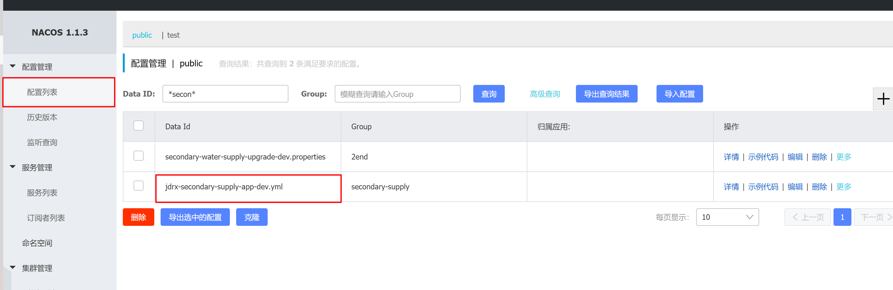


dubbo ocp 调用服务

```java
import com.jdrx.platform.dubbo.common.beans.DubboRpcBean;
import com.jdrx.platform.dubbo.common.service.IDubboRpcService;
import org.apache.dubbo.config.annotation.Reference;
import org.springframework.stereotype.Service;

import java.util.HashMap;
import java.util.List;
import java.util.Map;

/**
 * 项目名：jdrx-smartyu-cpf-app
 * Created by fu.
 * Created at 2019/10/9
 * 描述:远程调用告警方案
 */
@Service
public class WarningService extends RpcBaseService {

    @Reference(group = "jdrx-smartyu-warning-app", check = false)
    private IDubboRpcService dubboRpcService;

    public List<Map<String, Object>> findWarning(String areaId) throws Exception {
        Map<String, Object> map = new HashMap<>();
        DubboRpcBean bean = DubboRpcBean.builder()
                .setRpcPath("/api/0/smartyu/warningRule/findWarningNameGrade")
                .setOrgId(areaId)
                .setBody(map)
                .build();
        return getMapList(dubboRpcService, bean);
    }
}

```


```
地址：http://124.239.168.234:38081/cloud_test/water_saas/
公司编号：576
账号：egadmin
密码：egadmin123
```


开发人员安排：

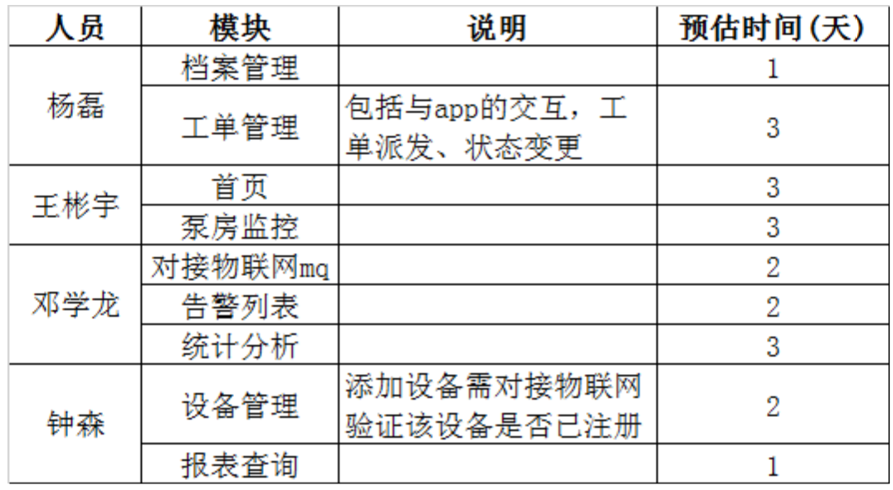

## swagger

```
http://localhost:13000/jdrx-secondary-supply/swagger-ui.html
```

需要注意的一点是：

swagger路径里面的是这个，不是spring.application.name 

```
server.context-path=/cdsw-install
```


## 新增泵房档案

```
{
  "address": "详细地址",
  "area": "所属区域",
  "buildDate": "2020-06-16T06:39:38.524Z",
  "code": "泵房编号",
  "community": "所属小区",
  "communityType": "所属单位类型",
  "createAt": "2020-06-16T06:39:38.524Z",
  "createBy": 0,
  "deviceInfo": "设备情况 设备套数",
  "ipAddress": "IP地址",
  "lat": 20,
  "lon": 30,
  "name": "泵房名字",
  "planInfo": "规划信息",
  "principalName": "负责人名字",
  "principalPhone": "负责人电话",
  "propertyMgt": "物业单位名称",
  "street": "所属街道",
  "waterSourceType": "供水方式",
  "waterSupplyType": "水源类型"
}
```


## ocp

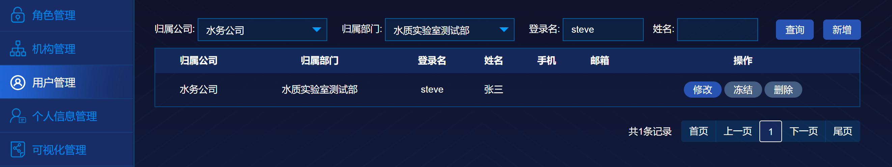

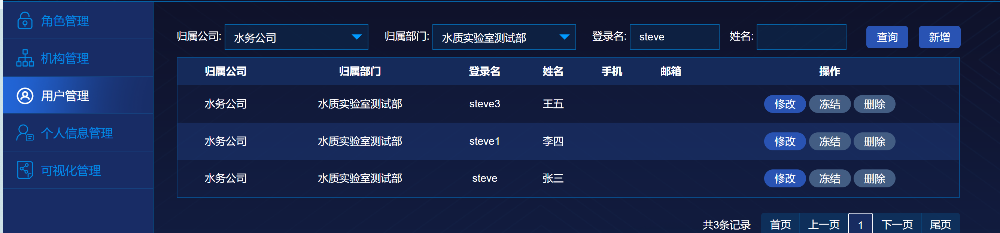

## 跨域问题 

需要再类的上面加这个注解 @CrossOrigin  提交代码的时候 注解去掉

参考：https://www.cnblogs.com/mmzs/p/9167743.html


## 不将服务注册到dubbo上面

```yml
dubbo:
  registry:
    address: 192.168.40.250:8848,192.168.40.251:8848,192.168.40.252:8848
    protocol: nacos
    register-enabled: false  #如果不将服务注册到nacos上面的话，就加这个 默认不加是true
```

要是需要和前端联合调试的话，就需要注册到那nacos上面。

如果不需要和前端联合调试的话，就自己在swagger里面进行测试，就不需要注册到nacos里面


# 鹿泉报装

## 清理 Git

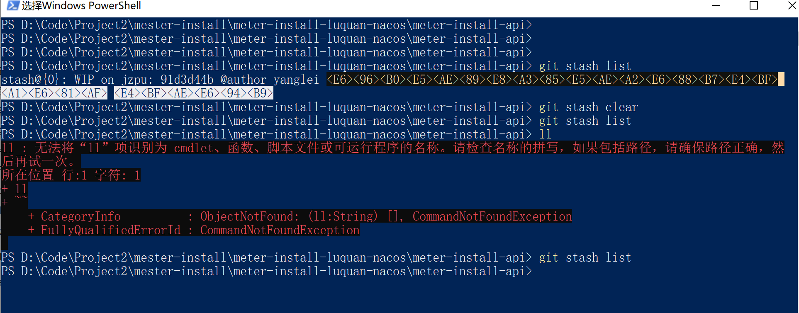


## 登录账户密码

```
admin
admin2020
```


## Nacos上面的配置文件

```yml
debug: false
dubbo:
    registry:
        address: 192.168.40.250:8848,192.168.40.251:8848,192.168.40.252:8848
        protocol: nacos
        register-enabled: true
es:
    analyzer: ik_max_word
    indexName: luquan-install
    port: 9300
    server: 192.168.0.121
    type: v1
gw:
    biz:
        appKey: CDJDRXINSTALL123456789cdjdrx1234
        appSecret: 049cc8a42e196eb8471352a94032ffa2
        appid: wxa4bdc8258afd339c
        getCodeUrl: https://api.weixin.qq.com/sns/oauth2/access_token
        merchantId: 1422300902
        platform-id: luquan-install
        url-prefix: http://192.168.40.250:6868/
        wechatTicketUrl: https://api.weixin.qq.com/cgi-bin/ticket/getticket
        wechatTokenUrl: https://api.weixin.qq.com/sns/oauth2/access_token
    permission:
        platform-id: luquan-install
        url-prefix: http://192.168.40.250:6868/
info:
    description: 鹿泉报装
    name: 鹿泉报装
    version: 1.0
jwt:
    expired-seconds: 600000
    signing-key: 1234567890
server:
    port: 10107
    servlet:
        context-path: /luquan-install
spring:
    activiti:
        async-executor-activate: true
        check-process-definitions: false
        jpa-enabled: false
    application:
        name: luquan-install-app
    cloud:
        nacos:
            discovery:
                server-addr: 192.168.40.250:8848,192.168.40.251:8848,192.168.40.252:8848
    datasource:
        pg:
            bz:
                borrowConnectionTimeout: 30
                driverClassName: org.postgresql.Driver
                loginTimeout: 30
                maintenanceInterval: 60
                maxIdleTime: 60
                maxLifetime: 20000
                maxPoolSize: 25
                minPoolSize: 3
                password: postgres
                testQuery: select 1
                url: jdbc:postgresql://192.168.10.244:5432/luquan-water-bz?autoReconnect=true&amp;failOverReadOnly=false
                username: postgres
            process:
                borrowConnectionTimeout: 30
                driverClassName: org.postgresql.Driver
                loginTimeout: 30
                maintenanceInterval: 60
                maxIdleTime: 60
                maxLifetime: 20000
                maxPoolSize: 25
                minPoolSize: 3
                password: 123456
                testQuery: select 1
                url: jdbc:postgresql://192.168.30.165:5432/process_system?autoReconnect=true&amp;failOverReadOnly=false
                username: postgres
    redis:
        database: 0
        host: 192.168.0.201
        password: ''
        port: 6379
        timeout: 3000
user:
    online:
        opentask: false
white:
    list:
        ip: 192.168.40.12

```


# 成都自来水


## Biz 指的是业务 business

新需求：


清单内容，excel 导入进来。字段固定。要设置一个模板。


项目中的bean好多都有判断，在接受到数据后，判断一下，业务里面就不用做判断啦。这种写法值得提倡。

```java
public Double getMoney() {
    if (money != null) {
        // 保留两位小数
        BigDecimal b = new BigDecimal(money);
        return b.setScale(2, BigDecimal.ROUND_HALF_UP).doubleValue();
    }
    return money;
}
```


登录：

```
cxgws001
wl111111
```


## 流程有好多 每个流程都需要配置流程人员


 每一个流程都需要  给对应的子流程 添加参与部门和参与者。

成都自来水的流程 比较多 有好多流程，每个流程还有好多子流程。


## Oracle Number

Oracle中的number在java中的实体类中Int，Long，BigDecimal 都可以

|                                  |                                        |                        |                               |
| :------------------------------- | :------------------------------------: | :--------------------: | :---------------------------: |
| SQL数据类型                      |              JDBC类型代码              |     标准的Java类型     |     Oracle扩展的Java类型      |
|                                  |           1.0标准的JDBC类型:           |                        |                               |
| `CHAR`                           |         `java.sql.Types.CHAR`          |   `java.lang.String`   |       `oracle.sql.CHAR`       |
| `VARCHAR2`                       |        `java.sql.Types.VARCHAR`        |   `java.lang.String`   |       `oracle.sql.CHAR`       |
| `LONG`                           |      `java.sql.Types.LONGVARCHAR`      |   `java.lang.String`   |       `oracle.sql.CHAR`       |
| `NUMBER`                         |        `java.sql.Types.NUMERIC`        | `java.math.BigDecimal` |      `oracle.sql.NUMBER`      |
| `NUMBER`                         |        `java.sql.Types.DECIMAL`        | `java.math.BigDecimal` |      `oracle.sql.NUMBER`      |
| `NUMBER`                         |          `java.sql.Types.BIT`          |       `boolean`        |      `oracle.sql.NUMBER`      |
| `NUMBER`                         |        `java.sql.Types.TINYINT`        |         `byte`         |      `oracle.sql.NUMBER`      |
| `NUMBER`                         |       `java.sql.Types.SMALLINT`        |        `short`         |      `oracle.sql.NUMBER`      |
| `NUMBER`                         |        `java.sql.Types.INTEGER`        |         `int`          |      `oracle.sql.NUMBER`      |
| `NUMBER`                         |        `java.sql.Types.BIGINT`         |         `long`         |      `oracle.sql.NUMBER`      |
| `NUMBER`                         |         `java.sql.Types.REAL`          |        `float`         |      `oracle.sql.NUMBER`      |
| `NUMBER`                         |         `java.sql.Types.FLOAT`         |        `double`        |      `oracle.sql.NUMBER`      |
| `NUMBER`                         |        `java.sql.Types.DOUBLE`         |        `double`        |      `oracle.sql.NUMBER`      |
| `RAW`                            |        `java.sql.Types.BINARY`         |        `byte[]`        |       `oracle.sql.RAW`        |
| `RAW`                            |       `java.sql.Types.VARBINARY`       |        `byte[]`        |       `oracle.sql.RAW`        |
| `LONGRAW`                        |     `java.sql.Types.LONGVARBINARY`     |        `byte[]`        |       `oracle.sql.RAW`        |
| `DATE`                           |         `java.sql.Types.DATE`          |    `java.sql.Date`     |       `oracle.sql.DATE`       |
| `DATE`                           |         `java.sql.Types.TIME`          |    `java.sql.Time`     |       `oracle.sql.DATE`       |
| `TIMESTAMP`                      |       `java.sql.Types.TIMESTAMP`       | `javal.sql.Timestamp`  |    `oracle.sql.TIMESTAMP`     |
|                                  |           2.0标准的JDBC类型:           |                        |                               |
| `BLOB`                           |         `java.sql.Types.BLOB`          |    `java.sql.Blob`     |       `oracle.sql.BLOB`       |
| `CLOB`                           |         `java.sql.Types.CLOB`          |    `java.sql.Clob`     |       `oracle.sql.CLOB`       |
| 用户定义的对象                   |        `java.sql.Types.STRUCT`         |   `java.sql.Struct`    |      `oracle.sql.STRUCT`      |
| 用户定义的参考                   |          `java.sql.Types.REF`          |     `java.sql.Ref`     |       `oracle.sql.REF`        |
| 用户定义的集合                   |         `java.sql.Types.ARRAY`         |    `java.sql.Array`    |      `oracle.sql.ARRAY`       |
|                                  |              Oracle扩展:               |                        |                               |
| `BFILE`                          |    `oracle.jdbc.OracleTypes.BFILE`     |          N/A           |      `oracle.sql.BFILE`       |
| `ROWID`                          |    `oracle.jdbc.OracleTypes.ROWID`     |          N/A           |      `oracle.sql.ROWID`       |
| `REF CURSOR`                     |    `oracle.jdbc.OracleTypes.CURSOR`    |  `java.sql.ResultSet`  | `oracle.jdbc.OracleResultSet` |
| `TIMESTAMP`                      |  `oracle.jdbc.OracleTypes.TIMESTAMP`   |  `java.sql.Timestamp`  |    `oracle.sql.TIMESTAMP`     |
| `TIMESTAMP WITH TIME ZONE`       | `oracle.jdbc.OracleTypes.TIMESTAMPTZ`  |  `java.sql.Timestamp`  |   `oracle.sql.TIMESTAMPTZ`    |
| `TIMESTAMP WITH LOCAL TIME ZONE` | `oracle.jdbc.OracleTypes.TIMESTAMPLTZ` |  `java.sql.Timestamp`  |   `oracle.sql.TIMESTAMPLTZ`   |


```json
{
  "barCode": "1",
  "initialReading": 0,
  "installAddress": "string",
  "installNo": "CX2020042600117",
  "jobNumber": "001",
  "managerContact": "",
  "managerName": "",
  "meterCaliber": "DN25",
  "meterType": "物联网智能表",
  "pageNum": 0,
  "pageSize": 0,
  "unitName": "string",
  "userCode": "string",
  "waterAddress": "string",
  "waterNature": "酒店用水"
}

```


## 数据库表

现在的数据库中是设置了一个序列，所有的表都有


## 成都自来水流程

### 管道复核流程ChannelAudit

在流程里面的现场勘查里面。

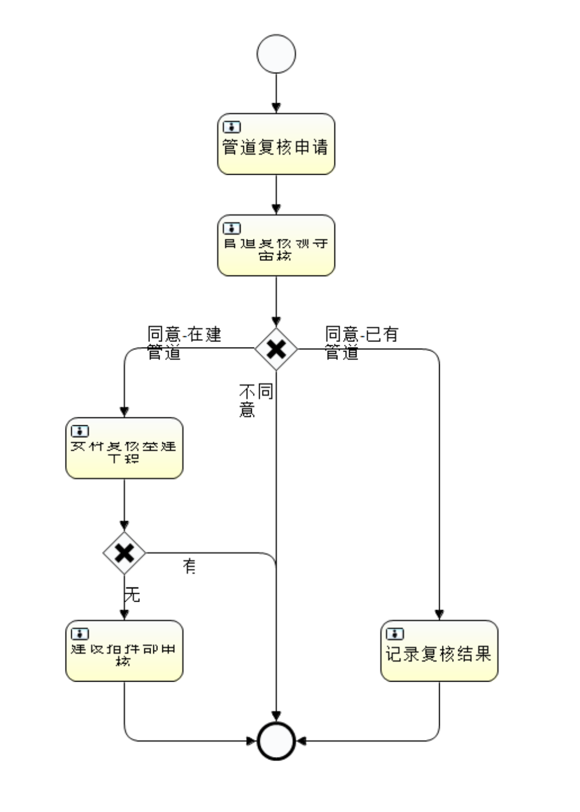

### 上报资信度问题  

流程配置里面没有配置流程人员  可以配 只是没有配置。

有两个 

一个是新增入库，还有一类资信度和二类资信度不一样。

CreditworthinessCheck1  


CreditworthinessCheck1 

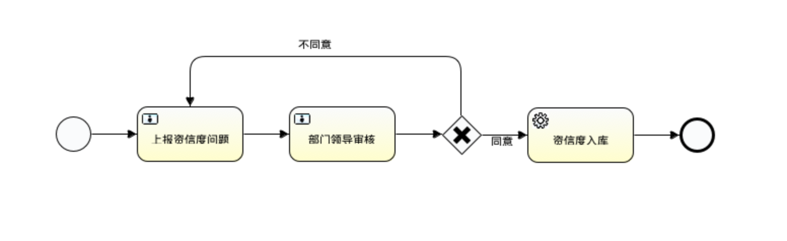

举个栗子，如果用户施工把水管挖断啦，没有交付违约金，以后用户在申请的时候，资信度不好就不能再安装水啦。

### 发起资信度处置 CreditworthinessHandle

有了前面的资信度以后，才有后面的资信度处置。

如果用户吧违约金交啦，应该给用户把资信度弄得正常。


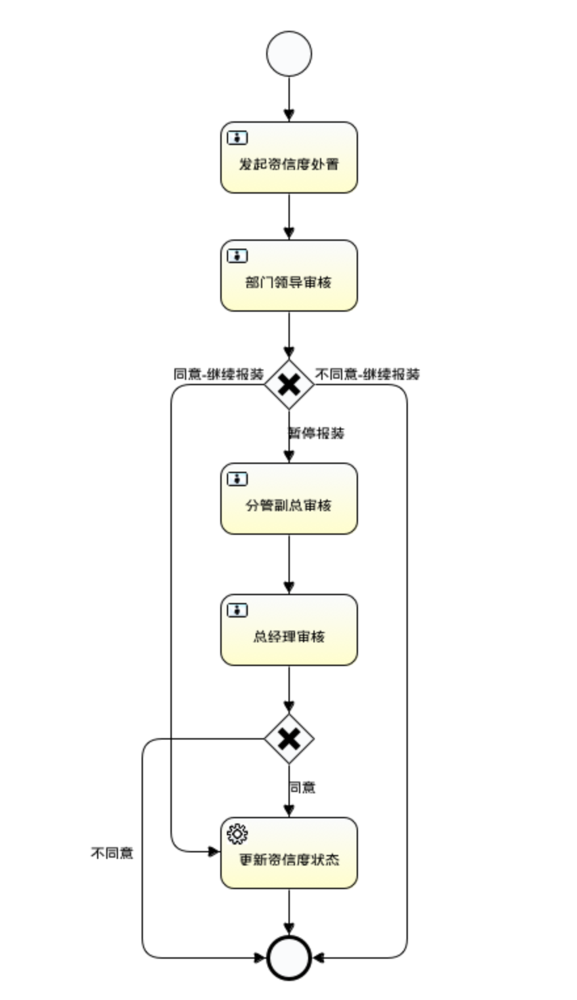

### 新建报装里 政务报装

其他的报装就是以往的流程，政务报装，和以前的报装开始的流程不一样。

政务报装开始要 有一些处理 如果可以 才走正常的流程。


### 撤销申请 CustomerRescind

新建报装以后，到受理之间用户可以撤销申请·。


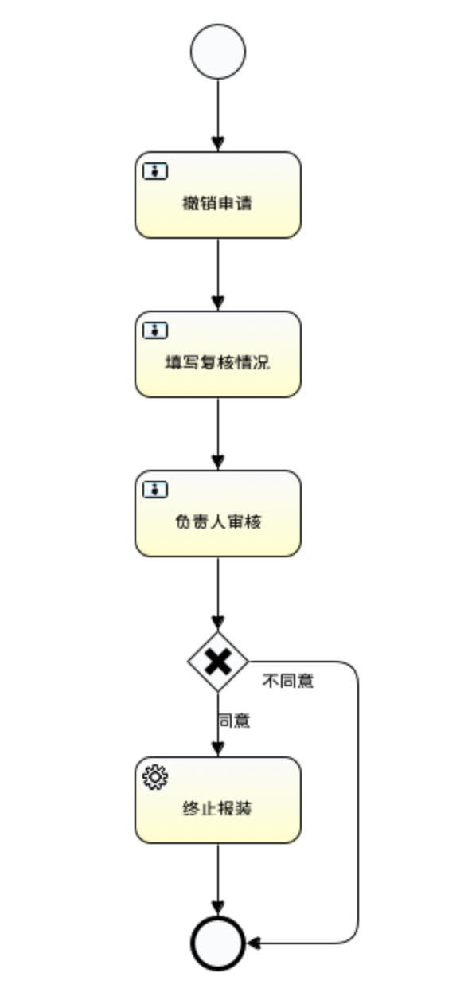

### 提交工程设计文件 DesignDocumentConfirmation


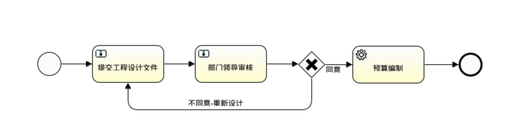


### 发起修改申请 （设计文件修改流程） DesignDocumentModify

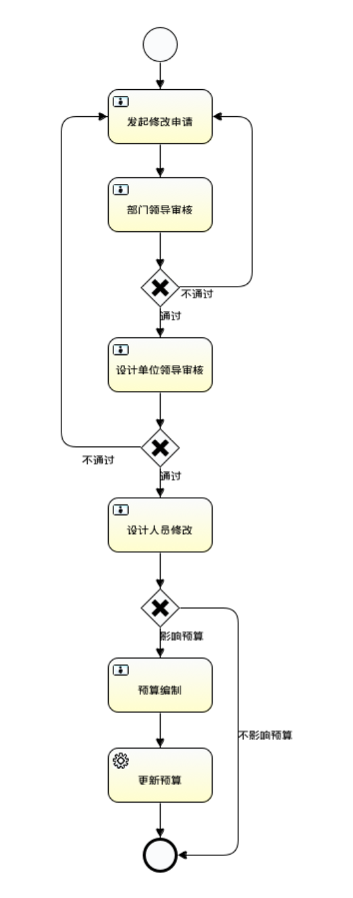

### 发起工程验收（工程验收子流程） EngineeringCheck

在主流程看的话 这个是 工程施工节水 后面一个 操作 一个子流程。

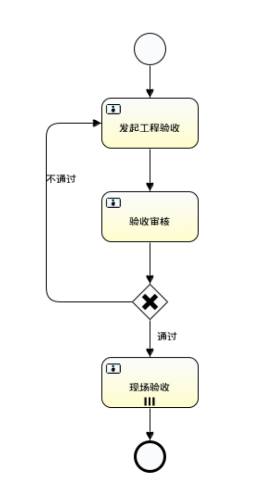

### 异常申请 ExceptionHandler

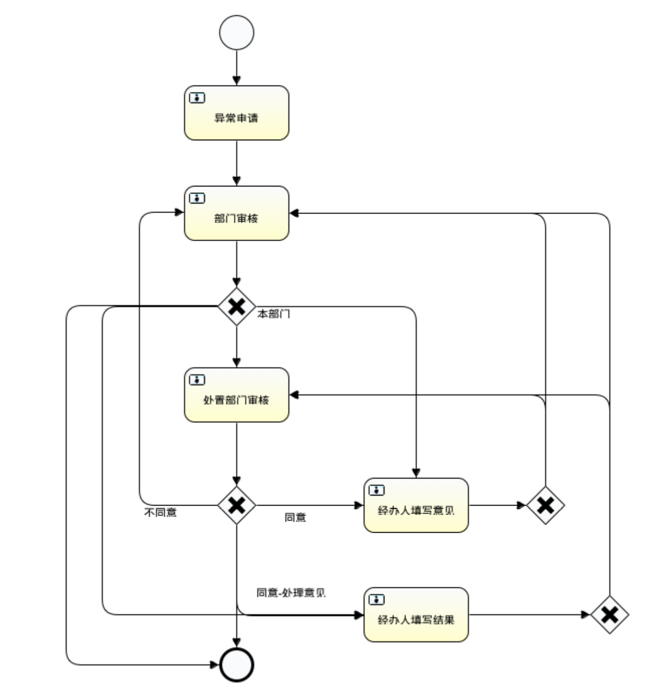

### 受理信息 （政务报装审核）govReportInstallAudit

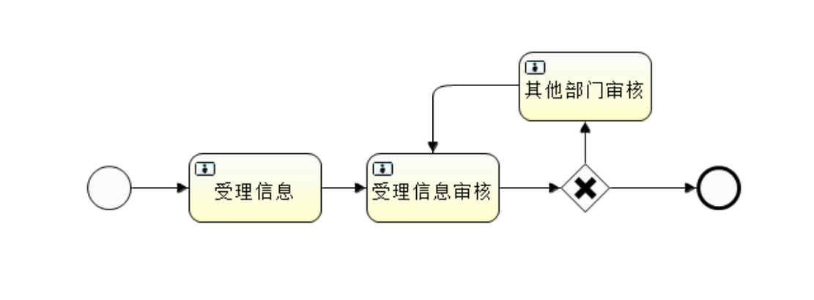

### 测压申请 ManometryApply

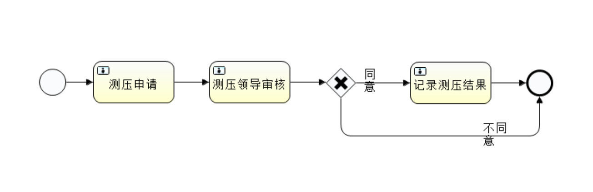


### 发起会签申请 OnLineCountersignature

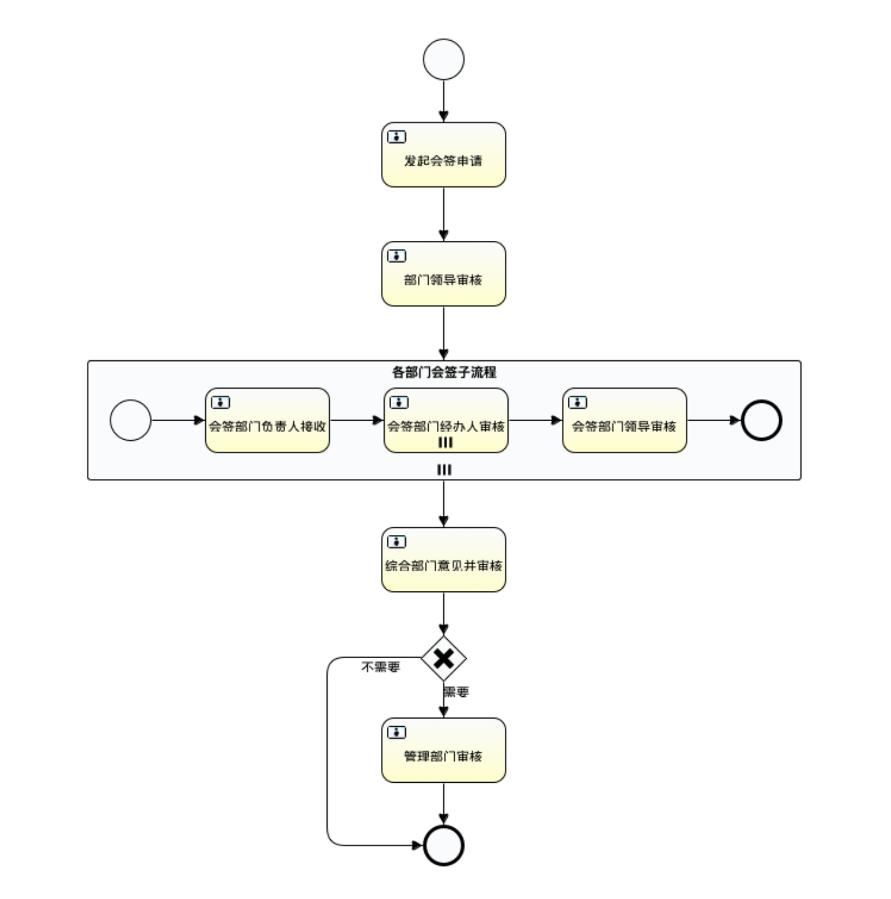


### 手续代办申请 ProceduresAwaitHandle

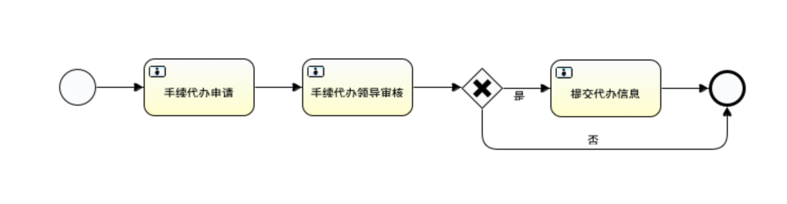

### 帮改要求 Rectification


### 报装主流程 ReportInstallationMain

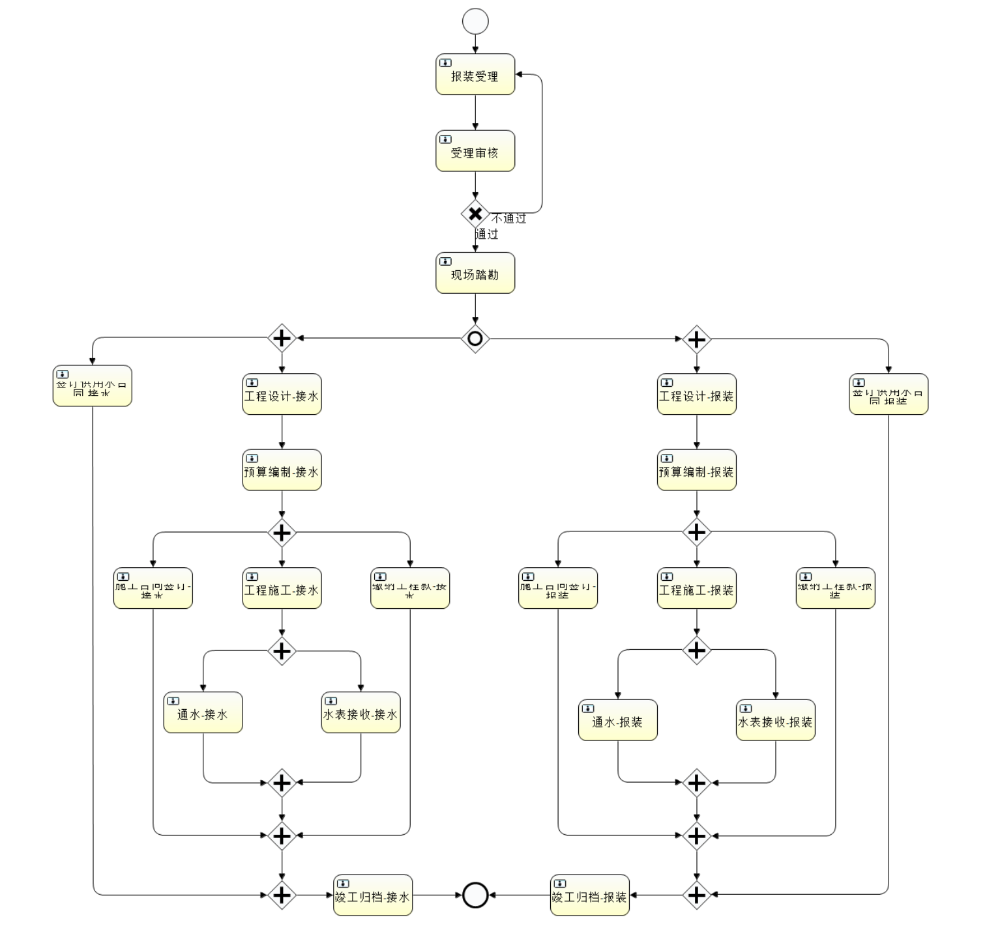

工程施工-接水  下面有一个子流程 手续代办

### 申请暂停报装 ReportInstallationPause

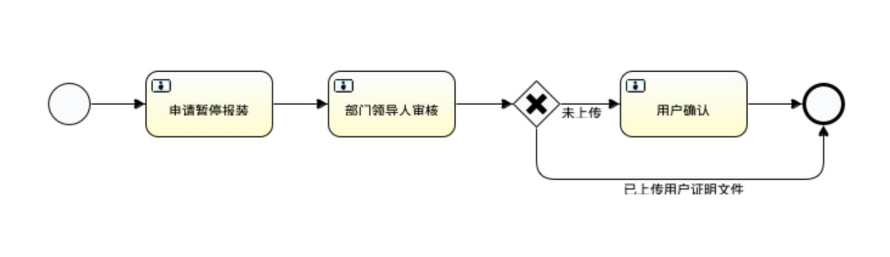


# 济宁报装

为什么 现在的济宁报装系统application 没有Eureka配置文件？ 

因为 配置文件都在配置中心。


## 线上项目地址：

```java
http://120.220.15.48:8081/cloud/meter-install-ui/#/login

//登录：JD_test    jd123456

```


## 流程

下面这个流程是成都自来水里面  的流程人员配置  其实济宁的流程 只有两个 一个是报装主流程，一个是开票流程。


### 报装主流程JZPU-ReportInstallationMain

报装受理-> 受理审核-> 现场勘查-> 工程设计-> 预算编制-> 合同签订-> 财务部确认-> 工程部确认-> 收费管理-> 竣工管理->竣工归档


```java
//给所有地方加更新时间 
@Autowired
private InstallReportRecordService installReportRecordService;

//在报装主表  添加更新时间  没写完
		InstallReportRecordPO installInfoByInstallNo = installReportRecordService.getInstallInfoByInstallNo(dto.getInstallNo());
		installReportRecordService.updateTime(installInfoByInstallNo);

```

### 开发票流程invoiceApply

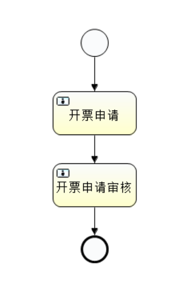


## 新装水表报装																					

#### 新建报装  

这个是流程的开始


#### 在线报装列表 


#### 已办理报装


#### 已暂停报装 


#### 上门报装管理

可以发起上门报装 


### 业务办理

#### 集中管理

集中管理 里面 已完成 可以看到整个项目完成以后的所有流程


#### 终止报装


#### 信息督办


#### 代办事项

详细流程里面可以看到当前项目进行到了哪里。

不同先项目所处在整个流程的环节不一样。


业务办理，可以办当前报装项目所在的流程需要办理的业务


#### 流程干预

#### 我的流程

#### 预警列表

#### 报警列表

#### 领导评价

#### 异常列表

#### 检查清单

#### 智能应答


启动CloudBoot的时候，要配置注册中心  公司注册中心192.168.40.250:8888


前端要连接


## 启动angular 

cmder/cmd 里面  live-server —port=8084

```
安装环境
npm i -g live-server
运行 
live-server --port=8084

```


  登录密码：cxgws001   wl111111


## 数据库表


partition by和group by对比

参考：https://www.cnblogs.com/hello-yz/p/9962356.html


## 查看一台电脑 的公网ip：


测试环境这里这个是公网ip，这里写本地局域网ip 192.168.40.44 和公网ip效果是一样的


新安装客户信息统计，原来的代码

```xml
	<select id="queryInstallClientInfo" resultType="java.util.Map">
		SELECT
			a.install_no "installNo",
			a.unit_name "unitName",
			a.project_name "projectName",
			a.water_address "waterAddress",
			a.manager_contact "managerContact",
			b.agreed_time "explorationTime",
			c.create_at "projectTime",
			c.create_at "drawingTime",
			d.create_at "contractTime",
			e.type "budgetType",
			e.total_amount "budgetFee",
			f.charge_time "chargeTime",
			COALESCE(g.receipt_no,'-')  "receiptNo",
			g.invoice_no "invoiceNo",
			g.invoice_fee "invoiceFee",
			g.invoice_time "invoiceTime",
			g.execution_site "executionSite",
			g.execution_locale_principal_name "executionLocalePrincipalName",
			i.create_at "acceptanceTime"
			FROM t_install_report_record a
			LEFT JOIN
			(SELECT
			a.install_no,
			a.agreed_time
			FROM
			(
			SELECT
			install_no,
			agreed_time,
			row_number () over ( partition BY install_no ORDER BY ID DESC ) "rownum"
			FROM t_process_exploration
			ORDER BY ID DESC
			) a
			WHERE a.rownum=1) b on b.install_no =a.install_no

			LEFT JOIN (
			SELECT
			a.install_no,
			a.create_at
			FROM
			(
			SELECT
			install_no,
			create_at,
			row_number () over ( partition BY install_no ORDER BY ID DESC ) "rownum"
			FROM t_process_design
			ORDER BY ID DESC
			) a
			WHERE a.rownum=1) c on c.install_no =a.install_no

			LEFT JOIN (
			SELECT
			a.install_no,
			a.create_at
			FROM
			(
			SELECT
			install_no,
			create_at,
			row_number () over ( partition BY install_no ORDER BY ID DESC ) "rownum"
			FROM t_biz_contract
			ORDER BY ID DESC
			) a
			WHERE a.rownum=1) d on d.install_no =a.install_no

			LEFT JOIN (
			SELECT
			a.install_no,
			a.type,
			a.total_amount
			FROM
			(
			SELECT
			install_no,
			type,
			total_amount,
			row_number () over ( partition BY install_no ORDER BY ID DESC ) "rownum"
			FROM t_process_budget
			ORDER BY ID DESC
			) a
			WHERE a.rownum=1) e on e.install_no =a.install_no

			LEFT JOIN (
			SELECT
			a.install_no,
			a.charge_time
			FROM
			(
			SELECT
			install_no,
			charge_time,
			row_number () over ( partition BY install_no ORDER BY ID DESC ) "rownum"
			FROM t_biz_charge
			ORDER BY ID DESC
			) a
			WHERE a.rownum=1) f on f.install_no =a.install_no

			LEFT JOIN (
			SELECT
			a.install_no,
			a.execution_site,
			a.execution_locale_principal_name,
			a.receipt_no,
			a.invoice_no,
			a.invoice_time,
			a.invoice_fee
			FROM
			(
			SELECT
			install_no,
			receipt_no,
			execution_site,
			execution_locale_principal_name,
			invoice_no,
			invoice_time,
			invoice_fee,
			row_number () over ( partition BY install_no ORDER BY ID DESC ) "rownum"
			FROM t_biz_construct
			ORDER BY ID DESC
			) a
			WHERE a.rownum=1) g on g.install_no =a.install_no

			LEFT JOIN (
			SELECT
			a.install_no,
			a.execution_site,
			a.execution_locale_principal_name,
			a.receipt_no,
			a.invoice_no,
			a.invoice_time,
			a.invoice_fee
			FROM
			(
			SELECT
			install_no,
			receipt_no,
			execution_site,
			execution_locale_principal_name,
			invoice_no,
			invoice_time,
			invoice_fee,
			row_number () over ( partition BY install_no ORDER BY ID DESC ) "rownum"
			FROM t_biz_construct
			ORDER BY ID DESC
			) a
			WHERE a.rownum=1) h on h.install_no =a.install_no

			LEFT JOIN (
			SELECT
			a.install_no,
			a.create_at
			FROM
			(
			SELECT
			install_no,
			create_at,
			row_number () over ( partition BY install_no ORDER BY ID DESC ) "rownum"
			FROM t_completion_archiving
			ORDER BY ID DESC
			) a
			WHERE a.rownum=1) i on i.install_no =a.install_no
			WHERE
			a.status != 0
			<if test="unitName!=null and unitName != ''">
				AND a.unit_name LIKE CONCAT('%',#{unitName,jdbcType=VARCHAR},'%')
			</if>
			<if test="waterAddress!=null and waterAddress != ''">
				AND a.water_address like CONCAT('%',#{waterAddress,jdbcType=VARCHAR},'%')
			</if>
			<if test="installNo!=null and installNo != ''">
				AND a.install_no like CONCAT('%',#{installNo,jdbcType=VARCHAR},'%')
			</if>

	</select>

```

开始的数据 


修改后的数据


## 项目测试时 在host文件中，添加过一些文件

C:\Windows\System32\drivers\etc

```hosts
####### --------------------------jdrx start------------------------------

192.168.10.241 postgresql_server
192.168.10.130 transp_in
192.168.10.242 mysql_server
192.168.10.243 gf_test_machine
192.168.80.106 pg-common-01

#大数据
192.168.30.241 dev-conn rocketmq-master-a rocketmq-nameserver-a
192.168.30.242 dev-mana
192.168.30.243 k8s-master
192.168.30.244 k8s-node1
192.168.30.245 k8s-node2 rocketmq-master-b rocketmq-nameserver-b
192.168.10.120 ebmas-01
192.168.10.121 ebmas-02
192.168.10.122 ebmas-03
192.168.10.123 ambari-server
192.168.0.81 ambari-server-test
192.168.0.82 ebmas-test-01
192.168.0.83 ebmas-test-02
192.168.0.84 ebmas-test-03
192.168.40.85 ebmas-test-04
192.168.40.85 ebmas-neo4j
192.168.10.124 platform_integration


#基础平台测试环境[V1.0版本]
192.168.10.160 ms-gw-01  ms-rc-00  
192.168.10.161 ms-rc-01 
192.168.10.162 ms-rc-02 
192.168.10.163 grc ggw 
192.168.10.164 redis-common-01  mysql-common-01  rabbitmq-common-01
192.168.10.150 dm-server
192.168.10.250 ms-web-01
192.168.0.200 loggerserver
192.168.10.244 postgres-common-01
192.168.30.246 rocketmq-common-01
192.168.30.249 mycat-server
192.168.0.121 es-common-01
192.168.0.121 ooo-common-01
192.168.40.250 ms-cc   mongodb-common-01  
192.168.0.124 activemq-common-01 hudson
192.168.10.243 gf_test_machine
192.168.10.165 ms-rc-05

#基础平台测试环境[V2.0版本]
192.168.10.160 ms-gw-01  ms-rc-00
192.168.10.161 ms-rc-01
192.168.10.162 ms-rc-02
192.168.40.250 ms-cc-00
192.168.40.251 ms-cc-01
192.168.40.252 ms-cc-02
192.168.10.164 redis-common-01  mysql-common-01  rabbitmq-common-01
192.168.10.250 ms-web-01
192.168.10.250 fs-common-01
192.168.0.200 loggerserver
192.168.30.165 postgres-common-01
192.168.30.246 rocketmq-common-01
192.168.30.222 dble-server
192.168.40.250 mongodb-common-01
192.168.0.121 es-common-01
192.168.0.121 ooo-common-01
192.168.30.249 mycat-server

####### --------------------------jdrx end------------------------------

```


解决方案：

https://blog.csdn.net/qq_21104515/article/details/79166098


## 项目中遇到的问题：

```java
Map<Long,InstallReportRecordPO> irrMap = installReportRecordDAO.listBy(params).stream()        .collect(Collectors.toMap(InstallReportRecordPO::getProcessId,Function.identity(),(o,n)->n));


```

这句话老报错，说类型转换错误。


这一句里面`::`表示：

> 双冒号运算操作符是类方法的句柄，lambda表达式的一种简写，这种简写的学名叫eta-conversion或者叫η-conversion。

通常的情况下:

把 x -> System.out.println(x) 简化为 System.out::println 的过程称之为 eta-conversion

把 System.out::println 简化为 x -> System.out.println(x) 的过程称之为 eta-expansion

范式:
**类名::方法名**

注意:

1. 方法后面并没有()
2. 懒加载方法是否调用要看调用方使用情况


## 使用lambda 表达式将list转换成map

### 常用方式

代码如下：

```
public Map<Long, String> getIdNameMap(List<Account> accounts) {
    return accounts.stream().collect(Collectors.toMap(Account::getId, Account::getUsername));
}


```

### 收集成实体本身map

代码如下：

```
public Map<Long, Account> getIdAccountMap(List<Account> accounts) {
    return accounts.stream().collect(Collectors.toMap(Account::getId, account -> account));
}


```

**account -> account**是一个返回本身的lambda表达式，其实还可以使用Function接口中的一个默认方法代替，使整个方法更简洁优雅：

```
public Map<Long, Account> getIdAccountMap(List<Account> accounts) {
    return accounts.stream().collect(Collectors.toMap(Account::getId, Function.identity()));
}


```

### 重复key的情况

代码如下：

```
public Map<String, Account> getNameAccountMap(List<Account> accounts) {
    return accounts.stream().collect(Collectors.toMap(Account::getUsername, Function.identity()));
}


```

这个方法可能报错（**java.lang.IllegalStateException: Duplicate key**），因为name是有可能重复的。**toMap**有个重载方法，可以传入一个合并的函数来解决key冲突问题：

```
public Map<String, Account> getNameAccountMap(List<Account> accounts) {
    return accounts.stream().collect(Collectors.toMap(Account::getUsername, Function.identity(), (key1, key2) -> key2));
}


```

这里只是简单的使用后者覆盖前者来解决key重复问题。还有一种分组的方法：

Map<Long, List<ActivityUserMissionDO>> map = activityUserMissionDos.stream().collect(Collectors.groupingBy(ActivityUserMissionDO::getParentModuleId));

### 指定具体收集的map

**toMap**还有另一个重载方法，可以指定一个Map的具体实现，来收集数据：

```
public Map<String, Account> getNameAccountMap(List<Account> accounts) {
    return accounts.stream().collect(Collectors.toMap(Account::getUsername, Function.identity(), (key1, key2) -> key2, LinkedHashMap::new));
}


```

 参考：https://www.cnblogs.com/xujanus/p/6133865.html

转自：https://zacard.net/2016/03/17/java8-list-to-map/

https://www.jianshu.com/p/267c53dd4295 (简书)


## 新安装客户信息统计


smallint 在pg 数据库 中别名是 int2


## 新加 开票信息 


## 查看 数据库 PostgreSql 版本号

### 1.查看客户端版本

```undefined
psql --version


```

### 2.查看服务器端版本

#### 2.1 查看详细信息

```csharp
select version();


```

#### 2.2 查看版本信息

```dart
show server_version;


```

#### 2.2 查看数字版本信息包括小版号

```undefined
SHOW server_version_num;


```

或

```csharp
SELECT current_setting('server_version_num');


```

### 3.注意事项

SELECT current_setting(‘server_version_num’);返回类型为text，如果需要可以转换为interger

```bash
SELECT current_setting('server_version_num')::integer;


```

参考：https://www.jianshu.com/p/c00aad0fd31a


## 配置PostgreSql  generator

```xml
<?xml version="1.0" encoding="UTF-8"?>
<!DOCTYPE generatorConfiguration
        PUBLIC "-//mybatis.org//DTD MyBatis Generator Configuration 1.0//EN"
        "http://mybatis.org/dtd/mybatis-generator-config_1_0.dtd">

<generatorConfiguration>

    <context id="postgrsesqlgenerator" targetRuntime="MyBatis3">

        <property name="autoDelimitKeywords" value="true"/>
        <!--可以使用``包括字段名，避免字段名与sql保留字冲突报错-->
        <property name="beginningDelimiter" value="`"/>
        <property name="endingDelimiter" value="`"/>

        <!-- 自动生成toString方法 -->
        <plugin type="org.mybatis.generator.plugins.ToStringPlugin"/>
        <!-- 自动生成equals方法和hashcode方法 -->
        <plugin type="org.mybatis.generator.plugins.EqualsHashCodePlugin"/>

        <!-- 非官方插件 https://github.com/itfsw/mybatis-generator-plugin -->
        <!-- 查询单条数据插件 -->
        <plugin type="com.itfsw.mybatis.generator.plugins.SelectOneByExamplePlugin"/>
        <!-- 查询结果选择性返回插件 -->
        <plugin type="com.itfsw.mybatis.generator.plugins.SelectSelectivePlugin"/>
        <!-- Example Criteria 增强插件 -->
        <plugin type="com.itfsw.mybatis.generator.plugins.ExampleEnhancedPlugin"/>
        <!-- 数据Model属性对应Column获取插件 -->
        <plugin type="com.itfsw.mybatis.generator.plugins.ModelColumnPlugin"/>
        <!-- 逻辑删除插件 -->
        <plugin type="com.itfsw.mybatis.generator.plugins.LogicalDeletePlugin">
            <!-- 这里配置的是全局逻辑删除列和逻辑删除值，当然在table中配置的值会覆盖该全局配置 -->
            <!-- 逻辑删除列类型只能为数字、字符串或者布尔类型 -->
            <property name="logicalDeleteColumn" value="deleted"/>
            <!-- 逻辑删除-已删除值 -->
            <property name="logicalDeleteValue" value="1"/>
            <!-- 逻辑删除-未删除值 -->
            <property name="logicalUnDeleteValue" value="0"/>
        </plugin>

        <commentGenerator>
            <property name="suppressDate" value="true"/>
            <property name="suppressAllComments" value="true"/>
        </commentGenerator>

        <!--数据库连接信息-->
        <jdbcConnection driverClass="org.postgresql.Driver"
                        connectionURL="jdbc:postgresql://192.168.10.244:5432/jzpu-water-bz"
                        userId="postgres"
                        password="postgres"/>

        <javaTypeResolver>
            <property name="useJSR310Types" value="true"/>
        </javaTypeResolver>

        <javaModelGenerator targetPackage="com.jdrx.install.beans.entity" targetProject="src/main/java"/>
        <sqlMapGenerator targetPackage="mapper" targetProject="src/main/resources"/>
        <javaClientGenerator type="XMLMAPPER" targetPackage="com.jdrx.install.dao"  targetProject="src/main/java"/>

        <table tableName="t_invoice">
            <generatedKey column="id" sqlStatement="PostgreSql" identity="true"/>
        </table>
        
    </context>
</generatorConfiguration>


```

pom.xml 里面 要导入插件  这样的话 右边maven插件才会有 generator


```xml
 <build>
        <plugins>
            <plugin>
                <groupId>org.mybatis.generator</groupId>
                <artifactId>mybatis-generator-maven-plugin</artifactId>
                <version>1.3.7</version>
                <configuration>
                    <configurationFile>
                        mybatis-generator/generatorConfig.xml
                    </configurationFile>
                    <overwrite>true</overwrite>
                    <verbose>true</verbose>
                </configuration>
                <dependencies>
                    <!--<dependency>
                        <groupId>postgrsesql</groupId>
                        <artifactId>mysql-connector-java</artifactId>
                        <version>5.1.46</version>
                    </dependency>-->
                    <dependency>
                        <groupId>postgresql</groupId>
                        <artifactId>postgresql</artifactId>
                        <version>9.1-901-1.jdbc4</version>
                    </dependency>
                    <dependency>
                        <groupId>com.itfsw</groupId>
                        <artifactId>mybatis-generator-plugin</artifactId>
                        <version>1.3.2</version>
                    </dependency>
                    <!--lombok-->
                    <dependency>
                        <groupId>org.projectlombok</groupId>
                        <artifactId>lombok</artifactId>
                        <version>1.18.8</version>
                        <optional>true</optional>
                    </dependency>

                </dependencies>
            </plugin>
        </plugins>

    </build>

```

**git stash**

开始点


开票申请：

```
{
  "installId": 49551,
  "installNo": "CD2019072500330",
  "reportType": 1,
  "invoiceType": 1,
  "customerName": "yanglei",
  "projectName": "自来水",
  "projectAdress": "成都",
  "managerContact": "15214031757",
  "managerName": "杨磊",
  "paymentAmount": "1000",
  "businessDepartmentHead": "业务部门",
  "businessDepartmentHeadTime": "1563984000000",
  "collectionDepartmentAgent": "收款部门",
  "collectionDepartmentAgentTime": "1563984000000",
  "businessDepartmentAgent": "业务部门经办人",
  "businessDepartmentAgentTime": "1563984000000",
  "applicationInformation": "开发票申请"
}

```

开票审核：

```json
{
"installId": "75712",
"waitId": "77500",
"auditResults": "1",
"auditInstructions": "好",
"instanceId": "1287503",
"installNo": "CX2020050800155"
}

```


## PostgreSql 设置数据库id自增

在PostgreSQL当中，我们实现ID自增首先创建一个关联序列序列

打开navcat查询列表，去创建一个序列

```sql
CREATE SEQUENCE upms_log_id_seq START 10;


```


然后在字段默认值里设 `nextval('` upms_log_id_seq`')`即可。


参考：https://www.jianshu.com/p/9687c9e66cec


### 第二种方式就是可以直接在navicat里面加序列

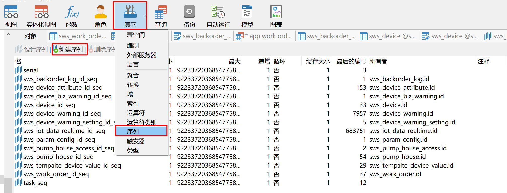

进来以后当然要设置一些参数：

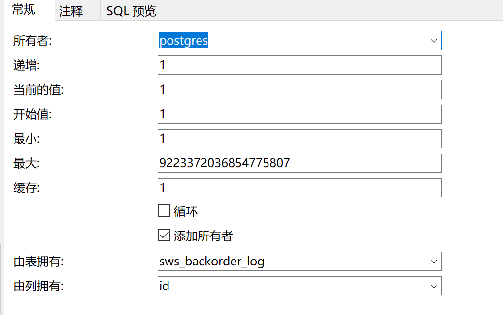


## mybatis-generator postgresql

参考：https://www.cnblogs.com/mengjianzhou/p/7918590.html

```xml
postgresql 配置文件
 
<?xml version="1.0" encoding="UTF-8"?>
<!DOCTYPE generatorConfiguration
        PUBLIC "-//mybatis.org//DTD MyBatis Generator Configuration 1.0//EN"
        "http://mybatis.org/dtd/mybatis-generator-config_1_0.dtd">
<generatorConfiguration>
    <classPathEntry location="D:/javaLib/postgresql-42.1.4.jar" />
 
    <context id="test" targetRuntime="MyBatis3">
        <plugin type="org.mybatis.generator.plugins.EqualsHashCodePlugin"></plugin>
        <plugin type="org.mybatis.generator.plugins.SerializablePlugin"></plugin>
        <plugin type="org.mybatis.generator.plugins.ToStringPlugin"></plugin>
 
        <commentGenerator>
            <!-- 这个元素用来去除指定生成的注释中是否包含生成的日期 false:表示保护 -->
            <!-- 如果生成日期，会造成即使修改一个字段，整个实体类所有属性都会发生变化，不利于版本控制，所以设置为true -->
            <property name="suppressDate" value="true" />
            <!-- 是否去除自动生成的注释 true：是 ： false:否 -->
            <property name="suppressAllComments" value="false" />
        </commentGenerator>
        <!--数据库链接URL，用户名、密码 -->
        <jdbcConnection driverClass="org.postgresql.Driver"
                        connectionURL="jdbc:postgresql://127.0.0.1:5432/erp"
                        userId="admin"
                        password="123456">
        </jdbcConnection>
        <javaTypeResolver>
            <property name="forceBigDecimals" value="false" />
        </javaTypeResolver>
        <!-- 生成模型的包名和位置 -->
        <javaModelGenerator targetPackage="包名" targetProject="文件路径"> <property name="enableSubPackages" value="true" />
        <property name="trimStrings" value="true" /> </javaModelGenerator>
        <!-- 生成映射文件的包名和位置 -->
        <sqlMapGenerator targetPackage="包名" targetProject="文件路径"> <property name="enableSubPackages" value="true" /> </sqlMapGenerator>
        <!-- 生成DAO的包名和位置 -->
        <javaClientGenerator type="XMLMAPPER" targetPackage="包名" implementationPackage="文件路径" argetProject="文件路径">
        <property name="enableSubPackages" value="true" /> </javaClientGenerator>
        <!-- 要生成哪些表 -->
        <table schema="public" tableName="table_name"/> </context>
        </generatorConfiguration>
　　

<?xml version="1.0" encoding="UTF-8"?>
<project xmlns="http://maven.apache.org/POM/4.0.0"
         xmlns:xsi="http://www.w3.org/2001/XMLSchema-instance"
         xsi:schemaLocation="http://maven.apache.org/POM/4.0.0 http://maven.apache.org/xsd/maven-4.0.0.xsd">
    <modelVersion>4.0.0</modelVersion>
 
    <groupId>com.robert.mybatis</groupId>
    <artifactId>mybatisGenerator</artifactId>
    <version>1.0-SNAPSHOT</version>
 
    <properties>
        <project.build.sourceEncoding>UTF-8</project.build.sourceEncoding>
    </properties>
 
    <dependencies>
        <dependency>
            <groupId>org.mybatis.generator</groupId>
            <artifactId>mybatis-generator-core</artifactId>
            <version>1.3.5</version>
        </dependency>
        <dependency>
            <groupId>org.mybatis</groupId>
            <artifactId>mybatis</artifactId>
            <version>3.2.8</version>
        </dependency>
        <dependency>
            <groupId>org.mybatis</groupId>
            <artifactId>mybatis</artifactId>
            <version>3.2.8</version>
        </dependency>
 
    </dependencies>
 
    <build>
        <plugins>
            <plugin>
                <groupId>org.apache.maven.plugins</groupId>
                <artifactId>maven-compiler-plugin</artifactId>
                <configuration>
                    <source>1.7</source>
                    <target>1.7</target>
                </configuration>
                <version>3.3</version>
            </plugin>
            <plugin>
                <groupId>org.mybatis.generator</groupId>
                <artifactId>mybatis-generator-maven-plugin</artifactId>
                <version>1.3.5</version>
                <executions>
                    <execution>
                        <id>Generate MyBatis Artifacts</id>
                        <goals>
                            <goal>generate</goal>
                        </goals>
                    </execution>
                </executions>
                <dependencies>
                    <dependency>
                        <groupId>org.postgresql</groupId>
                        <artifactId>postgresql</artifactId>
                        <version>9.4-1201-jdbc4</version>
                    </dependency>
                </dependencies>
            </plugin>
        </plugins>
    </build>
</project>

```

http://182.150.63.195:28989/jzpusw-install/api/0/install/concentrationControlList


换新电脑 项目启动不了 要加hosts  

C:\Windows\System32\drivers\etc  

如果修不了 要改一下hosts属性 ：

讲只读去掉  

安全里面  选完全控制

```java
####### --------------------------jdrx start------------------------------

192.168.10.241 postgresql_server
192.168.10.130 transp_in
192.168.10.242 mysql_server
192.168.10.243 gf_test_machine
192.168.80.106 pg-common-01

#大数据
192.168.30.241 dev-conn rocketmq-master-a rocketmq-nameserver-a
192.168.30.242 dev-mana
192.168.30.243 k8s-master
192.168.30.244 k8s-node1
192.168.30.245 k8s-node2 rocketmq-master-b rocketmq-nameserver-b
192.168.10.120 ebmas-01
192.168.10.121 ebmas-02
192.168.10.122 ebmas-03
192.168.10.123 ambari-server
192.168.0.81 ambari-server-test
192.168.0.82 ebmas-test-01
192.168.0.83 ebmas-test-02
192.168.0.84 ebmas-test-03
192.168.40.85 ebmas-test-04
192.168.40.85 ebmas-neo4j
192.168.10.124 platform_integration


#基础平台测试环境[V1.0版本]
192.168.10.160 ms-gw-01  ms-rc-00  
192.168.10.161 ms-rc-01 
192.168.10.162 ms-rc-02 
192.168.10.163 grc ggw 
192.168.10.164 redis-common-01  mysql-common-01  rabbitmq-common-01
192.168.10.150 dm-server
192.168.10.250 ms-web-01
192.168.0.200 loggerserver
192.168.10.244 postgres-common-01
192.168.30.246 rocketmq-common-01
192.168.30.249 mycat-server
192.168.0.121 es-common-01
192.168.0.121 ooo-common-01
192.168.40.250 ms-cc   mongodb-common-01  
192.168.0.124 activemq-common-01 hudson
192.168.10.243 gf_test_machine
192.168.10.165 ms-rc-05

#基础平台测试环境[V2.0版本]
192.168.10.160 ms-gw-01  ms-rc-00
192.168.10.161 ms-rc-01
192.168.10.162 ms-rc-02
192.168.40.250 ms-cc-00
192.168.40.251 ms-cc-01
192.168.40.252 ms-cc-02
192.168.10.164 redis-common-01  mysql-common-01  rabbitmq-common-01
192.168.10.250 ms-web-01
192.168.10.250 fs-common-01
192.168.0.200 loggerserver
192.168.30.165 postgres-common-01
192.168.30.246 rocketmq-common-01
192.168.30.222 dble-server
192.168.40.250 mongodb-common-01
192.168.0.121 es-common-01
192.168.0.121 ooo-common-01
192.168.30.249 mycat-server

####### --------------------------jdrx end------------------------------

```


## 配置PostgreSql  generator

```xml
<?xml version="1.0" encoding="UTF-8"?>
<!DOCTYPE generatorConfiguration
        PUBLIC "-//mybatis.org//DTD MyBatis Generator Configuration 1.0//EN"
        "http://mybatis.org/dtd/mybatis-generator-config_1_0.dtd">

<generatorConfiguration>

    <context id="postgrsesqlgenerator" targetRuntime="MyBatis3">

        <property name="autoDelimitKeywords" value="true"/>
        <!--可以使用``包括字段名，避免字段名与sql保留字冲突报错-->
        <property name="beginningDelimiter" value="`"/>
        <property name="endingDelimiter" value="`"/>

        <!-- 自动生成toString方法 -->
        <plugin type="org.mybatis.generator.plugins.ToStringPlugin"/>
        <!-- 自动生成equals方法和hashcode方法 -->
        <plugin type="org.mybatis.generator.plugins.EqualsHashCodePlugin"/>

        <!-- 非官方插件 https://github.com/itfsw/mybatis-generator-plugin -->
        <!-- 查询单条数据插件 -->
        <plugin type="com.itfsw.mybatis.generator.plugins.SelectOneByExamplePlugin"/>
        <!-- 查询结果选择性返回插件 -->
        <plugin type="com.itfsw.mybatis.generator.plugins.SelectSelectivePlugin"/>
        <!-- Example Criteria 增强插件 -->
        <plugin type="com.itfsw.mybatis.generator.plugins.ExampleEnhancedPlugin"/>
        <!-- 数据Model属性对应Column获取插件 -->
        <plugin type="com.itfsw.mybatis.generator.plugins.ModelColumnPlugin"/>
        <!-- 逻辑删除插件 -->
        <plugin type="com.itfsw.mybatis.generator.plugins.LogicalDeletePlugin">
            <!-- 这里配置的是全局逻辑删除列和逻辑删除值，当然在table中配置的值会覆盖该全局配置 -->
            <!-- 逻辑删除列类型只能为数字、字符串或者布尔类型 -->
            <property name="logicalDeleteColumn" value="deleted"/>
            <!-- 逻辑删除-已删除值 -->
            <property name="logicalDeleteValue" value="1"/>
            <!-- 逻辑删除-未删除值 -->
            <property name="logicalUnDeleteValue" value="0"/>
        </plugin>

        <commentGenerator>
            <property name="suppressDate" value="true"/>
            <property name="suppressAllComments" value="true"/>
        </commentGenerator>

        <!--数据库连接信息-->
        <jdbcConnection driverClass="org.postgresql.Driver"
                        connectionURL="jdbc:postgresql://192.168.10.244:5432/jzpu-water-bz"
                        userId="postgres"
                        password="postgres"/>

        <javaTypeResolver>
            <property name="useJSR310Types" value="true"/>
        </javaTypeResolver>

        <javaModelGenerator targetPackage="com.jdrx.install.beans.entity" targetProject="src/main/java"/>
        <sqlMapGenerator targetPackage="mapper" targetProject="src/main/resources"/>
        <javaClientGenerator type="XMLMAPPER" targetPackage="com.jdrx.install.dao"  targetProject="src/main/java"/>

        <table tableName="t_invoice">
            <generatedKey column="id" sqlStatement="PostgreSql" identity="true"/>
        </table>
        
    </context>
</generatorConfiguration>

```

pom.xml 里面 要导入插件  这样的话 右边maven插件才会有 generator


```xml
 <build>
        <plugins>
            <plugin>
                <groupId>org.mybatis.generator</groupId>
                <artifactId>mybatis-generator-maven-plugin</artifactId>
                <version>1.3.7</version>
                <configuration>
                    <configurationFile>
                        mybatis-generator/generatorConfig.xml
                    </configurationFile>
                    <overwrite>true</overwrite>
                    <verbose>true</verbose>
                </configuration>
                <dependencies>
                    <!--<dependency>
                        <groupId>postgrsesql</groupId>
                        <artifactId>mysql-connector-java</artifactId>
                        <version>5.1.46</version>
                    </dependency>-->
                    <dependency>
                        <groupId>postgresql</groupId>
                        <artifactId>postgresql</artifactId>
                        <version>9.1-901-1.jdbc4</version>
                    </dependency>
                    <dependency>
                        <groupId>com.itfsw</groupId>
                        <artifactId>mybatis-generator-plugin</artifactId>
                        <version>1.3.2</version>
                    </dependency>
                    <!--lombok-->
                    <dependency>
                        <groupId>org.projectlombok</groupId>
                        <artifactId>lombok</artifactId>
                        <version>1.18.8</version>
                        <optional>true</optional>
                    </dependency>

                </dependencies>
            </plugin>
        </plugins>

    </build>

```

**git stash**

开始点


开票申请：

```
{
  "installId": 49551,
  "installNo": "CD2019072500330",
  "reportType": 1,
  "invoiceType": 1,
  "customerName": "yanglei",
  "projectName": "自来水",
  "projectAdress": "成都",
  "managerContact": "15214031757",
  "managerName": "杨磊",
  "paymentAmount": "1000",
  "businessDepartmentHead": "业务部门",
  "businessDepartmentHeadTime": "1563984000000",
  "collectionDepartmentAgent": "收款部门",
  "collectionDepartmentAgentTime": "1563984000000",
  "businessDepartmentAgent": "业务部门经办人",
  "businessDepartmentAgentTime": "1563984000000",
  "applicationInformation": "开发票申请"
}

```

开票审核：

```json
{
"installId": "75712",
"waitId": "77500",
"auditResults": "1",
"auditInstructions": "好",
"instanceId": "1287503",
"installNo": "CX2020050800155"
}

```


## PostgreSql 设置数据库id自增

在PostgreSQL当中，我们实现ID自增首先创建一个关联序列序列

打开navcat查询列表，去创建一个序列

```sql
CREATE SEQUENCE upms_log_id_seq START 10;

```


然后在字段默认值里设 `nextval('` upms_log_id_seq`')`即可。


参考：https://www.jianshu.com/p/9687c9e66cec


## mybatis-generator postgresql

参考：https://www.cnblogs.com/mengjianzhou/p/7918590.html

```xml
postgresql 配置文件
 
<?xml version="1.0" encoding="UTF-8"?>
<!DOCTYPE generatorConfiguration
        PUBLIC "-//mybatis.org//DTD MyBatis Generator Configuration 1.0//EN"
        "http://mybatis.org/dtd/mybatis-generator-config_1_0.dtd">
<generatorConfiguration>
    <classPathEntry location="D:/javaLib/postgresql-42.1.4.jar" />
 
    <context id="test" targetRuntime="MyBatis3">
        <plugin type="org.mybatis.generator.plugins.EqualsHashCodePlugin"></plugin>
        <plugin type="org.mybatis.generator.plugins.SerializablePlugin"></plugin>
        <plugin type="org.mybatis.generator.plugins.ToStringPlugin"></plugin>
 
        <commentGenerator>
            <!-- 这个元素用来去除指定生成的注释中是否包含生成的日期 false:表示保护 -->
            <!-- 如果生成日期，会造成即使修改一个字段，整个实体类所有属性都会发生变化，不利于版本控制，所以设置为true -->
            <property name="suppressDate" value="true" />
            <!-- 是否去除自动生成的注释 true：是 ： false:否 -->
            <property name="suppressAllComments" value="false" />
        </commentGenerator>
        <!--数据库链接URL，用户名、密码 -->
        <jdbcConnection driverClass="org.postgresql.Driver"
                        connectionURL="jdbc:postgresql://127.0.0.1:5432/erp"
                        userId="admin"
                        password="123456">
        </jdbcConnection>
        <javaTypeResolver>
            <property name="forceBigDecimals" value="false" />
        </javaTypeResolver>
        <!-- 生成模型的包名和位置 -->
        <javaModelGenerator targetPackage="包名" targetProject="文件路径"> <property name="enableSubPackages" value="true" />
        <property name="trimStrings" value="true" /> </javaModelGenerator>
        <!-- 生成映射文件的包名和位置 -->
        <sqlMapGenerator targetPackage="包名" targetProject="文件路径"> <property name="enableSubPackages" value="true" /> </sqlMapGenerator>
        <!-- 生成DAO的包名和位置 -->
        <javaClientGenerator type="XMLMAPPER" targetPackage="包名" implementationPackage="文件路径" argetProject="文件路径">
        <property name="enableSubPackages" value="true" /> </javaClientGenerator>
        <!-- 要生成哪些表 -->
        <table schema="public" tableName="table_name"/> </context>
        </generatorConfiguration>

<?xml version="1.0" encoding="UTF-8"?>
<project xmlns="http://maven.apache.org/POM/4.0.0"
         xmlns:xsi="http://www.w3.org/2001/XMLSchema-instance"
         xsi:schemaLocation="http://maven.apache.org/POM/4.0.0 http://maven.apache.org/xsd/maven-4.0.0.xsd">
    <modelVersion>4.0.0</modelVersion>
 
    <groupId>com.robert.mybatis</groupId>
    <artifactId>mybatisGenerator</artifactId>
    <version>1.0-SNAPSHOT</version>
 
    <properties>
        <project.build.sourceEncoding>UTF-8</project.build.sourceEncoding>
    </properties>
 
    <dependencies>
        <dependency>
            <groupId>org.mybatis.generator</groupId>
            <artifactId>mybatis-generator-core</artifactId>
            <version>1.3.5</version>
        </dependency>
        <dependency>
            <groupId>org.mybatis</groupId>
            <artifactId>mybatis</artifactId>
            <version>3.2.8</version>
        </dependency>
        <dependency>
            <groupId>org.mybatis</groupId>
            <artifactId>mybatis</artifactId>
            <version>3.2.8</version>
        </dependency>
 
    </dependencies>
 
    <build>
        <plugins>
            <plugin>
                <groupId>org.apache.maven.plugins</groupId>
                <artifactId>maven-compiler-plugin</artifactId>
                <configuration>
                    <source>1.7</source>
                    <target>1.7</target>
                </configuration>
                <version>3.3</version>
            </plugin>
            <plugin>
                <groupId>org.mybatis.generator</groupId>
                <artifactId>mybatis-generator-maven-plugin</artifactId>
                <version>1.3.5</version>
                <executions>
                    <execution>
                        <id>Generate MyBatis Artifacts</id>
                        <goals>
                            <goal>generate</goal>
                        </goals>
                    </execution>
                </executions>
                <dependencies>
                    <dependency>
                        <groupId>org.postgresql</groupId>
                        <artifactId>postgresql</artifactId>
                        <version>9.4-1201-jdbc4</version>
                    </dependency>
                </dependencies>
            </plugin>
        </plugins>
    </build>
</project>

```


## 分布式事务

项目中 jta atomikos 是分布式事务。


查询预装列表 ，findAlarmList里面  findInstallByAny方法，

里面有使用DECODE 函数，这个函数是oracle里面的，表示if-else-then的


**decode 函数基本语法**：

```
decode（字段|表达式，条件1，结果1，条件2，结果2，...，条件n，结果n，缺省值）；
--缺省值可以省略

```

 表示如果 字段|表达式 等于 条件1 时，DECODE函数的结果返回 条件1 ,...,如果不等于任何一个条件值，则返回缺省值。
【注意】：decode 函数 ，只能在select 语句用。

**decode 函数 用法**：

1.使用decode 判断字符串是否一样

sql 测试：

```
1 select empno,
2        decode(empno,
3        7369,'smith',
4        7499,'allen',
5        7521,'ward',
6        7566,'jones',
7        'unknow') as name 
8 from emp 
9 where rownum<=10;

```

参考： https://www.cnblogs.com/jiaxinwei/p/10252513.html


**pgsql如果要表达这个意思，需要用另一种：**


oracle的decode大家都很熟悉，现在用postgresql的数据库好像没有类似的方法，在网上找了下有种写法也类似。

```sql
select (case when order_count = 0 then 1 else order_count end) as ordercount from order

```

case when 当数据order_count是0我们把ordercount结果设置成1，如果不是零我们就取order_count的值。小宝制造。

case when 当数据order_count是0我们把ordercount结果设置成1，如果不是零我们就取order_count的值。小宝制造。


## Springboot application.yml和bootstrap.yml 区别：

yml与properties
其实yml和properties文件是一样的原理，且一个项目上要么yml或者properties，二选一的存在。

推荐使用yml，更简洁。

bootstrap与application
1.加载顺序
这里主要是说明application和bootstrap的加载顺序。

bootstrap.yml（bootstrap.properties）先加载
application.yml（application.properties）后加载
bootstrap.yml 用于应用程序上下文的引导阶段。

bootstrap.yml 由父Spring ApplicationContext加载。

父ApplicationContext 被加载到使用 application.yml 的之前。

2.配置区别
bootstrap.yml 和application.yml 都可以用来配置参数。

bootstrap.yml 可以理解成系统级别的一些参数配置，这些参数一般是不会变动的。
application.yml 可以用来定义应用级别的，如果搭配 spring-cloud-config 使用 application.yml 里面定义的文件可以实现动态替换。
使用Spring Cloud Config Server时，应在 bootstrap.yml 中指定：

spring.application.name
spring.cloud.config.server.git.uri
一些加密/解密信息


当使用Spring Cloud时，通常从服务器加载“real”配置数据。为了获取URL（和其他连接配置，如密码等），您需要一个较早的或“bootstrap”配置。因此，您将配置服务器属性放在bootstrap.yml中，该属性用于加载实际配置数据（通常覆盖application.yml [如果存在]中的内容）。

当然，在一些情况上不用那么区分这两个文件，你只需要使用application文件即可，把全部选项都写在这里，效果基本是一致的，在不考虑上面的加载顺序覆盖的问题上。


## 济宁里面文件上传 

选择文件 然后上传 是前端干的事情 

上传完了以后 返回一些信息

这些信息是需要后端进行处理的

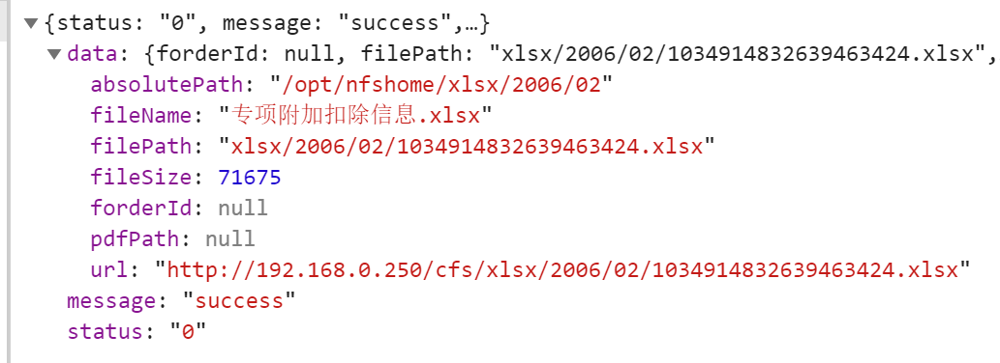


# Exchange

## 一.交易所项目

### 后台管理 后端:

## 1.controller

### ActivityController前端控制器

#### /activity/modify

里面用到的LocalKey是i18n中的，是国际化的一部分。里面包含各种各样的参数很多。

#### /activity/query

这个里面的请求参数中用到的 BaseDTO，是在代码里面传输的时候进行的操作，也可以。

#### /activity/like

这里面的模糊查询  title和lang需要改吗？

### AdminController管理系统控制器

在类的最开始，用到一个java中的工具类，Hutool.

什么是Hutool？
Hutool是一个Java工具包，也就是一个工具箱，一个utils集合，它帮助我们简化每一行代码，减少每一个方法，让Java语言也可以简单粗暴。Hutool最初是作者项目中“util”包的一个整理，后来慢慢积累并加入更多非业务相关功能，并广泛学习其它开源项目精髓，经过自己整理修改，最终形成丰富的开源工具集。

 https://blog.csdn.net/moshowgame/article/details/80087954 

。。。。详细见博客。


这里用到RedisPlugin，radis插件，在plugin中的redis中的RedisPlugin里面。

这是Redis中的一个服务工具类，里面有连接对象，指定失效时间，获取过期时间，删除缓存等等，都是对redis中数据进行的操作。

#### /dict  获取字典数据

#### /upgrade  升级配置


### AdvertControllerotc广告控制器

#### /otc/advert/query 广告列表 


### ArticleController文章管理控制器

#### /article/query 查询分页 

#### /article/modify 新增修改  

#### /article/delete 删除 


### AssetController资产中心

#### /assets/coins 获取货币列表 

下面还有,但是被注销啦 


### BaseController基础控制类

这个里面没有请求url 


### ChainController用户出入金控制器

#### /chain/list  提币申请

#### /chain/audit 审核 

财务管理  提币审核

#### /chain/query 出入金列表 


### CoinController币种控制器

#### /coin/modify 币种配置

#### /coin/query 币种查询 

#### /coin/detail/{id} 币种详情

#### /coin/delete/{id}  删除币种

#### /coin/list 列表 不分页


### DrawController

里面有幸运转盘等东西

#### /draw/aecords  幸运转盘抽奖记录


### FundManagementController资金管理

#### /fundManagement/rechargeFlow 手动上分记录

#### /fundManagement/foundUser  搜索某个账户 

#### //fundManagement/recharge 手动充值 

#### /fundManagement/rechargeCoin 手动提现

#### /fundManagement/outExamineList 财务出金审核列表

#### /fundManagement/outExamine 财务出金审核 


### GiveController赠送控制器

#### /give/list 赠送记录

#### /give/check 核查数据

#### /give/grant 发送代币 


### KycController  kyc认证控制器

#### /kyc /query  kyc 列表

#### /kyc /audit 认证审核


### MarketController交易市场控制器

#### /market/modify 添加修改市场

#### /market/query   市场的查询

#### /market/pair 交易对查询 

#### /market/交易对添加或者更新

#### /market/pair/delete/{id } 删除 


### MemberController会员

里面有用户服务接口等

用StrUtil里面的字符和方法

#### /member/query  查询分页用户

这里的一些错误信息,以key和value的方式放到了messages_zh_CN.prooerties 中.


#### /member/capotalCipherReset 用户资金密码重置,需要添加权限认证 

#### /member/lockUser 锁定用户,修改用户状态,  禁止转账,禁止交易,禁止转出,  需要添加权限认证

#### /member/identityInformation 获取用户身份信息,需要添加权限认证  


### MerchantControllerotc商户控制器

otc商户控制器,  里面有获取商户交易记录，商户的审核列表等等

#### /otc/merchant/query 获取商户otc交易记录

#### /otc/merchant/list 商户的审核列表 

这个里面用了一个连接查询  

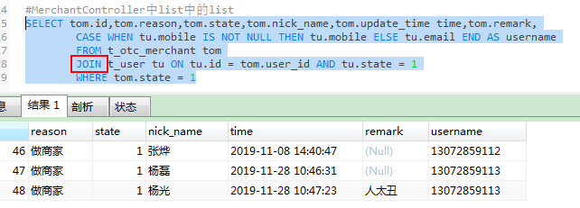


一般用的是left join左连接,内连接inner join.

这里的join意思就是内连接   和 inner join 的用法差不多.


#### /otc/merchant/audit  审核商户 

#### /otc/merchant/prohibit 禁用/解除禁用  发广告的权利


### MessageController站内信控制器

站内信 控制器

#### /message/query 站内信列表 

#### /message/modify 发送站内信


### NoticeController 

里面有文章服务接口，文章列表等

#### notice/query    文章列表

这里面用的映射bean是ActivityEntity  

#### notice/modify	 新增修改

#### notice/delete/{id}   删除操作

删除操作就是讲数据库种的status的值修改成


### OrderController交易订单控制器

这里的委托订单撤销操作没有进行修改，不用改，然后弄

#### /order/coinCoinRecords  获取币的交易记录,也就是流水

#### /order/secondsContractRecords  获取秒合约记录

#### /order/bigContractRecords  获取大合约记录

#### /order/oTcRecords   otc记录

#### /order/entrustedRecords  获取当前委托订单

#### /order/dealActives    获取历史订单 交易信息,流水

#### /order/revoke  委托订单撤销操作


### OTCOrderControllerOTC订单管理控制器

OTC订单管理控制器

#### /otc/order/query 获取广告对应的订单列表

#### /otc/order/cancel/{id}     取消订单

#### /otc/order/adopt/{id}   放币

#### /otc/order/details/{id} 获取订单详情

#### /otc/order/declare  申述列表 

这里的方法里面用到的: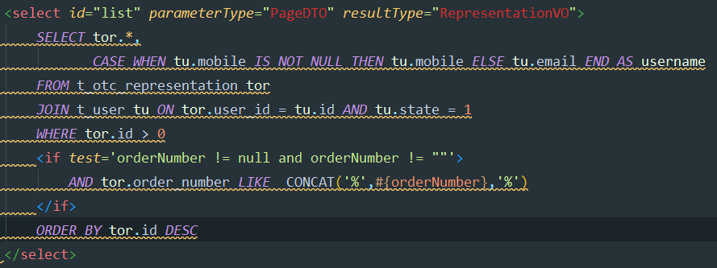

这里的业务逻辑是:

页面要想显示出来  state = 1 ,同时在user表里面要有对于的user 

也是内连接查询.


#### /otc/order/handle 处理申诉


### ParamController参数设置控制器

参数设置控制器

#### /param/query  参数分页列表

#### /param/modify 参数新增或者编辑


### SecondsContractController秒合同控制器

#### /secondsContract/query 获取秒合同配置

#### /secondsContract/updateOrIn 添加或更新秒合同配置

#### /secondsContract/queryLastOrder  查询最后一次订单

#### /secondsContract/collection  集合


### TeamController团队控制器

里面有团队服务接口，用户服务接口，团队个人推广

#### /team/extension 团队个人推广

group by 聚合函数,分组用的 :

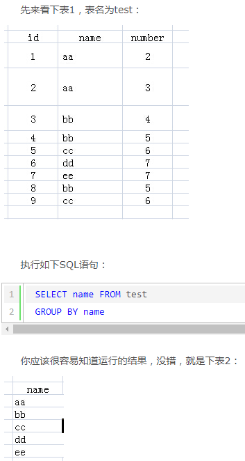


这里的groupby分组 ,根据用户id分组  . 

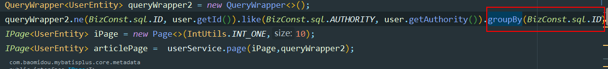

Ctrl  +  p 方法参数提醒   

这个查询语句里面的这三个地方,其实是三个字符串,在navicat里面进行运行的时候,这里要加引号" "

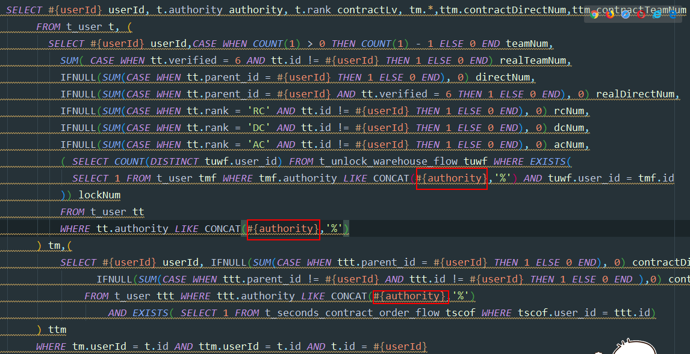

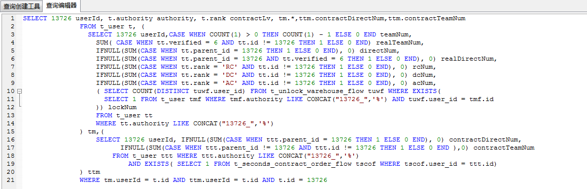


#### /team/extensionC 团队下属分页


### UEditorController  UE编辑器控制

这个里面进行了修改  UE编辑器

#### /editor/upload  文件上传


### UserController用户控制器

里面有登录，设置用户等级，修改密码等

#### /user/login  用户登录

#### /user/intervene 设置用户等级

#### /user/reset 重新设置密码

#### /user/check核查用户情况


### UserWalletController用户钱包操作

里面有钱包服务操作，资产明细用户信息

#### /wallet/details 资产明细用户币信息

#### /wallet/changeWallet  修改钱包

#### /wallet/getUserWallet  得到用户钱包


### WorkController工单控制器

里面有工单服务，工单列表等

#### /work/reply  回复

#### /work/query   工单列表

#### /work/modify   编辑状态

/work/detail/{id}  详情

## 2.services

### ColdlarServiceImpl

这里面有设置签名，设置提现任务等

这个里面做了修改，改了好多

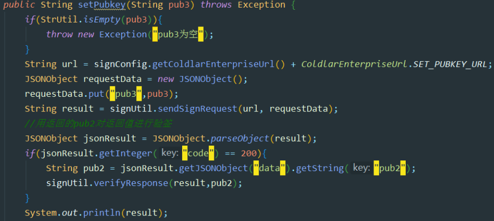

提交提现任务

还有下面的好多

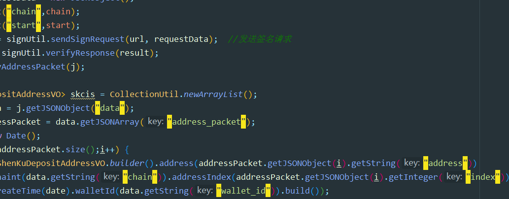

和交易和币有关的不弄，SecondsContract不管

充值验证没改   不改 


## 2.constant

这里面是业务级常量。写这些事为了代码好进行维护，所以写到这里。

### RedisConst

redis中用到的缓存常量

里面有redis用户对象，货币配置等，交易对配置。登录有效时间等等等，这里的常量，主要是用在redis中的map中，这里的常量应该是key。


## 后台管理 前端:

用户管理模块在这里放着.这里不光有用户模块,还有其他模块,用户管理里面的实名认证模块,团队管理等等模块.

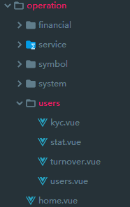

模块中,  有一些通用的模块,供其他地方调用

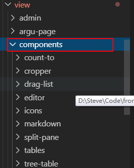

这里的这个方法是打开页面,就会 弹出的一个方法 .  

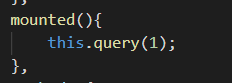

methods里面的方法,就是后端requestMapping里面的url

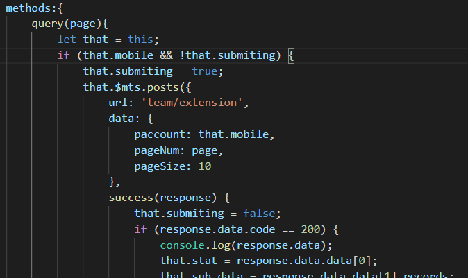

data里面的东西, 就是这个页面所需要的数据,页面根据这些数据的变化和不同,对页面进行一定程度的显示. 

这里的数据也就和后端bean中的数据是一样的 . 

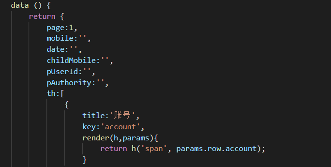


### 交易所前台:

### 移动端 前端

注册账户和密码  

账户是1367623781@qq.com

密码是19950921y


使用前端的时候,首先要配置一下:

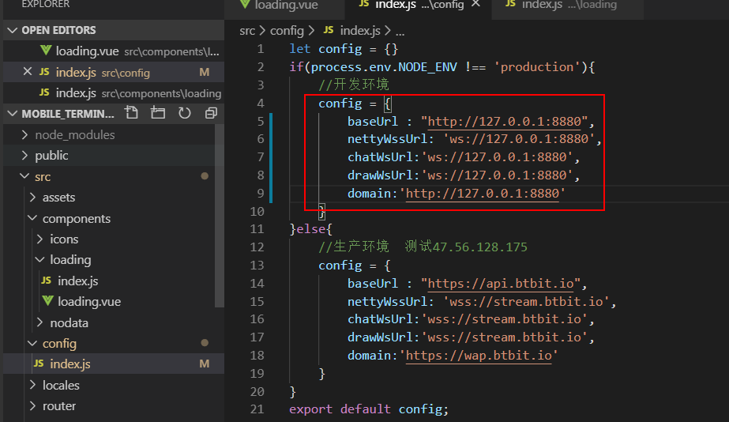


下面是实名认证:

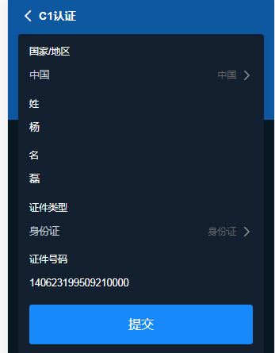


用户钱包,各种币   : 对于数据库 

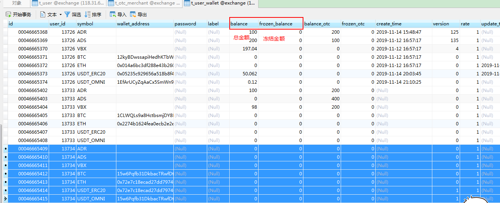


要想在VScode中打开两个前端, 就需要ctrl + shift + n 新打开一个窗口

## 移动端 后端  

## 1.controller

### AdviceController 咨询建议控制器

#### /advice/query 建议分页列表 

#### /advice/modify 新增咨询

#### /advice/upload 上传图片


### ArticleController 文章控制器

#### /article/{id}  文章详情


### BaseController 基础控制器父类

缓存工具 

 默认语言

 用户token  

获取web

 用户登录token

获取当前用户登录对象

重新设置登录对象

限制开始

判断邮箱 

判断电话号码

判断邮箱还是电话号吗

获取当前货币

获取交易对配置

当前语言


### ChainController 代币流水控制器

#### /chain/address 获取代币对应的钱包地址

#### /chain/deposit/flow 充币流水

#### /chain/withdrow/flow 提币流水

#### /chain/captcha 提币短信

#### /chain/withdraw 提币申请 


### ChartController  tv控制器,k线(前端插件使用类似轮询的方式udf)

#### /chart/config 图标配置

#### /chart/time  时间戳 


### ChequeController 提币地址管理  

#### /cheque/query 获取用户提币地址 

#### /cheque/list  列表不分页

#### /cheque/modify 新增或编辑提币地址

#### /cheque/delete/{id}  删除提币地址

#### /cheque/captcha 添加地址发送验证码


### CoinController  币控制器

#### /coin/info 币简介


### DrawController  抽奖控制器

#### /draw/query  获取抽奖列表 

#### /draw/list 获取抽奖活动的具体奖项

#### /draw/log 获取抽奖活动的抽奖记录(抽中)

#### /draw/history  获取抽奖活动的抽奖历史(抽中)

#### /draw/own  我的奖品

#### /draw/info 获取抽奖列表次数 ,kyc次数 , 秒合同次数

#### /draw/prize 抽奖


### KycController 实名认证

#### /kyc/authC1 C1认证 

#### /kyc/authC2 C2认证

#### /kyc/upload 上传图片

#### /kyc/details 用户KYC情况


### LockWarehouseController  

#### /lockWarehouse/lockCoin 用户锁仓 

#### /lockWarehouse/lockDetails 用户锁仓情况

#### /lockWarehouse/unlockFlow 用户解锁流水列表(分页)

#### /lockWarehouse/config 锁仓配置

#### /lockWarehouse/dayTaskNum 获取当天任务有效次数


### OrderController 交易订单控制器

#### /order/business 用户下单

这里面是币币交易   

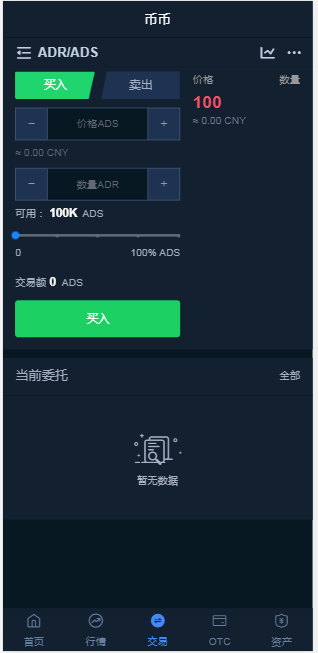

买入卖出一套流程走完以后,才算完成.

买入卖出,这叫撮合.撮合要扣手续费.

可以自己买自己的.自己买自己的,相当于自己炒自己的.   

买入卖出一套流程走完以后, 行情里面才会出现k线图.

这是交易用到的表.

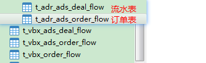

每次交易,有一个冻结资金,  交易完成  冻结资金还给

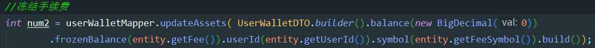


里面有一个VBX是记录手续费的,


撮合交易队列,不同于MQ,这是自己的一个队列

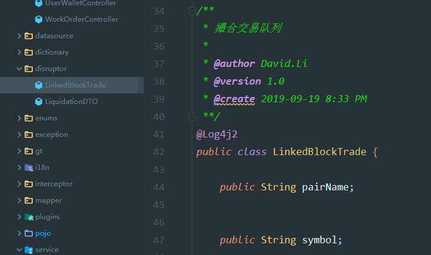

主方法中,有一个线程池   ThreadPoolTaskScheduler的使用，**定时任务开启与关闭**

 https://blog.csdn.net/qq_32711309/article/details/84944534  这篇文章里面有写

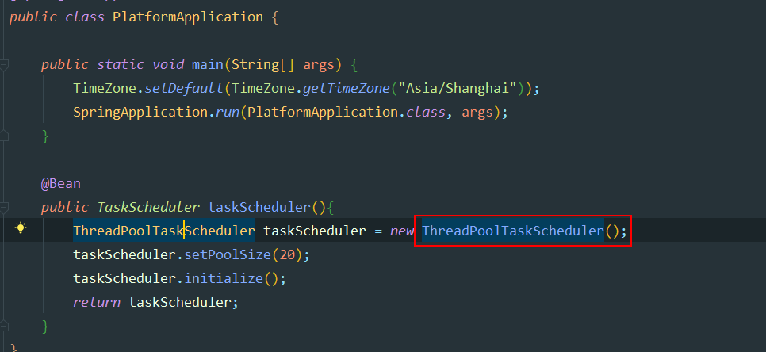

这里面用的队列:LinkedBlockingQueue 

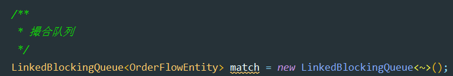

查资料发现  下边   :    https://www.cnblogs.com/duodushuduokanbao/p/9556555.html 


##### 阻塞队列之LinkedBlockingQueue

概述  

LinkedBlockingQueue内部由**单链表实现**，只能从head取元素，从tail添加元素。添加元素和获取元素都有独立的锁，也就是说**LinkedBlockingQueue是读写分离的**，读写操作可以并行执行。LinkedBlockingQueue采用可重入锁(**ReentrantLock)**来保证在并发情况下的线程安全。

构造器

LinkedBlockingQueue一共有三个构造器，分别是无参构造器、可以指定容量的构造器、可以穿入一个容器的构造器。如果在创建实例的时候调用的是无参构造器，LinkedBlockingQueue的默认容量是Integer.MAX_VALUE，这样做很可能会导致队列还没有满，但是内存却已经满了的情况（内存溢出）。

```
1 public LinkedBlockingQueue()；   //设置容量为Integer.MAX
2 
3 public LinkedBlockingQueue(int capacity)；  //设置指定容量
4 
5 public LinkedBlockingQueue(Collection<? extends E> c)；  //穿入一个容器，如果调用该构造器，容量默认也是Integer.MAX_VALUE

```

LinkedBlockingQueue常用操作

取数据

**take()：首选。当队列为空时阻塞**

poll()：弹出队顶元素，队列为空时，返回空

peek()：和poll烈性，返回队队顶元素，但顶元素不弹出。队列为空时返回null

remove(Object o)：移除某个元素，队列为空时抛出异常。成功移除返回true

 

添加数据

**put()：首选。队满是阻塞**

offer()：队满时返回false

 

判断队列是否为空

**size()方法会遍历整个队列，时间复杂度为O(n),所以最好选用isEmtpy**

 

put元素原理

基本过程：

1.判断元素是否为null，为null抛出异常

2.加锁(可中断锁)

3.判断队列长度是否到达容量，如果到达一直等待

4.如果没有队满，enqueue()在队尾加入元素

5.队列长度加1，此时如果队列还没有满，调用signal唤醒其他堵塞队列

[](javascript:void(0);)

```
 1  if (e == null) throw new NullPointerException();
 2        
 3         int c = -1;
 4         Node<E> node = new Node<E>(e);
 5         final ReentrantLock putLock = this.putLock;
 6         final AtomicInteger count = this.count;
 7         putLock.lockInterruptibly();
 8         try {
 9             while (count.get() == capacity) {
10                 notFull.await();
11             }
12             enqueue(node);
13             c = count.getAndIncrement();
14             if (c + 1 < capacity)
15                 notFull.signal();
16         } finally {
17             putLock.unlock();
18         }

```

[](javascript:void(0);)

 

take元素原理

 基本过程：

1.加锁(依旧是ReentrantLock)，注意这里的锁和写入是不同的两把锁

2.**判断队列是否为空，如果为空就一直等待**

3.通过dequeue方法取得数据

3.取走元素后队列是否为空，如果不为空唤醒其他等待中的队列

[](javascript:void(0);)

```
 1 public E take() throws InterruptedException {
 2         E x;
 3         int c = -1;
 4         final AtomicInteger count = this.count;
 5         final ReentrantLock takeLock = this.takeLock;
 6         takeLock.lockInterruptibly();
 7         try {
 8             while (count.get() == 0) {
 9                 notEmpty.await();
10             }
11             x = dequeue();
12             c = count.getAndDecrement();
13             if (c > 1)
14                 notEmpty.signal();
15         } finally {
16             takeLock.unlock();
17         }
18         if (c == capacity)
19             signalNotFull();
20         return x;
21     }

```

[](javascript:void(0);)

enqueue()和dequeue()方法实现都比较简单，无非就是将元素添加到队尾，从队顶取走元素，感兴趣的朋友可以自己去看一下，这里就不粘贴了。

 

LinkedBlockingQueue与LinkedBlockingDeque比较

 

LinkedBlockingDeque和LinkedBlockingQueue的**相同点**在于： 
\1. 基于链表 
\2. 容量可选，不设置的话，就是Int的最大值

和LinkedBlockingQueue的**不同点**在于： 
\1. 双端链表和单链表 
\2. 不存在哨兵节点 
\3. 一把锁+两个条件

实例：

 小记：**AtomicInteger的getAndIncrment和getAndDcrement()等方法，这些方法分为两步，get和increment(decrement)，在get和increment中间可能有其他线程进入，导致多个线程get到的数值是相同的，也会导致多个线程累加后的值其实累加1.在这种情况下，使用volatile也是没有效果的**，因为get之后没有对值进行修改，不能触发[volatile](https://www.cnblogs.com/duodushuduokanbao/p/9538067.html)的效果。

[](javascript:void(0);)

```
 1 public class ProducerAndConsumer {
 2     public static void main(String[] args){
 3 
 4         try{
 5             BlockingQueue queue = new LinkedBlockingQueue(5);
 6 
 7             ExecutorService executor = Executors.newFixedThreadPool(5);
 8             Produer producer = new Produer(queue);
 9             for(int i=0;i<3;i++){
10                 executor.execute(producer);
11             }
12             executor.execute(new Consumer(queue));
13 
14             executor.shutdown();
15         }catch (Exception e){
16             e.printStackTrace();
17         }
18 
19     }
20 }
21 
22 class Produer implements  Runnable{
23 
24     private BlockingQueue queue;
25     private int nums = 20;  //循环次数
26 
27     //标记数据编号
28     private static volatile AtomicInteger count = new AtomicInteger();
29     private boolean isRunning = true;
30     public Produer(){}
31 
32     public Produer(BlockingQueue queue){
33         this.queue = queue;
34     }
35 
36     public void run() {
37         String data = null;
38         try{
39             System.out.println("开始生产数据");
40             System.out.println("-----------------------");
41 
42           while(nums>0){
43                 nums--;
44                 count.decrementAndGet();
45 
46                 Thread.sleep(500);
47                 System.out.println(Thread.currentThread().getId()+ " :生产者生产了一个数据");
48                 queue.put(count.getAndIncrement());
49             }
50         }catch(Exception e){
51             e.printStackTrace();
52             Thread.currentThread().interrupt();
53         }finally{
54             System.out.println("生产者线程退出！");
55         }
56     }
57 }
58 
59 class Consumer implements Runnable{
60 
61     private BlockingQueue queue;
62     private int nums = 20;
63     private boolean isRunning = true;
64 
65     public Consumer(){}
66 
67     public Consumer(BlockingQueue queue){
68         this.queue = queue;
69     }
70 
71     public void run() {
72 
73         System.out.println("消费者开始消费");
74         System.out.println("-------------------------");
75 
76         while(nums>0){
77             nums--;
78             try{
79                 while(isRunning){
80                     int data = (Integer)queue.take();
81                     Thread.sleep(500);
82                     System.out.println("消费者消费的数据是" + data);
83             }
84 
85             }catch(Exception e){
86                 e.printStackTrace();
87                 Thread.currentThread().interrupt();
88             }finally {
89                 System.out.println("消费者线程退出!");
90             }
91 
92         }
93     }
94 }

```

[](javascript:void(0);)

效果：

[](javascript:void(0);)

```
 1 12 :生产者生产了一个数据
 2 11 :生产者生产了一个数据
 3 13 :生产者生产了一个数据
 4 12 :生产者生产了一个数据
 5 消费者消费的数据是-3
 6 11 :生产者生产了一个数据
 7 13 :生产者生产了一个数据
 8 12 :生产者生产了一个数据
 9 消费者消费的数据是-3
10 13 :生产者生产了一个数据
11 11 :生产者生产了一个数据
12 12 :生产者生产了一个数据
13 消费者消费的数据是-3
14 13 :生产者生产了一个数据
15 11 :生产者生产了一个数据
16 消费者消费的数据是-3
17 消费者消费的数据是-3

```

[](javascript:void(0);)

可以看到，有多个producer在生产数据的时候get到的是相同的值。

分类: [Java](https://www.cnblogs.com/duodushuduokanbao/category/1278817.html)

标签: [java并发](https://www.cnblogs.com/duodushuduokanbao/tag/java并发/)


这个项目中,用到的这个是个阻塞队列.

订单是要柱塞的，订单是有先后顺序的，价格匹配的情况下，先下单的先撮合

(至于订单的先后顺序,会直接影响价格是否匹配,所以这个阻塞队列是合适的)


#### /order/tradeMatch 撮合分发接受点

#### /order/revoke 用户撤单 

#### /order/robotBook 机器人下单 

#### /order/actives  获取订单


### OTCAdvertController OTC广告控制器

#### /otc/advert/query  我的广告

#### /otc/advert/modify 发布

发布的时候 手续费 

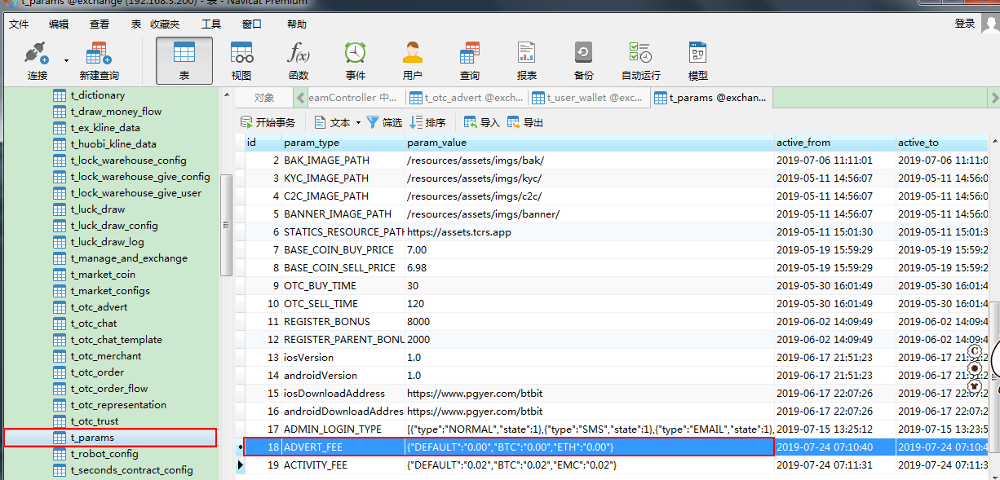

用到一个配置表 

设置手续费的时候是从配置文件中读取的. 是通过redis读取的   这里是get出来 

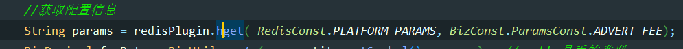


至于哪里set金redis中的呢?

ctrl + shift + f  搜索到 :  這個要點出來  有時候快捷鍵 出不來

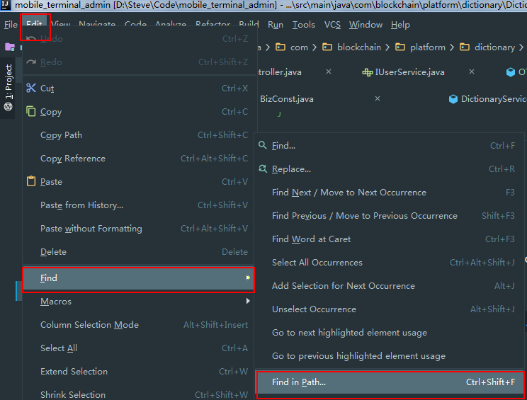

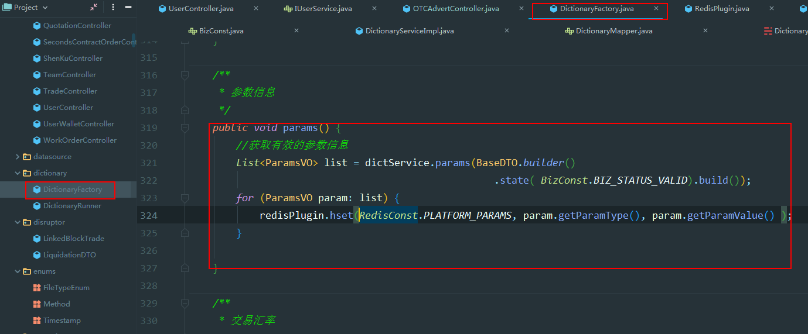


#### /otc/advert/invalid/{id} 下架广告 

#### /otc/advert/list  获取出售,买入的广告列表 

#### /otc/advert/detail/{id} 获取广告详情


### OTCChatController OTC聊天控制器

#### /oct/chat/unread 用户未读消息 

#### /oct/chat/query 聊天消息列表

#### /oct/chat/send 发送 

#### /oct/chat/template 聊天模板消息列表 

#### /oct/chat/template/add 新增聊天模板信息

#### /oct/chat/template/delete/{id}  删除模板信息


### OTCMerchantController  OTC 商户控制器

#### /otcmerchant/apply 申请成为商户 

#### /otcmerchant/details 商户详情


### OTCOrderController OTC订单管理控制器

#### /otc/order/query  订单列表 

#### /otc/order/list 获取广告对应的订单列表 

#### /otc/order/sell 卖出 

#### /otc/order/buy 买入

这里面是从redis中拿出来值

里面有计算手续费

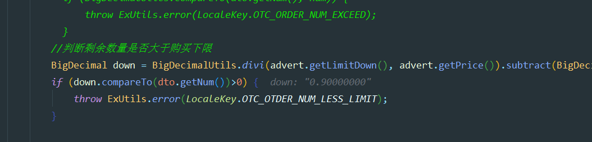


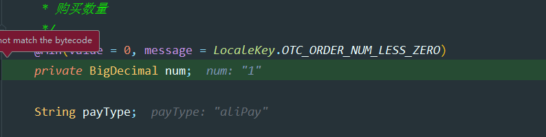


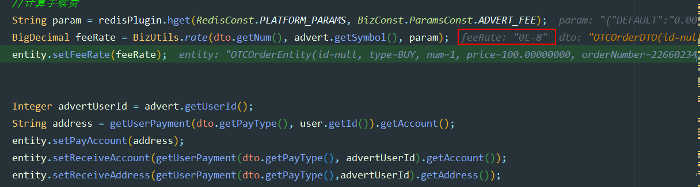


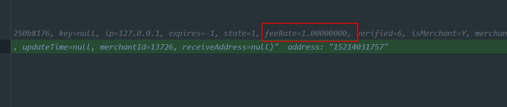

#### /otc/order/cancel/{id}取消订单 

#### /otc/order/sspay 用户点击已付款

#### /otc/order/adopt 放币

#### /otc/order/comment 评论打分

#### /otc/order/representation 订单申诉

#### /otc/order/material 证明材料上传  

#### /otc/order/details/{id}  获取订单详情


### OTCTrustController  OTC信任管理控制器

#### /otc/trust/query   OTC信任管理  信任我的 /我信任的

#### /otc/trust/modify 添加取消 


### PaymentController 用户支付方式控制器 

#### /payment/query 查询用户支付方式

#### /payment/add 新增 

#### /payment/delete/{id} 删除支付方式 

#### /payment/priority/{id}  设置默认支付方式

#### /payment/upload 上传信息图片 

#### /payment/Payments 收款信息

#### /payment/list  获取用户支付方式

#### /payment/type 获取用户支持的支付方式


### PlatformController  主页控制器

#### /banner   平台banner查询

#### /notice 通知信息

#### /article 文章列表 区域

#### /coin 系统级货币配置

#### /version     app下载

#### /rete   汇率配置

这里要进行汇率的配置  

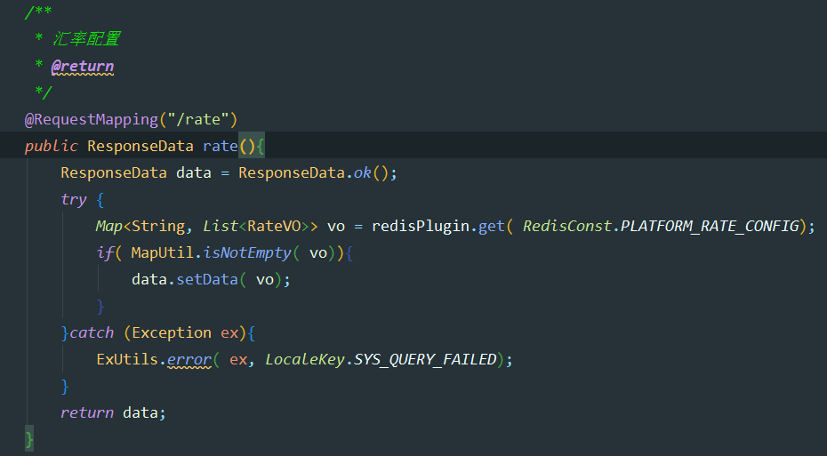

哪里set进去redis的呢?

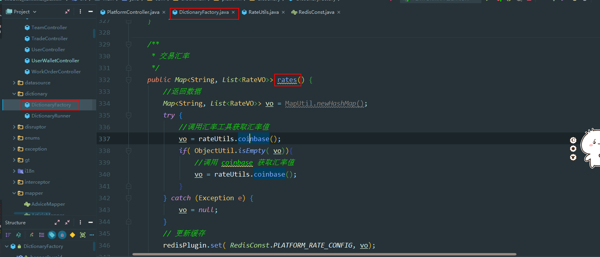

但是redis中什么都没有

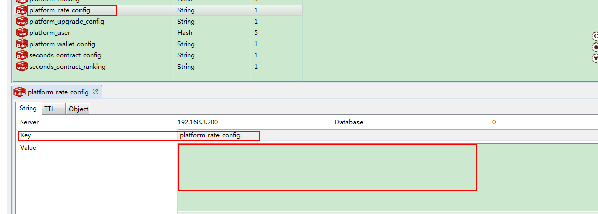

这里调用了汇率工具 在utils里面

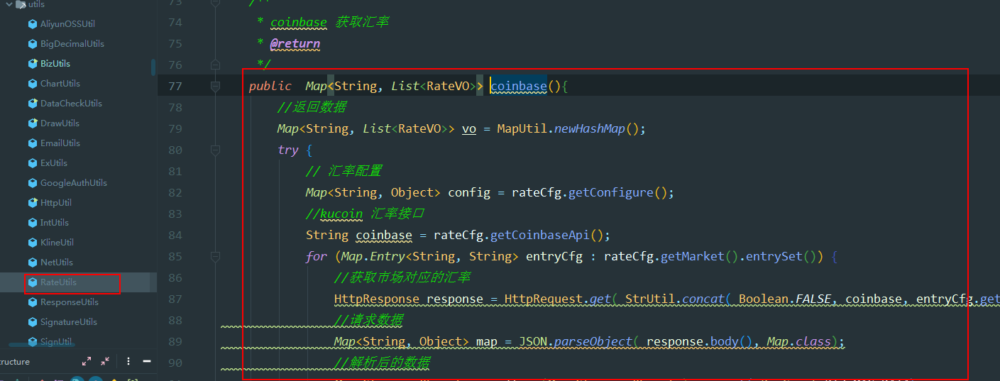


具体的汇率的值 ,是从国外的网站请求过来的  

这里面有一个定时器task:  这里是每一分钟请求一次  就是上面注解设置的参数

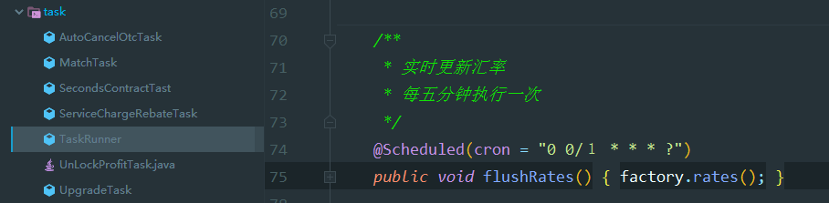

定时器 每过一会 就会调用  工厂里面的一个方法 来获取汇率的配置

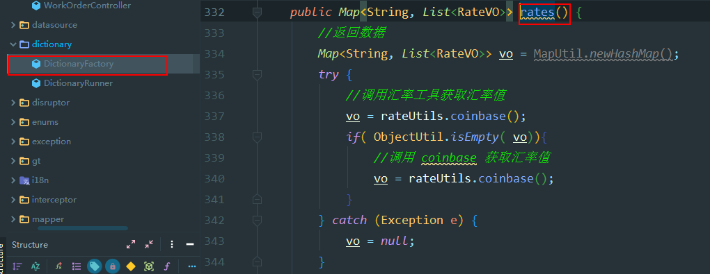

在方法中 ,有用到配置类 

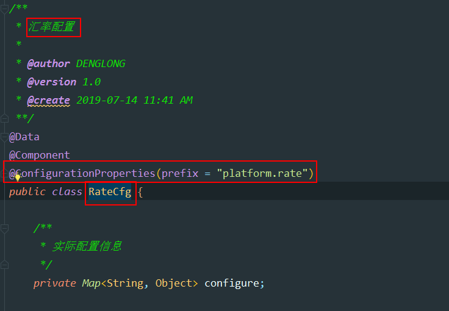

这里配置的是配置文件中的这块内容  

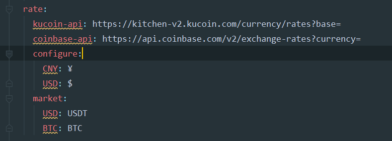

这个方法就是从配置文件中提供的网址的前半部分,结合后面的market ,拼接成url

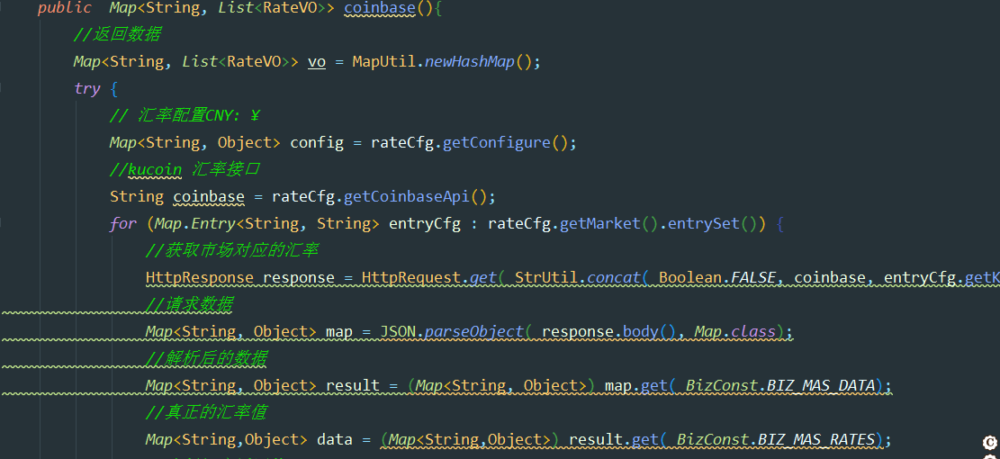

#### /flush 刷新

#### /market 获取所有市场

#### /rates 汇率值

#### /currency 法币 

#### /dict 获取数字字典

#### /draw 抽奖信息

#### /draw/{id} 抽奖信息奖项

#### /second 秒合同 行情

#### /advert/config 广告配置


### QuotationController  交易行情数据展示控制器

#### /quotation/ranking  查询 交易行情排行

#### /quotation/optional  获取用户自选货币的排行榜

#### /quotation/markets 获取所有市场


### SecondsContractOrderController

#### /secondsContract/query 秒合同配置

#### /secondsContract/secondsQuery 进行秒合同的交易对

#### /secondsContract/actives 分页获取我的秒合同订单,订单状态和时间排序

#### /secondsContract/activeings 获取我的进行中的秒合约订单 最多五个

#### /secondsContract/favor 合约排行榜

#### /secondsContract/quotation 自选的合约排行榜 


### ShenKuController

#### /shenku/cancelWithdrawTask

#### /shenku/getDepositAddress

#### /shenku/push_deposit_task 充值推送

#### /shenku/push_withdrow_task 提现推送


### TeamController 团队控制器

#### /team/extenshion  团队个人推广

#### /team/contract 

#### /team/contracts 秒合约收益明细

#### /team/profits 星球计划在收益明细

#### /team/stage 我的团队(二级)


### TradeController 交易界面控制器 

#### /trade/history 币币交易


### UserController  用户管理控制器 

#### /user/query 分页查询数据

#### /user/timestamp 获取服务器时间戳 

#### /user/logon/password 用户修改登录密码

#### /user/chpher/password 用户修改交易密码

#### /user/cipher/captcha  修改资金密码发送验证码

#### /user/optional 用户添加自选货币

#### /user/facor 我的自选

#### /user/login 用户登录

#### /user/register/captcha 发送注册验证码  

用postman发送短信 

因为要传输的数据是json格式,所以参考:

 https://blog.csdn.net/Joker_N/article/details/94026962 

 https://blog.csdn.net/qq_36350532/article/details/80318091 

原来的请求是这样的: 

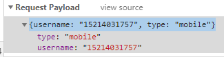

但是用post发送的时候,前面的key要加双引号 ""  这样的才可以成功.

有个小技巧,如果postman提示json不合适,也就是前面多个x(红色的x) 说明json格式不合适,要改正确才可以传输

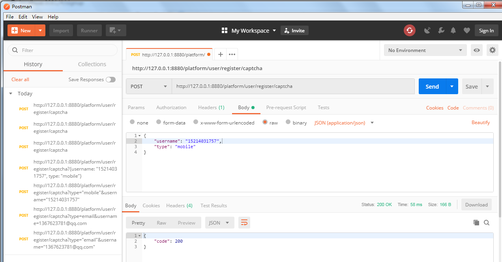


#### /user/register 用户的注册

#### /user/forget/captcha 忘记密码的验证码 

#### /user/forget 忘记密码

#### /user/auth 交易授权

#### /user/logout 用户退出系统

#### /user/message 获取用户的站内信

#### /user/message/{id} 站内信详情

#### /user/bind/captcha 绑定邮箱或者电话验证码  

#### /user/bind 绑定

#### /user/upload 用户上传头像

#### /user/head/image  更换头像


### UserWalletController  用户钱包操作

#### /wallet/details 资产明细

#### /wallet/flow 账户流水 

#### /wallet/signature 获取数字签名

#### /wallet/transfer 划转

#### /wallet/info 获取用户钱包信息


### WorkOrderController 工单控制器 

#### /work/query 我的工单

#### /work/modify 提交工单

#### /work/material  证明材料上传

#### /work/reply 回复


## 当前要做的事情

Utils里面有一些用到的utils

例如常用的Int在intUtils里面，这里的东西是通用的Int

重新安装个Navicat

这个项目中用到redis中的地方,前端好多数据是放到redis中啦.问一下  要一个看redis的软件. 

后端中用到redis的地方是


这两个地方 ,主要是出金 定时器 五分钟刷新一趟.   数据字典中.

专心多学数据结构和数据库 知识 


## 二:商城项目

### 商城前台前端

### 商城前台后端   也就是小程序端

发送短信的时候: 配置文件在core的application

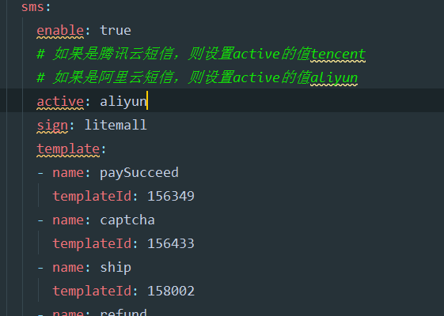

如果要使用发短信功能,需要将这里的enable改成true,否则是发送不了短信的.

发短信接口,会判断发送阿里的,还是腾讯的:

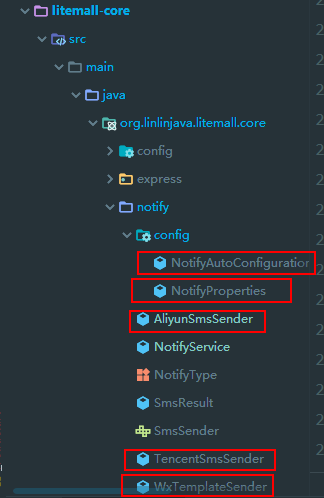


测试时将验证码失效时间写成了1000分钟,在下面这个类中

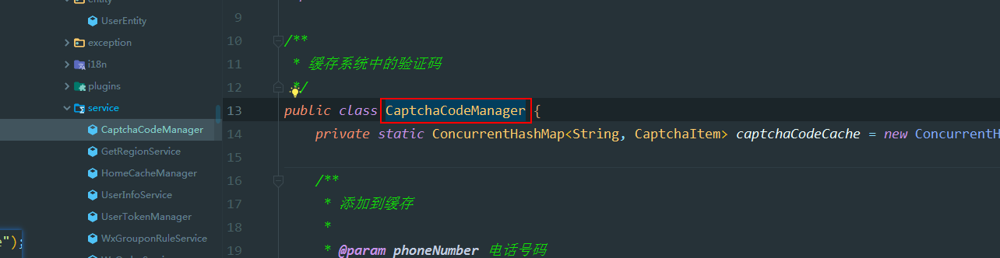

### 订单模块 :

#### 订单状态

- 订单流程：下单成功－》支付订单－》发货－》收货
- 订单状态：
- 101 订单生成，未支付；102，下单未支付用户取消；103，下单未支付超期系统自动取消
- 201 支付完成，商家未发货；202，订单生产，已付款未发货，用户申请退款；203，管理员执行退款操作，确认退款成功；
- 301 商家发货，用户未确认；
- 401 用户确认收货，订单结束； 402 用户没有确认收货，但是快递反馈已收货后，超过一定时间，系统自动确认收货，订单结束.


- 当101用户未付款时，此时用户可以进行的操作是取消或者付款
- 当201支付完成而商家未发货时，此时用户可以退款
- 当301商家已发货时，此时用户可以有确认收货
- 当401用户确认收货以后，此时用户可以进行的操作是退货、删除、去评价或者再次购买
- 当402系统自动确认收货以后，此时用户可以删除、去评价、或者再次购买

### 订单模块中是如何获取到userId的呢???

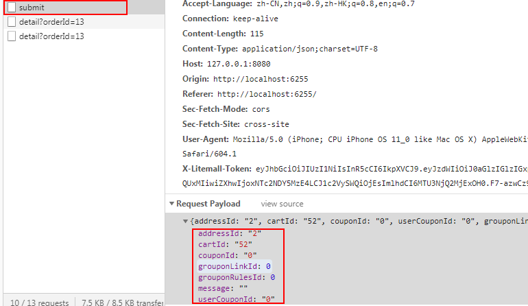

前端传过来的参数没有直接的userId

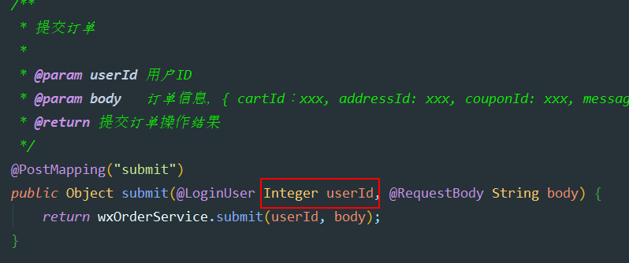

而接受参数的地方,有userId 

说明有类似拦截器的地方  有根据token来获取userId的地方   

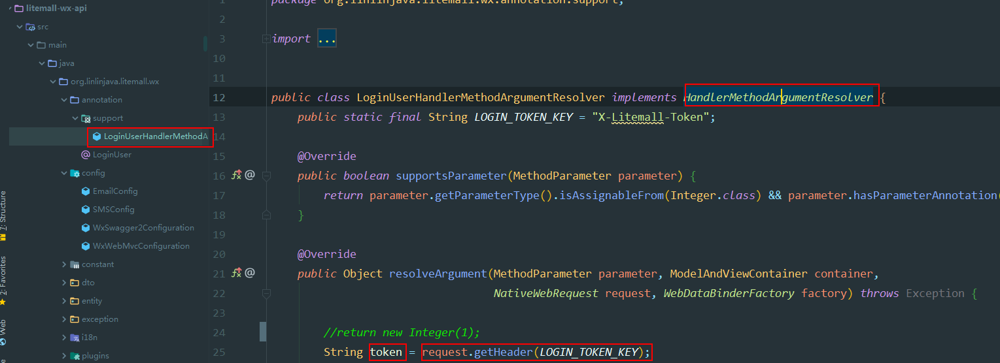

这个里面进行了操作 

HandlerMethodArgumentResolver这个是自定义解析器

这个自定义解析器:

我们在解析器中返回一个固定的UserBean,实际情况是从Session、数据库或者缓存中查。 

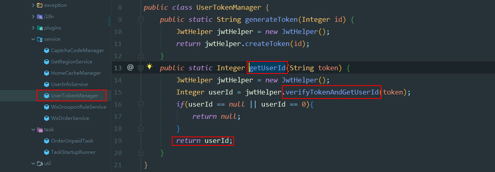

这里这个方法中,就是用JWT 技术 ,从token中获取到userId然后返回

<div>
      <el-form-item label="店铺id" prop="storeId">
          <el-input v-model="goods.storeId" />
      </el-form-item>
    </div>


## 商城后台前端

## 商城后台后端

登录的时候 涉及到shiro 数据库的admin表


### 商城项目:

### 接受参数 如果是bean  要加@RequestBody

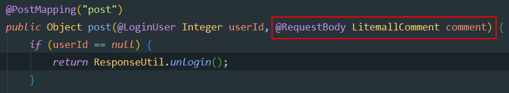


## 总结

在byte[]和String互相转换的时候你应该注意输入数据的类型

1. 当使用String类的时候，将String作为输入类型
2. 当使用Base64类的时候，使用byte数组作为输入类型


## 货币:

 货币名称 　 货币符号

人民币 RMB
美元 USD
日元 JPY
欧元 EUR
英镑 GBP
德国马克 DEM
瑞士法郎 CHF
法国法郎 FRF
加拿大元 CAD
[澳大利亚](https://www.baidu.com/s?wd=澳大利亚&tn=SE_PcZhidaonwhc_ngpagmjz&rsv_dl=gh_pc_zhidao)元 AUD
港币 HKD
奥地利先令 ATS
芬兰马克 FIM
比利时法郎 BEF
爱尔兰镑 IEP
意大利里拉 ITL
卢森堡法郎 LUF
荷兰盾 NLG
葡萄牙埃斯库多 PTE
西班牙比塞塔 ESP
印尼盾 IDR
[马来西亚](https://www.baidu.com/s?wd=马来西亚&tn=SE_PcZhidaonwhc_ngpagmjz&rsv_dl=gh_pc_zhidao)林吉特 MYR
新西兰元 NZD
菲律宾比索 PHP
俄罗斯卢布 SUR
新加坡元 SGD
韩国元 KRW
泰铢 THB
各国货币名称的英文缩写简写
主要国家货币简写：
1．CNY（ChiNese Yuan）人民币
2．FRF（FRench Franc）法国法郎
3．HKD（Hong Kong Dollar）港元
4．CHF（德文 sCHweizer Franken）瑞士法郎
5．USD（United States Dollar）美元
6．CAD（CAnadian Dollar）加拿大元
7．GBP（Great Britain Pound）英镑
8．NLG（NetherLandish Guilder）荷兰盾
9．DEM（德文 DEutsche M ark）德国马克
10．BEF（BElgischer Franc）比利时法郎
11．JPY（JaPanese Yen）日元
12．AUD（AUstralian Dollar）[澳大利亚](https://www.baidu.com/s?wd=澳大利亚&tn=SE_PcZhidaonwhc_ngpagmjz&rsv_dl=gh_pc_zhidao)元

各国详细货币简介：

Afghani阿富汗尼 Af Afghanistan阿富汗
bath铢 B Thailand泰国
balboa巴波亚 B Panama巴拿马
aolivar博利瓦 ＄b Venezuela委内瑞拉
colon（[哥斯达黎加](https://www.baidu.com/s?wd=哥斯达黎加&tn=SE_PcZhidaonwhc_ngpagmjz&rsv_dl=gh_pc_zhidao)）科郎 ￠ Costa Rica[哥斯达黎加](https://www.baidu.com/s?wd=哥斯达黎加&tn=SE_PcZhidaonwhc_ngpagmjz&rsv_dl=gh_pc_zhidao)
colon（萨尔瓦多）科郎 ￠ El Salvador萨尔瓦多
cordoba科多巴 C＄ Nicaragua尼加拉瓜
cruzeiro克鲁赛罗 Cr＄ brazil巴西
dalasi达拉西 DG Gambia冈比亚
dinar（[阿尔及利亚](https://www.baidu.com/s?wd=阿尔及利亚&tn=SE_PcZhidaonwhc_ngpagmjz&rsv_dl=gh_pc_zhidao)）第纳尔 DA Algeria[阿尔及利亚](https://www.baidu.com/s?wd=阿尔及利亚&tn=SE_PcZhidaonwhc_ngpagmjz&rsv_dl=gh_pc_zhidao)
dinar（伊拉克）第纳尔 ID Iraq伊拉克
dinar（约旦）第纳尔 JD Jordan约旦
dinar（科威特）第纳尔 KD Kuwait科威特
dinar（利比亚）第纳尔 LD Libya利比亚
dinar（[也门民主人民共和国](https://www.baidu.com/s?wd=也门民主人民共和国&tn=SE_PcZhidaonwhc_ngpagmjz&rsv_dl=gh_pc_zhidao)）第纳尔 YD The People’s Democratic Republic of Yemen [也门民主人民共和国](https://www.baidu.com/s?wd=也门民主人民共和国&tn=SE_PcZhidaonwhc_ngpagmjz&rsv_dl=gh_pc_zhidao)
dinar（突尼斯）第纳尔 D Tunisia突尼斯
dinar（南斯拉夫）第纳尔 DIN Yugoslavia南斯拉夫
dirham迪拉姆 DH Morocco摩洛哥
dollar（[澳大利亚](https://www.baidu.com/s?wd=澳大利亚&tn=SE_PcZhidaonwhc_ngpagmjz&rsv_dl=gh_pc_zhidao)）元 ＄A Australia澳大利亚
dollar（巴哈马）元 B＄ Bahamas巴哈马
dollar（百慕大）元 DB＄ Bermuda百慕大
dollar（加拿大）元 Can＄ Canada加拿大
dollar[埃塞俄比亚](https://www.baidu.com/s?wd=埃塞俄比亚&tn=SE_PcZhidaonwhc_ngpagmjz&rsv_dl=gh_pc_zhidao)）元 ＄Eth Ethiopia[埃塞俄比亚](https://www.baidu.com/s?wd=埃塞俄比亚&tn=SE_PcZhidaonwhc_ngpagmjz&rsv_dl=gh_pc_zhidao)
dollar（斐济）元 F＄ Fiji斐济
dollar（圭亚那）元 G＄ Guyana圭亚那
dollar（香港）元 HK＄ Hongkong香港
dollar（牙买加）元 J＄ Jamaica牙买加
dollar（利比里亚）元 L＄ Liberia利比里亚
dollar（[马来西亚](https://www.baidu.com/s?wd=马来西亚&tn=SE_PcZhidaonwhc_ngpagmjz&rsv_dl=gh_pc_zhidao)）元 M＄ Malaysia[马来西亚](https://www.baidu.com/s?wd=马来西亚&tn=SE_PcZhidaonwhc_ngpagmjz&rsv_dl=gh_pc_zhidao)
dollar（新西兰）元 NA＄ NewZealand 新西兰
dollar（新加坡）元 S＄ Singapore新加坡
dollar（[特立尼达和多巴哥](https://www.baidu.com/s?wd=特立尼达和多巴哥&tn=SE_PcZhidaonwhc_ngpagmjz&rsv_dl=gh_pc_zhidao) TT＄ Trinidad and Tobago[特立尼达和多巴哥](https://www.baidu.com/s?wd=特立尼达和多巴哥&tn=SE_PcZhidaonwhc_ngpagmjz&rsv_dl=gh_pc_zhidao)
dollar（美国）元 US＄ USA美国
dong（越南）盾 D DBVN越南民主共和国
drachma德拉克马 Dr Greece希腊
escudo（智利）埃斯库多 E Chili智利
escudo（葡萄牙）埃斯库多 Esc Portugal葡萄牙
forint福林 Ft Hungary匈牙利
franc（比利时）法郎 BF Belgium比利时
franc（布隆迪）法郎 Fbu Burundi布隆迪
Franc（非洲金融共同体）法郎 Franc（非洲金融共同体）法郎 CFAF Cameroon喀麦隆；The Central African Republic中非共和国； Chad乍得；The People''s Republic of the Congo 刚果人民共和国；Dahomey达荷美；Gabon加蓬；Ivory Coast象牙海岸；Niger尼日尔；Senegal塞内加尔；Toto多哥；Upper Volta上沃尔特等
franc(法国) 法郎 FF France法国
franc（卢森堡）法郎 LuxF Luxemb(o)urg 卢森堡
franc（马尔加什）法郎 FMG The Malagasy Republic马尔加什共和国
franc（马里）法郎 MF Mali马里
franc(卢旺达)法郎 RF Rwanda卢旺达
franc(瑞士)法郎 Sf Switzerland瑞士
gourde古德 G Haiti海地
guarani瓜拉尼 C Paraguay巴拉圭
Guilder(或florin)（荷兰）盾 fF Netherlands荷兰
kip基普 K Laos老挝
koruna（捷克）克朗 KeS Czechoslovakia[捷克斯洛伐克](https://www.baidu.com/s?wd=捷克斯洛伐克&tn=SE_PcZhidaonwhc_ngpagmjz&rsv_dl=gh_pc_zhidao)
krona（冰岛）克朗 IKr Iceland冰岛
krona（瑞典）克朗 SKr Sweden瑞典
krone（丹麦）克朗 DKr Denmark丹麦
krone（挪威）克朗 NKr Norway挪威
kwacha（马拉维）克瓦查 MK Malawi马拉维
kwacha（赞比亚）克瓦查 K Zambia赞比亚
kyat（缅甸）元 K Burma缅甸
lek列克 Lek Albania[阿尔巴尼亚](https://www.baidu.com/s?wd=阿尔巴尼亚&tn=SE_PcZhidaonwhc_ngpagmjz&rsv_dl=gh_pc_zhidao)
lempira伦皮拉 L Honduras洪都拉斯
leone利昂 Le Sierra Leone塞拉利昂
leu列伊 Lv Romania罗马尼亚
lev列弗 L Bulgaria保加利亚
lira(意大利)里拉 Lit Italy意大利
Lira（土耳其）里拉（或镑） LT Turkey土耳其
Mark（[德意志联邦共和国](https://www.baidu.com/s?wd=德意志联邦共和国&tn=SE_PcZhidaonwhc_ngpagmjz&rsv_dl=gh_pc_zhidao)）马克 DM GFR[德意志联邦共和国](https://www.baidu.com/s?wd=德意志联邦共和国&tn=SE_PcZhidaonwhc_ngpagmjz&rsv_dl=gh_pc_zhidao)
Markka（芬兰）马克 Fmk Finland芬兰
Naira奈拉 Nigeria 尼日利亚
new cedi新塞地 NC Ghana加纳
Ouguiya乌吉亚 UM Mauritania毛里塔尼亚
pa''anga邦加 T＄ Tonga汤加
Peseta比塞塔 Ptas Spain西班牙
peso（阿根廷）比索 ＄a Argentina阿根廷
peso（玻利维亚）比索 ＄b Bolivia玻利维亚
peso（哥伦比亚）比索 Col＄ Colombia哥伦比亚
peso(古巴)比索 Cub＄ Cuba古巴
peso（多米尼加）比索 RD＄ The Dominican Republic多米尼加共和国
peso（墨西哥）比索 Mex＄ Mexico墨西哥
peso（菲律宾）比索 P Philippines菲律宾
peso（乌拉圭）比索 Ur＄ Uruguay乌拉圭
pound（塞浦路斯）镑 ￡C Cyprus塞浦路斯
pound（埃及）镑 LE Egypt埃及
pound（英国）镑 ￡(￡ Stg) Great Britain英国
pound（爱尔兰）镑 ￡Ir Ireland爱尔兰
pound（黎巴嫩）镑 LL Lebanon黎巴嫩
pound（马耳他）镑 ￡M Malta马耳他
pound（苏丹）镑 ￡S Sudan苏丹
pound（叙利亚）镑 LS Syria叙利亚
quetzal格查尔 Q Guatemala危地马拉
Renminbiyuan人民币元 RMB China中国
rial（伊朗）里亚尔 Rls Iran伊朗
riel瑞尔 Cambodia柬埔寨
riyal（沙特阿拉伯）里亚尔 SRls Saudi Arabia沙特阿拉伯
riyal（阿拉伯也门共和国）里亚尔 YRls The Arab Republic of Yemen阿拉伯也门共和国
rouble卢布 R(rub, Rbl) USSR俄罗斯
rupee（印度）卢比 Rs India印度
rupee（毛里求斯）卢比 MRs Mauritius毛里求斯
rupee（尼泊尔）卢比 NRs Nepal尼泊尔
rupee（巴基斯坦）卢比 PRs Pakistan巴基斯坦
rupee（斯里兰卡）卢比 SRs Sri Lanka斯里兰卡
rupiah（印度尼西亚）卢比（或盾） Rp Indonesia印度尼西亚
schilling(奥地利)先令 Sch Austria(奥地利)
shilling（肯尼亚）先令 KSh Kenya(肯尼亚)
shilling（坦桑尼亚）先令 TSh 坦桑尼亚
shilling（乌干达）先令 USh 乌干达
sol索尔 s/ 秘鲁
Somali shilling索马里先令 ShSo Somali索马里
sucre苏克雷 S/ Ecuador厄瓜多尔
syli西里 syli syli几内亚
tugrik图格里克 Tug Mongolia蒙古
won（朝鲜）圆 W The Democratic People''s republic of Korea 朝鲜民主主义人民共和国
日元 ￥ Japan日本
扎伊尔 Z Zaire扎伊尔
兹罗提 Zl Poland波兰

注：①dellar的符号＄也可作＄。
②有些货币的符号或缩写用复数，如比塞塔（Ptas）、里亚尔（Rls）、卢比（Rs）等，
一般去掉末尾的即为其单数形式，但卢比（urpee）的单数形式为Re。
③非洲金融共同体法郎（CFAF）的全称为Communaute Financiere Africaine Franc 


## SQl拼接   sql语句中的表名 是数据库中没有的  但是还是查出来啦 为什么呢?


原因是拦截器的作用.  拦截器里面进行了sql表名的拼接

本来拦截器应该在这里:


这个sql的拦截器 在:


这里面有两个注解:

@Intercepts      在实现Interceptor接口的类声明,使该类注册成为拦截器  

@Signature       定义哪些类(4种)，方法，参数需要被拦截 

关于拦截器,有一篇文章   

 https://blog.csdn.net/yhjyumi/article/details/49188051 


写拦截器,除了要实现拦截器的接口,还要写拦截器的注解

拦截器中的类,好多都是  下面的这个里面的  这个是sql解析器


这里面 用到的很多  都是Java SQL语句解析——Jsqlparser   这个里面的方法


# Litemall

## 1.跨域

​		当它请求的一个资源是从一个与它本身提供的第一个资源的不同的域名时，一个资源会发起一个**跨域**HTTP请求(Cross-site HTTP request)。

​		比如说，域名A ( [http://domaina.example](http://domaina.example/) ) 的某 Web 应用程序中通过< img>标签引入了域名B( [http://domainb.foo](http://domainb.foo/) ) 站点的某图片资源(http://domainb.foo/image.jpg)，域名A的那 Web 应用就会导致浏览器发起一个跨站 HTTP 请求。
​		在当今的 Web 开发中，使用跨站 HTTP 请求加载各类资源（包括CSS、图片、JavaScript 脚本以及其它类资源），已经成为了一种普遍且流行的方式。
正如大家所知，出于安全考虑，浏览器会限制脚本中发起的跨站请求。比如，使用[ XMLHttpRequest ](https://developer.mozilla.org/en/DOM/XMLHttpRequest)对象发起 HTTP 请求就必须遵守[同源策略](https://developer.mozilla.org/en/Same_origin_policy_for_JavaScript)。 具体而言，Web 应用程序能且只能使用 [XMLHttpRequest](https://developer.mozilla.org/en/DOM/XMLHttpRequest)对象向其加载的源域名发起 HTTP 请求，而不能向任何其它域名发起请求。为了能开发出更强大、更丰富、更安全的Web应用程序，开发人员渴望着在不丢失安全的前提下，Web 应用技术能越来越强大、越来越丰富。比如，可以使用 [XMLHttpRequest](https://developer.mozilla.org/en/DOM/XMLHttpRequest)发起跨站 HTTP 请求。

​	（**这段描述跨域不准确，跨域并非浏览器限制了发起跨站请求，而是跨站请求可以正常发起，但是返回结果被浏览器拦截了。最好的例子是CSRF跨站攻击原理，请求是发送到了后端服务器无论是否跨域！注意：有些浏览器不允许从HTTPS的域跨域访问HTTP，比如Chrome和Firefox，这些浏览器在请求还未发出的时候就会拦截请求，这是一个特例。**）

​		资料来自互联网: https://www.cnblogs.com/csguo/p/9597791.html


项目中用到的跨域:

```java
import org.springframework.context.annotation.Bean;
import org.springframework.context.annotation.Configuration;
import org.springframework.web.cors.CorsConfiguration;
import org.springframework.web.cors.UrlBasedCorsConfigurationSource;
import org.springframework.web.filter.CorsFilter;

@Configuration
public class CorsConfig { 
    private CorsConfiguration buildConfig() { 
        CorsConfiguration corsConfiguration = new CorsConfiguration();
        corsConfiguration.addAllowedOrigin("*"); // 1 设置访问源地址
        corsConfiguration.addAllowedHeader("*"); // 2 设置访问源请求头
        corsConfiguration.addAllowedMethod("*"); // 3 设置访问源请求方法
        return corsConfiguration;
    }

    @Bean
    public CorsFilter corsFilter() {
        UrlBasedCorsConfigurationSource source = new UrlBasedCorsConfigurationSource();
        source.registerCorsConfiguration("/**", buildConfig()); // 4 对接口配置跨域设置
        return new CorsFilter(source);
    }
}

```

​		

## 2.分页

首先需要导入分页所需要的依赖:

```xml
<!--分页插件-->
<dependency>
    <groupId>com.github.pagehelper</groupId>
    <artifactId>pagehelper-spring-boot-starter</artifactId>
    <version>1.2.5</version>
</dependency>

```

application.yml中需要写配置项:

```yml
spring:
  datasource:
    driver-class-name: com.mysql.jdbc.Driver
    url: jdbc:mysql://localhost:3306/j16_db
    username: root
    password: 123456
pagehelper:
  helper-dialect: mysql
logging:
  level:
    com:
      cskaoyan:
        pagehelper:
          mapper: debug

```

其他层正常写,然后services层:

```java
import com.cskaoyan.pagehelper.bean.ListBean;
import com.cskaoyan.pagehelper.bean.User;
import com.cskaoyan.pagehelper.mapper.UserMapper;
import com.github.pagehelper.PageHelper;
import com.github.pagehelper.PageInfo;
import org.springframework.beans.factory.annotation.Autowired;
import org.springframework.stereotype.Service;

import java.util.List;

@Service
public class UserServiceImpl implements UserService {
    @Autowired
    UserMapper userMapper;
    @Override
    public ListBean queryUsers(int start, int limit) {
        //只需要加下面一句话就可以分页
        PageHelper.startPage(start, limit);
        //如果前端的需求是要根据某一个值,进行排序,按照下面的写,sort里面是根据哪一个值排序,order里面是要写顺序还是逆序排序,bean中的这两个值是需要接受前端数据来获得得!
        //PageHelper.startPage(steveGoods.getPage(), steveGoods.getLimit(), 			                      steveGoods.getSort() + " " + steveGoods.getOrder());
        List<User> users = userMapper.queryUsers();
        PageInfo<User> userPageInfo = new PageInfo<>(users);
        //下面这句还可以查询出来总数(不用自己另外写sql语句来查询总数)
        long total = userPageInfo.getTotal();

        ListBean<User> userListBean = new ListBean<>();
        userListBean.setItems(users);
        userListBean.setTotal(total);
        return userListBean;
    }
}

```


## 3.typeHander 将数组和json转换

## string string[]

这个东西解决的问题是:

数据库存储的是,放json的string,而bean中放的是string[],要实现这两者之间的转换!

分为两种,第一种将Javabean中的数组string[]数据,转换成数据库接受的类型string

​				第二种将数据库中的json数据string,查出来,转换成Javabean中的string[]类型

```java
import com.fasterxml.jackson.core.JsonProcessingException;
import com.fasterxml.jackson.databind.ObjectMapper;
import org.apache.ibatis.type.BaseTypeHandler;
import org.apache.ibatis.type.JdbcType;
import org.apache.ibatis.type.MappedTypes;
import org.apache.ibatis.type.TypeHandler;

import java.io.IOException;
import java.sql.CallableStatement;
import java.sql.PreparedStatement;
import java.sql.ResultSet;
import java.sql.SQLException;

@MappedTypes(String[].class)
public class TransferStringArrayHandler implements TypeHandler<String[]> {
    ObjectMapper objectMapper = new ObjectMapper();

    /*插入数据 由javabean转换为数据库接收的类型*/
    @Override
    public void setParameter(PreparedStatement preparedStatement, int index, String[] strings, JdbcType jdbcType) throws SQLException {
        try {
            String jsonArray = objectMapper.writeValueAsString(strings);
            preparedStatement.setString(index,jsonArray);
        } catch (JsonProcessingException e) {
            e.printStackTrace();
        }
    }
    
    //由数据中查询出的结果转换成javabean中的类型
    @Override
    public String[] getResult(ResultSet resultSet, String parameterName) throws SQLException {
        String value = resultSet.getString(parameterName);
        return parseString2StringArray(value);
    }

    private String[] parseString2StringArray(String value) {

        String[] strings = new String[0];
        if (value == null){
            return strings;
        }
        try {
            strings = objectMapper.readValue(value, String[].class);
        } catch (IOException e) {
            e.printStackTrace();
        }
        return strings;
    }

    @Override
    public String[] getResult(ResultSet resultSet, int index) throws SQLException {
        String value = resultSet.getString(index);
        return parseString2StringArray(value);
    }

    @Override
    public String[] getResult(CallableStatement callableStatement, int index) throws SQLException {
        String value = callableStatement.getString(index);
        return parseString2StringArray(value);
    }
}

```

## user user.detail

查出来数据,自动查出来detail

```java
import com.cskaoyan.bean.UserDetail;
import com.fasterxml.jackson.core.JsonProcessingException;
import com.fasterxml.jackson.databind.ObjectMapper;
import org.apache.ibatis.type.JdbcType;
import org.apache.ibatis.type.MappedTypes;
import org.apache.ibatis.type.TypeHandler;

import java.io.IOException;
import java.sql.CallableStatement;
import java.sql.PreparedStatement;
import java.sql.ResultSet;
import java.sql.SQLException;

@MappedTypes(UserDetail.class)
public class TransferUserDetailHandler implements TypeHandler<UserDetail> {
    ObjectMapper objectMapper = new ObjectMapper();

    @Override
    public void setParameter(PreparedStatement preparedStatement, int i, UserDetail userDetail, JdbcType jdbcType) throws SQLException {
        String s = null;
        try {
            s = objectMapper.writeValueAsString(userDetail);
        } catch (JsonProcessingException e) {
            e.printStackTrace();
        }
        preparedStatement.setString(i,s);
    }

    @Override
    public UserDetail getResult(ResultSet resultSet, String s) throws SQLException {
        String string = resultSet.getString(s);
        return parseString2UserDetail(string);
    }

    private UserDetail parseString2UserDetail(String string) {
        UserDetail userDetail = null;
        if (string == null)
            return userDetail;
        try {
            userDetail = objectMapper.readValue(string, UserDetail.class);
        } catch (IOException e) {
            e.printStackTrace();
        }
        return userDetail;
    }

    @Override
    public UserDetail getResult(ResultSet resultSet, int i) throws SQLException {
        String string = resultSet.getString(i);
        return parseString2UserDetail(string);
    }

    @Override
    public UserDetail getResult(CallableStatement callableStatement, int i) throws SQLException {
        String string = callableStatement.getString(i);
        return parseString2UserDetail(string);
    }
    /*插入数据 由javabean转换为数据库接收的类型*/
}

```


## 5.Druid监控功能

## 导包

druid对springboot的支持（druid包）


## 配置


## 使用


## 6.${}和\#{}

## \${}字符串的拼接

不好的 sql注入的风险

若使用\${}作为sql语句


## \#{} 预编译


## 7.Hibernate Validator参数校验

Username length 》6

Password \< 6

Hibernate validator对javabean（domain model）进行校验

## 导包

Spring-boot-start-web中提供了validator需要的包，不需要额外的导包

## 组件注册


## 使用

在javabean中直接使用注解


## 8.Springboot文件上传

默认注册了multipartResolver这个组件，可以直接去使用

我们可以将文件上传到指定目录，并且将该指定目录配置为静态资源目录


使用阿里云oss存储图片等静态资源，首先需要配置一些参数！

```yml
mall:
  aliyun:
    access-key-id: LTAI4Fr5gfYhcVjLMqeRGbuT
    access-secret: IrkcHu6dZyrjPZRushgO76P5392HJ1
    url: https://cskaoyan.oss-cn-beijing.aliyuncs.com/
    oss:
      bucket: cskaoyan
      end-point: oss-cn-beijing.aliyuncs.com

```

然后进文件长传的细节写入工具类中：

```java
import com.aliyun.oss.OSSClient;
import com.aliyun.oss.model.PutObjectRequest;
import com.cskaoyan.mall.bean.Storage;
import com.cskaoyan.mall.config.AliyunConfig;
import org.springframework.beans.factory.annotation.Autowired;
import org.springframework.beans.factory.annotation.Value;
import org.springframework.stereotype.Component;
import org.springframework.stereotype.Controller;
import org.springframework.util.ResourceUtils;
import org.springframework.web.multipart.MultipartFile;

import javax.servlet.http.HttpServletRequest;
import java.io.File;
import java.io.IOException;
import java.io.InputStream;
import java.util.Date;
import java.util.UUID;
@Controller
public class FileUpload {
    
    public static Storage uploadToAliyun(AliyunConfig aliyunConfig,MultipartFile file) throws IOException {
        InputStream inputStream = file.getInputStream();
        String accessKeyId = aliyunConfig.getAccessKeyId();
        String accessSecret = aliyunConfig.getAccessSecret();
        String bucket = aliyunConfig.getOssConfig().getBucket();
        String endPoint = aliyunConfig.getOssConfig().getEndPoint();
        OSSClient ossClient = new OSSClient(endPoint, accessKeyId, accessSecret);
        String uuid = UUID.randomUUID().toString().replaceAll("-", "");
        String key = uuid + ".jpg";
        ossClient.putObject(new PutObjectRequest(bucket,key, inputStream));
        String requestURL = aliyunConfig.getUrl()+key;
        Storage storage = getStorage(file, requestURL, key);
        return storage;
    }
    private static Storage getStorage(MultipartFile file,String requestURL,String key){
        Storage storage = new Storage();
        storage.setKey(key);
        storage.setUrl(requestURL);
        storage.setType(file.getContentType());
        storage.setSize((int)file.getSize());
        storage.setName(file.getOriginalFilename());
        Date date = new Date();
        storage.setAddTime(date);
        storage.setUpdateTime(date);
        return storage;
    }

    public static Storage uploadToLocation(MultipartFile file, String filePath,HttpServletRequest request) throws IOException {
        String url="/wx/storage/fetch/";
        String key = UUID.randomUUID().toString()+".jpg";
        File file1 = new File(filePath+url+key);
        if(!file1.exists()){
            file1.mkdirs();
        }
        file.transferTo(file1);
        String requestURL = request.getRequestURL().toString();
        String requestURI = request.getRequestURI();
        requestURL = requestURL.replace(requestURI,"");
        requestURL = requestURL+url+key;
        Storage storage = getStorage(file, requestURL, key);
        return storage;
    }
}

```

然后再controler层调用对应的方法即可！

```java
@RequestMapping("/wx/storage/upload")
public BaseRespVo upload(HttpServletRequest request) throws IOException {

    MultipartHttpServletRequest req =(MultipartHttpServletRequest)request;
    MultipartFile file =  req.getFile("file");

    Storage storage = FileUpload.uploadToAliyun(aliyunConfig,file);

    //Storage storage = FileUpload.uploadToLocation(file,filePath, request);

    BaseRespVo insert = storageService.insert(storage);
    return insert;
}

@RequestMapping("/admin/storage/create")
@RequiresPermissions("admin:storage:create")
public BaseRespVo create(MultipartFile file) throws IOException {
    Storage storage = FileUpload.uploadToAliyun(aliyunConfig,file);
    BaseRespVo insert = storageService.insert(storage);
    return insert;
}

```


## 微信端前台应用

直接扫码进入，使用测试号进入，安装默认debug插件需要一点儿时间


执行登陆可以使用的账号信息


订单的状态信息


9. oss 对象存储 放照片

   oss 文件上传 9元 对象存储  

10. 短信服务

    短信服务 200元 5000条 

    怎么保证获取验证码的时候,session是一样的!

11. 修改session ,保证是同一个session

    改一下,前端,需要给他加一个,请求头  保证让他的session一样!

12. MD5 ("加密算法")  这是哈希算法,不是加密算法!

13 .. 看最后一天的课 补充 

MD5 信息会发生丢失 不管多大文件   只有128bit  肯定信息会发生丢失

14.接口文档生成器 


# Mall

## 项目总体概述

分为两部分，前端的用户页面以及后台管理系统


后端管理系统


## 前后端分离项目如何开发

这里面不会涉及到jsp的概念了。Java服务端开发只需要提供相应的接口（这里面的接口其实指的是前端访问某个url连接，然后后端会发送回一个响应）数据。页面的渲染全部由前端vue来完成。包含正确格式的数据。一般情况下
，在企业中开发，前端开发人员和后端开发人员，一起合作，开发对应的接口（按照什么样的数据格式进行传输数据）


## 开始项目

首先启动前端页面 npm run dev.根据axios中的配置


选择对应的一个端口号

接下来，新建web项目，端口号指定8084，接下来新建servlet，最好遵循这么一个原则，一个servlet来处理一个模块（管理员一个servlet，商品管理一个servlet）。根据对应的url进行分发。


建议在controller下面在新建一个package，叫做admin，专门用来存放后台管理系统里面的所有servlet，前台系统不用放在admin下面。

## 开发过程的坑

跨域 前端应用localhost:8080

服务端应用localhost:8084

## 企业开发项目历程

### 项目经理

### 产品经理

提需求

### UI

### 前端

### 服务端

## 项目进展

## Day2 多条件模糊查询


假如一个商品搜索页面，有商品编号，名称，分类，以及价格区间等多条件可以用来搜寻。但是每一个条件都不是必须要提供的，如果提供，那就必须要加入到搜索条件中去。

拼接sql。

String sql =”select \* from product where 1=1”;

## Day3 商品模块 

新增商品，首先加载当前系统的所有分类。

上传图片接口：


该接口后台的处理逻辑就是利用fileUpload组件将图片保存在服务器上，同时将地址返回给前端vue。

关于商品规格表新建：


## Day4 订单模块

入口在前台，用户下单-新增逻辑。


请求报文的三个参数：

Service层处理具体的逻辑：

总个数

总页数

每页显示的条目

后台接口的权限控制：

目前系统仅仅是前台页面有登录校验，但是如果直接访问接口，那么可以直接访问到所有的数据。

接口系统中增加权限控制，session，登录时添加session，注销时清除session。

但是因为是前后端分离系统，默认情况下，浏览器不会带上cookie请求头，所以需要客户端和服务端一起添加一些头信息。

前端axios需要添加：


服务端需要添加配置：


添加cookie需要客户端和服务端同时处理。才允许系统带上cookie。

## Day5 首页&登录注册

首页的接口：复用了后台的接口。将这个接口名称url改掉，改成另外一个。（后台加了权限验证）。Service和dao层复用。Model也可以复用。（/api/admin/\*）

前台的接口也是需要权限验证。包含：加入购物车的接口，订单接口。再写一个Filter？/api/user.

service层中需要引入多个不同类型的dao时，不要把各种dao写在一起。ProductDao
UserDao。更不能在一个dao里面写多个sql语句。（复用性会差很多）。

### 正则表达式

## Day6 ThreadLocal

在一个线程内新建了一个ThreadLocal对象，该对象的API
set方法和get方法可以用来存取数据


之后新建了另外一个线程，然后将该threadLocal对象作为参数传递过去，在新的线程内


新线程打印出的值为null。

为什么取不出来？？？


首先是获取当前的线程，然后再当前的线程内取出里面的成员变量ThreadLocalMap对象，这个对象你可以认为和我们的HahsMap很相似。存储键值对。

再看get方法：


分析之前的过程，为什么新建一个线程之后，取出来的是null。

假如我在一个threadLocal对象中放了一个connection对象，那么只要在该线程内，无论什么地方取出来的都是同一个connection对象.